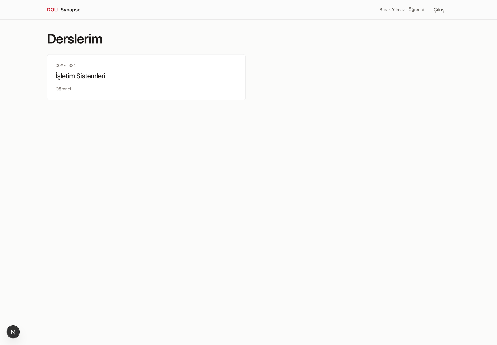
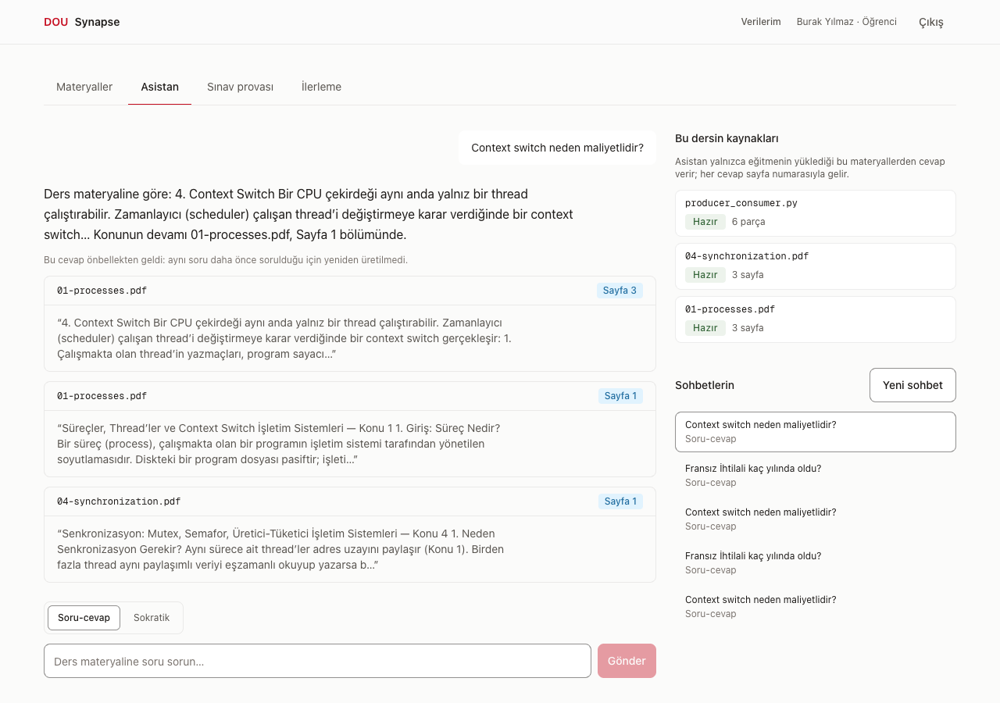
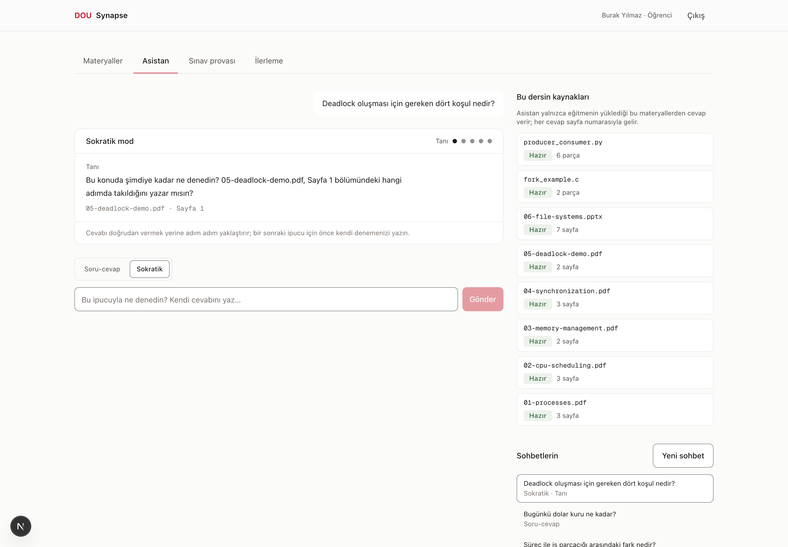
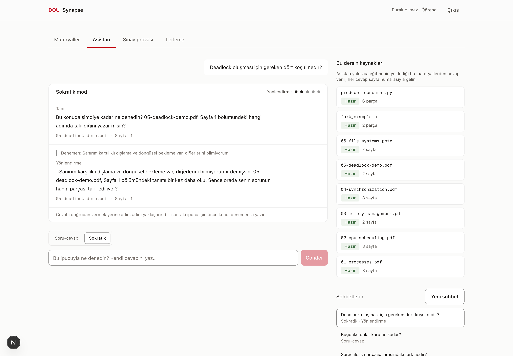
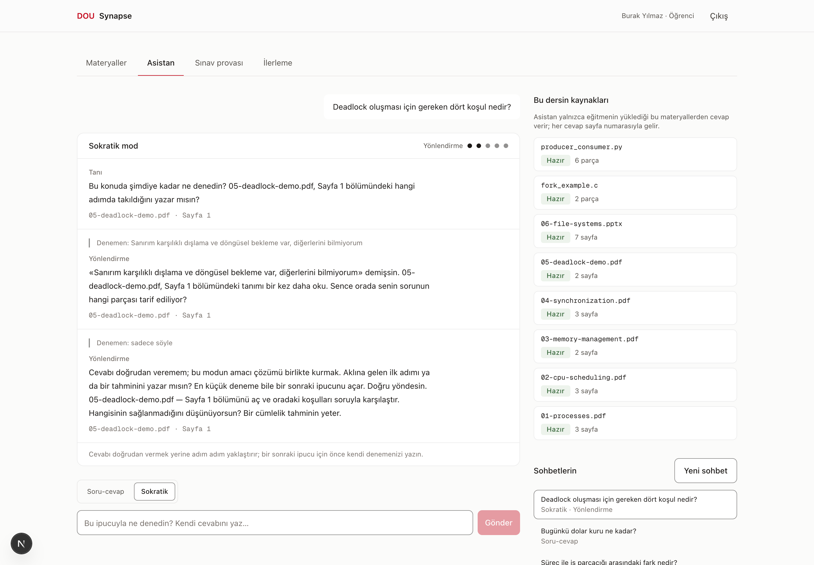
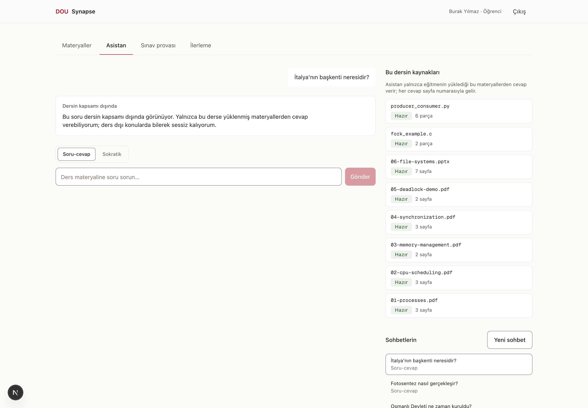
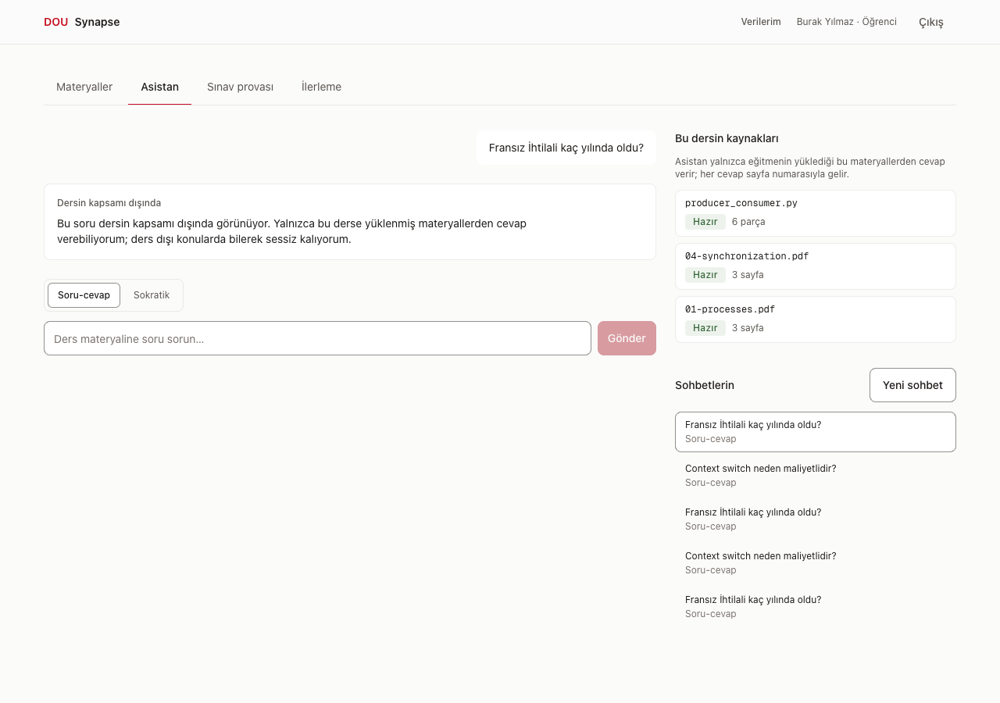
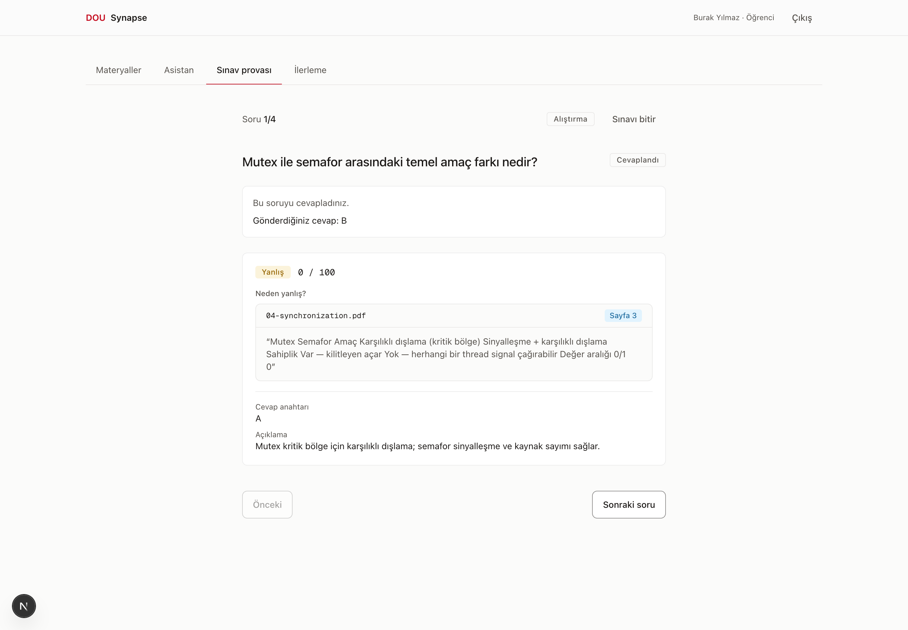
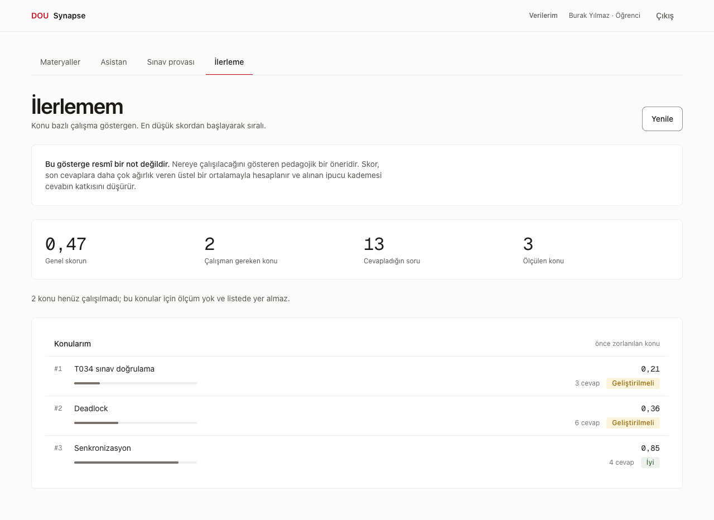

# Öğrenci Kılavuzu

DOU-Synapse, hocanın derse yüklediği materyallerden — **ve yalnız onlardan** — cevap veren
bir çalışma asistanıdır. Her cevabın altında hangi dosyanın hangi sayfasından geldiği yazar.

> Bu kılavuzdaki ekran görüntüleri gerçek sistemden alınmıştır ve beş şerit birleştikten
> sonra yeniden çekilmiştir; **hiçbiri örnek veri değildir.**

---

## 1. Giriş ve derse katılım


Üniversite hesabınızla girersiniz. Karşınıza **yalnız kayıtlı olduğunuz dersler** çıkar.



Dersi listede göremiyorsanız hocanız sizi henüz eklememiştir — sistemde kendinizi bir derse
ekleyemezsiniz.

---

## 2. Asistanla çalışma (Soru-cevap modu)

Ders → **Asistan**. İki mod var; üstteki düğmeden seçilir.

| Mod | Ne zaman |
|---|---|
| **Soru-cevap** | Bir şeyi öğrenmek/hatırlamak istediğinizde |
| **Sokratik** | Bir soruyu **kendiniz çözmek** istediğinizde (ödev, alıştırma) |

### Kaynaklı cevap nasıl görünür



Cevabın altında **kaynak kartları** var: dosya adı, sayfa/slayt numarası ve materyalden
birebir alıntı.

**Bu kartlar neden önemli:** sayfa numarasını model yazmıyor. Model yalnızca "hangi parçaya
dayandım" diyor; dosya adını ve sayfayı sistem o parçanın kaydından üretiyor. Yani
**kartta gördüğünüz sayfayı açtığınızda oradaki cümleyi bulursunuz.** Sınava çalışırken
cevabı okumakla yetinmeyin — kaynağa gidin.

Sağdaki **"Bu dersin kaynakları"** paneli asistanın erişebildiği her şeyi listeler. Orada
olmayan bir konuda cevap alamazsınız.

### Konuşmalarınız kayıtlı

Sağ alttaki **Sohbetlerin** listesinden eski konuşmalara dönebilirsiniz. **Yeni sohbet**
düğmesi temiz bir konuşma açar.

---

## 3. Sokratik mod — cevabı almazsınız, cevaba yürürsünüz

Ödev sorusu sorduğunuzda asistanın cevabı vermesini beklemeyin. Sokratik modda beş
kademeli bir merdiven vardır ve **her kademe sizin bir deneme yapmanızla açılır**:

```
Tanı → Yönlendirme → Kavram ipucu → Benzer örnek → Kaynakla açıklama
```

Sağ üstteki beş nokta hangi kademede olduğunuzu gösterir.

### Nasıl işliyor

**1. Soruyu sorarsınız** → asistan cevap vermez, **sizi tanır**:

> "Bu konuda şimdiye kadar ne denedin? 05-deadlock-demo.pdf, Sayfa 1 bölümündeki hangi
> adımda takıldığını yazar mısın?"



**2. Gerçekten denersiniz** → merdiven bir kademe ilerler ve ipucu kişiselleşir:

> "Sanırım karşılıklı dışlama ve döngüsel bekleme var, diğerlerini bilmiyorum"



**3. "Sadece söyle" derseniz** → merdiven **ilerlemez**:



> "Cevabı doğrudan veremem; bu modun amacı çözümü birlikte kurmak. Aklına gelen ilk adımı
> ya da bir tahminini yazar mısın? En küçük deneme bile bir sonraki ipucunu açar."

Israr etmek işe yaramaz — bu bir ton tercihi değil, sistemin kuralı. Ama **en küçük
deneme bile yeter**: yanlış bir tahmin de bir denemedir ve merdiveni ilerletir. Sistem
sizi doğru cevap verdiğiniz için değil, **denediğiniz için** ilerletir.

**İpucu:** takıldığınızda "hiçbir fikrim yok" yazmak yerine *"bence şununla ilgili ama
emin değilim"* yazın. İkincisi hem merdiveni açar hem daha isabetli bir ipucu getirir —
neyi yanlış anladığınızı görmeden verilen ipucu yönlendirme değil, tahmindir.

**Not:** Sokratik konuşma tek bir sorunun etrafında ilerler. Başka bir soruya geçmek için
**yeni sohbet** açın. Mod da bir sohbetin ortasında değiştirilemez.

---

## 4. Asistan "bilmiyorum" derse

Asistanın **iki farklı reddi** vardır ve ikisi farklı şey söyler.

**1. "Dersin kapsamı dışında"** — soru bu dersin konusu değil:



> "Bu soru dersin kapsamı dışında görünüyor. Yalnızca bu derse yüklenmiş materyallerden
> cevap verebiliyorum; ders dışı konularda bilerek sessiz kalıyorum."

**2. "Materyalde dayanak bulunamadı"** — konu dersle ilgili olabilir ama materyalde
yeterli dayanak yok:



> "Bu soruya ders materyalinde yeterli dayanak bulamadım, bu yüzden cevap vermiyorum..."

**İkisi de hata değildir.** Asistan yeterince güçlü bir dayanak bulamadığında cevap
üretmeyi reddeder — çünkü üretseydi uydurma riski olurdu ve siz onu ders bilgisi
sanardınız. Ayrım işinize yarar: birincisinde soruyu başka yere sorun, ikincisinde
soruyu düzeltmeyi deneyin.

| Sebep | Ne yapmalı |
|---|---|
| "Dersin kapsamı dışında" | Doğru davranış. Genel bir arama motoruna sorun |
| Soru çok genel ("her şeyi anlat") | Somutlaştırın: kavram adı ya da haftanın konusunu ekleyin |
| Konu materyalde yok | Hocanıza söyleyin — ilgili materyal yüklenmemiş olabilir |
| Yazım hatası / çok kısa soru | Soruyu tam cümleyle yeniden yazın |

**En işe yarayan düzeltme:** konunun adını sorunun içine koymak.
"Bu nasıl oluyor?" yerine *"Semafor ile mutex arasındaki fark nedir?"*

---

## 5. Sınav provası



- Sınav yalnız **hocanın onayladığı** sorulardan oluşur. Onaylanmış soru yoksa sistem
  *"Bu derste henüz onaylanmış soru yok"* der.
- **Prova modunda ipucu isteyebilirsiniz.** İpucu size sorunun dayandığı bölümü gösterir
  (dosya + sayfa). Aldığınız ipucu kademesi puanınızı düşürür — bu bilinçlidir; ipuçsuz
  çözmek daha değerlidir.
- **Gerçek sınav modunda ipucu tamamen kapalıdır** ve geri bildirim sınav bitince gelir.

### "Neden yanlış?"

Yanlış cevapladığınızda sistem yalnız "yanlış" demez; **seçtiğiniz şıkkın hangi cümleyle
çeliştiğini** gösterir — dosya adı, sayfa ve materyalden alıntıyla.

Ölçülen bir örnek: "Mutex ile semafor arasındaki temel amaç farkı nedir?" sorusunda yanlış
şık işaretlendiğinde sistem `04-synchronization.pdf · Sayfa 3`'ü ve o sayfadaki
karşılaştırma tablosunu gösterdi.

Bu eşleme modelden gelmez; her çeldirici, soru üretilirken hangi parçaya karşı yazıldıysa
ona bağlıdır. **Yanlış cevabınız size doğrudan çalışılacak sayfayı verir** — sınav
provasının en değerli tarafı budur.

---

## 6. İlerlemem



Konu bazlı bir puan ve seviye görürsünüz:

| Seviye | Puan |
|---|---|
| Geliştirilmeli | < 0,40 |
| Orta | 0,40 – 0,74 |
| İyi | ≥ 0,75 |

Puan, son cevaplarınıza daha çok ağırlık verir: eski bir hatanın etkisi zamanla azalır,
son performansınız öne çıkar. Aldığınız ipuçları puanı düşürür.

**Bu bir not değildir.** Resmî değerlendirme hocanızındır; buradaki puan yalnız
*"hangi konuya çalışmalıyım"* sorusunun cevabıdır. Yanında **kaç cevaba dayandığı** yazar
— 3 cevaba dayanan bir "Geliştirilmeli" sizin hakkınızda pek bir şey söylemez.

---

## 7. Asistan ne yapmaz

- **İnternetten bilgi getirmez.** Yalnız hocanızın yüklediği materyali bilir.
- **Başka dersin materyaline bakamaz.** Kayıtlı olmadığınız bir dersin içeriğine
  erişemezsiniz; o dersin varlığını bile göremezsiniz.
- **Kaynaksız cevap göstermez.** Kaynağını gösteremediği bir cevabı hiç göstermez.
- **Ödevinizi çözmez.** Sokratik modda ısrar cevabı getirmez.
- **Sınav sırasında yardım etmez.** Gerçek sınav modunda ipucu kapalıdır.
- **Not vermez.** İlerleme ekranı bir çalışma göstergesidir.
- **Bilmediğinde uydurmaz.** "Dayanak bulamadım" demesi sistemin çalıştığının işaretidir.
- **Hocanız sorularınızı okuyamaz.** Sohbet mesajlarınız eğitmene kapalıdır; hoca yalnız
  sınıf düzeyinde sayısal özet görür, kimin ne sorduğunu göremez.
  Ayrıntı: [KVKK Aydınlatma Metni](kvkk.md).

---

## 8. Sık karşılaşılanlar

| Durum | Ne yapmalı |
|---|---|
| "Çok sık soru gönderiyorsun" | Dakikada 20 istek sınırı var; bir dakika bekleyin |
| Sokratik modda ilerlemiyorum | Bir deneme yazın — yanlış olması sorun değil |
| Modu değiştiremiyorum | Mod sohbet ortasında değişmez; yeni sohbet açın |
| Cevap geldi ama kaynak yok | Bu olmamalı; hocanıza bildirin |
| Ders listemde ders yok | Hocanız sizi eklememiş |
| İlk soru çok yavaş geldi | İlk soruda model belleğe yükleniyor (~12 sn), sonrakiler saniyenin altında |

---

## İlgili belgeler

- [Eğitmen Kılavuzu](instructor-guide.md)
- [KVKK Aydınlatma Metni](kvkk.md)
