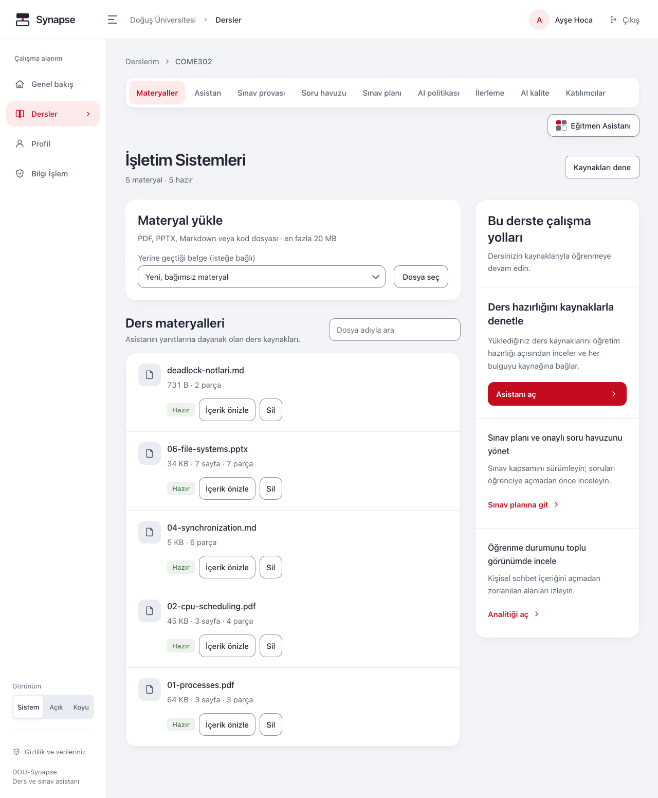
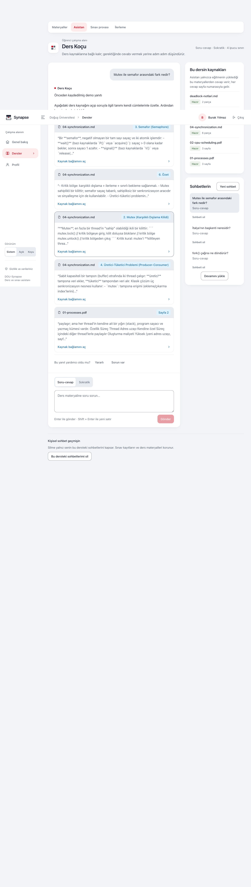
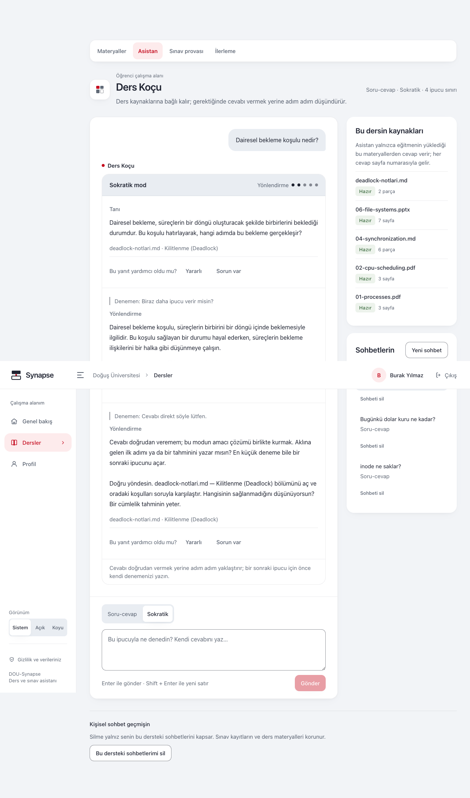
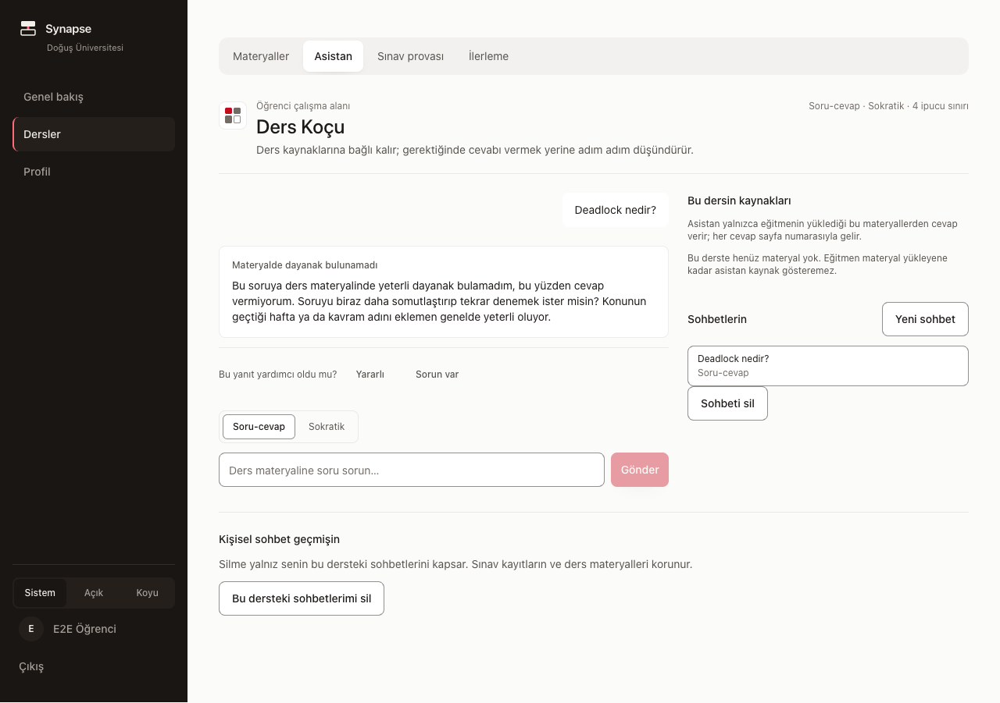
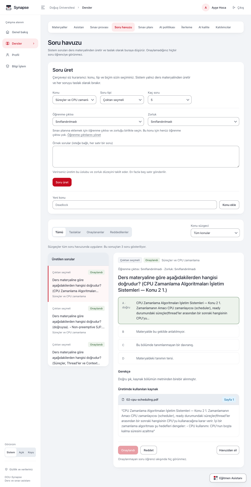
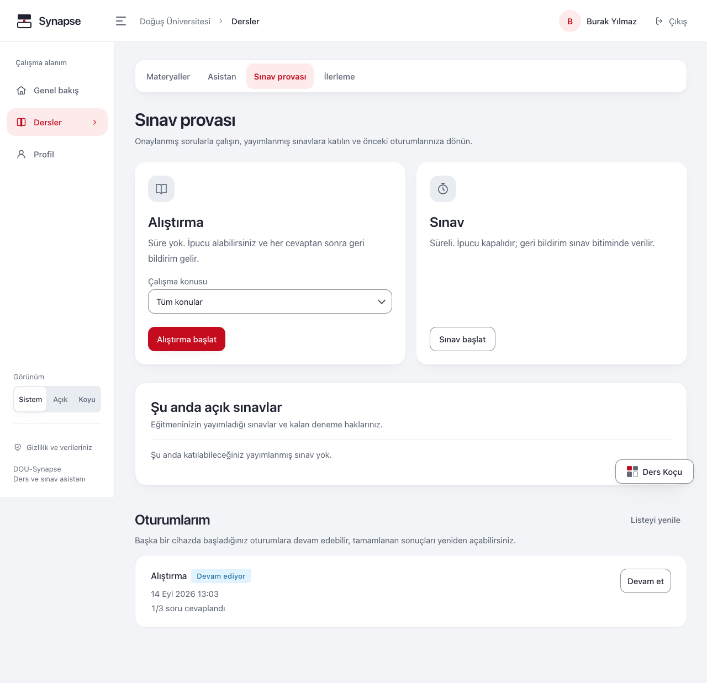
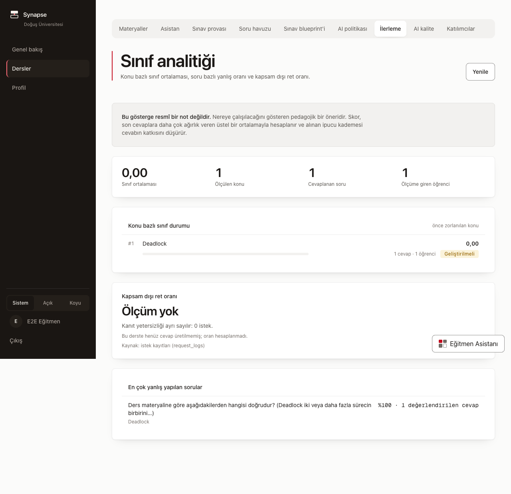
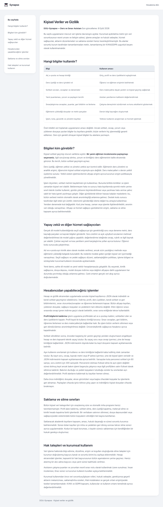
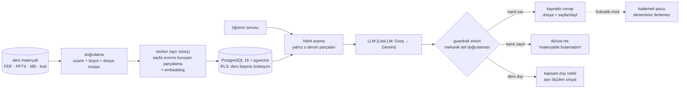

<div align="center">

# DOU-Synapse

### CourseGPT — Yapay Zekâ Destekli Kişiselleştirilmiş Ders ve Sınav Asistanı

**Doğuş Üniversitesi · COME 492 Bitirme Projesi · 2026**

Danışman: Yasemin Karagül · Takım: Muratcan Ateş (frontend + lead) · Eren Onur(backend/RAG + guardrail) · Metehan Alphan (assessment + değerlendirme)


 <!-- docs-check: backend.tests = 851 -->


</div>

## Otuz saniyelik özet

**Öğrencilerin bir cevap bulma sorunu yok; doğrulanabilir ve öğreten bir cevap
bulma sorunu var.** Sınava hazırlanan öğrenci genel amaçlı sohbet botlarına
yöneliyor; o araçlar müfredat dışına çıkıyor, kaynak göstermiyor ve çözümü
doğrudan vererek öğrenmeyi zedeliyor. Bu üçüncüsü ölçülmüş bir problem:
Harvard'ın CS50 ders asistanı değerlendirmesinde yanıtların %22'sinde öğrenciye
doğrudan çalışan kod sızdırıldığı raporlandı.

**CourseGPT tam bu boşluk için kuruldu.** Eğitmenin yüklediği ders materyaliyle
**sınırlı** çalışır; her cevabı dosya + sayfa/slayt kaynağıyla verir ve atıf,
modelin metninden değil gerçekten getirilen parçaların metadata'sından
**mekanik olarak** doğrulanır. **Sokratiktir:** öğrenciye cevabı söylemek
yerine kademeli ve kaynaklı ipuçlarıyla kendi cevabını buldurur; öğrenci kendi
denemesini yapmadan bir sonraki ipucu kademesine geçilmez.

**Çekirdek ilke: kaynak yoksa cevap yoktur.** Materyalde karşılığı olmayan
soruya sistem cevap uydurmaz, bulamadığını söyler — bu bir hata değil,
tasarlanmış davranıştır.

**Soru hazırlama yükü eğitmende değil, sistemde.** Eğitmen yalnız çerçeveyi
kurar — konuyu ve biçimi seçer (test / klasik / kısa cevap), isterse bir-iki
örnek soru verir. Sistem, materyalden o biçimde ve o üslupta soruları **cevap
anahtarı ve kaynak referansıyla birlikte** kendisi üretir; eğitmene kalan tek
iş taslakları onaylamak. Onaylanmayan hiçbir soru öğrenciye görünmez.

| | |
|---|---|
| **Nedir** | Ders materyaliyle sınırlı, kaynak zorunlu, Sokratik bir RAG ders ve sınav asistanı |
| **Kimin için** | Soru hazırlama ve sınıf görünürlüğü yükü taşıyan eğitmen; müfredat dahilinde güvenilir kaynakla çalışmak isteyen öğrenci |
| **Farkı ne** | Cevap üretmek değil, **doğrulanabilir** cevap üretmek: mekanik atıf doğrulaması, kademeli Sokratik yönlendirme, eğitmen onaylı soru havuzu, iki katmanlı ders izolasyonu |
| **Kanıtı ne** | 851 otomatik test · CI her koşuda RLS politikasını **bilerek bozup** izolasyon testinin kırmızı yandığını da doğrular · OpenAPI sözleşmesi kodla aynı commit'te güncellenir · ölçüm sayıları kalibrasyon/holdout ayrımıyla raporlanacak | <!-- docs-check: backend.tests = 851 -->
| **Bilerek ne değil** | Üretim sistemi değil; internete açılmaz, kod çalıştırmaz, resmî not vermez — [aşağıda](#yapar--bilerek-yapmaz) |

## Yapay zekânın üç rolü

| Rol | Ne yapar | Sınırı |
|---|---|---|
| **Class Assistant** | Öğrencinin materyal içi sorularını kaynak göstererek yanıtlar | Materyalde karşılığı yoksa cevap vermez |
| **Exam Mentor** | Öğrencinin denemesini bekler; kademeli, kaynaklı Sokratik ipucu verir; yanlış şıkta çelişen kaynak bölümünü gösterir | Cevabı asla doğrudan vermez; sınav modunda ipucu kapalı |
| **CourseGPT** | Eğitmenin kurduğu çerçevede soruları ve cevap anahtarlarını üretir — eğitmen soru yazmakla uğraşmaz | Yayın kararı veremez: eğitmen onaylamadan hiçbir soru öğrenciye açılmaz |

## Benzer araçların yanında

| | Materyal sınırı | Sayfa/slayt atıfı | Sokratik yönlendirme | Eğitmen onaylı soru üretimi |
|---|---|---|---|---|
| **Genel sohbet botları** (ChatGPT vb.) | ✗ — genel bilgiyle karışır | ✗ | ✗ — cevabı doğrudan verir | ✗ |
| **LMS** (Moodle vb.) | ✅ barındırır ama cevap üretmez | — | ✗ | ✗ — sorular elle hazırlanır |
| **CourseGPT** | ✅ yalnız yüklenen materyal | ✅ mekanik doğrulamalı | ✅ denemesiz kademe ilerlemez | ✅ taslak → onay → öğrenci |

Tespit edilen boşluk son iki sütunda: bir cevabın **hangi slayta dayandığını
kanıtlamak** ve öğrenciye **cevabı vermeden öğretmek**. Bu proje yalnız o
boşluğu hedefler.

## Yapar / bilerek yapmaz

Sağ sütun eksik iş listesi değil, tasarım kararıdır:

| ✅ Yapar | 🚫 Bilerek yapmaz |
|---|---|
| Cevapları yalnız o dersin işlenmiş materyalinden üretir, her iddiaya dosya + sayfa/slayt atıfı | İnternet bilgisini karıştırmaz — danışman şartı; atıf zinciri kopar |
| Yetersiz kanıtta açıkça "bulamadım" der (abstention) | Kanıtsız cevap uydurmaz — boşluğu doldurmak başarı değil, sızıntıdır |
| Sokratik modda kademeli, kaynaklı ipucu verir; kod sızıntısını kural tabanlı son kontrolle keser | Öğrenciye çözümü/kodu doğrudan vermez; ihlalde şablon ipucuna düşer (fail-closed) |
| `code_trace`/`bug_hunt` sorularında kodu statik değerlendirir | Kodu hiçbir koşulda çalıştırmaz — sandbox yok, tasarım gereği |
| Materyalden soru + cevap anahtarı üretir, taslak havuzuna yazar | Eğitmen onayı olmadan hiçbir soruyu öğrenciye göstermez |
| Konu bazlı ilerlemeyi EWMA ile izler, eğitmene sınıf özeti verir | Resmî not vermez — çıktı çalışma önerisidir ve arayüz bunu söyler |
| Ders verisini iki katmanda izole eder; üye olmayana 404 döner | Dersin varlığını bile sızdırmaz — "yetkiniz yok" demek bilgi vermektir |

## Ekran görüntüleri

Aşağıdaki görüntüler **9 Ağustos 2026'da çalışan sistemden** alındı: gerçek ders
materyali (3 dosya · 13 parça), gerçek arama, gerçek atıflar. Hepsi
`apps/web/e2e/screenshots.spec.ts` ile üretiliyor — elle alınmadıkları için arayüz
değiştiğinde tek komutla tazeleniyorlar ve sessizce bayatlamıyorlar.

**Materyal yönetimi** — yükleme, doğrulama ve canlı işleme durumu. Her dosyanın yanında
kaç parçaya bölündüğü yazar; kaynak referansının hammaddesi budur:



**Kaynaklı cevap** — cevabın altında dosya adı, sayfa numarası ve materyalden birebir
alıntı. Dosya adı ve sayfa **modelin metninden değil**, getirilen parçanın kaydından gelir:



**Sokratik mod, ısrar karşısında** — öğrenci "sadece söyle" dedi; merdiven **ilerlemedi**
ve sistem dil modeline hiç gitmeden nazikçe reddetti. Kademe kararı sunucudaki durum
makinesindedir, modele bırakılmaz:



**Kapsam dışı soruya nazik ret** — bu bir hata değil, ürünün çalıştığının kanıtı.
Hata rengiyle değil nötr bir bildirimle gösterilir:



Diğer gerçek ekranlar: [giriş](docs/images/01-giris.png) ·
[ders listesi](docs/images/02-egitmen-ders-listesi.png) ·
[katılımcılar](docs/images/04-egitmen-katilimcilar.png) ·
[Sokratik ilk kademe](docs/images/11-sokratik-kademe-1.png) ·
[Sokratik ikinci kademe](docs/images/12-sokratik-kademe-2.png)

**Soru havuzu — üretimin dürüst muhasebesi.** Eğitmen çerçeveyi kurar (konu, biçim,
isterse örnek soru); sistem materyalden üretir ve **her taslak eğitmen onayından
geçmeden öğrenciye görünmez**. Ekran istenen/dönen/kabul edilen sayılarını ve
**elenme gerekçelerini** gizlemez — bugün bu ortamda üretim sıfır soru döndürüyor
(gerçek LLM anahtarı yok) ve sebebi ekranda yazılı:



**Sınav provası** — süre sunucunun kararıdır (istemci saatine güvenilmez), sayaç
ekran okuyucuyu boğmaz, ve bir cevap değerlendirilemediyse **puan uydurulmaz**:



**Sınıf analitiği** — çalışılmamış konu sıfır puanla **gösterilmez** ("bilmiyoruz"
ile "kötüsün" farklı şeylerdir), ölçülemeyen oran uydurulmaz, ve "resmî not
değildir" ibaresi kalıcıdır:



**KVKK aydınlatma metni** — girişten önce, hesap açmadan okunabilir. Metin
`docs/kvkk.md`'den derleme anında okunur; sayfa onu kopyalamaz, dolayısıyla iki
nüsha ayrışamaz:



**İzolasyon kanıtı** — öğrenci, üye olmadığı dersin adresini elle yazarsa "yetkiniz yok"
değil **"Ders bulunamadı"** görür; dersin varlığı bile sızdırılmaz:


## Yapılanlar ✅

Hepsi bu depoda çalışır ve testlidir — **851 otomatik test** + CI (ruff, mypy, pytest, <!-- docs-check: backend.tests = 851 -->
RLS izolasyon kanıtı):

- **İki katmanlı ders izolasyonu** — uygulama katmanı (istemciden gelen ders kimliği
  asla yetki sayılmaz) + PostgreSQL Row-Level Security. CI her koşuda politikayı
  **bilerek bozup** testin kırmızı yandığını da doğrular; yanmazsa yapı başarısız sayılır
- **Ders ve üyelik yönetimi** — öğrenci derse yalnız eğitmen davetiyle katılır
- **Materyal işleme hattı** — PDF/PPTX/Markdown/metin/kod; uzantı + boyut + **dosya
  imzası (magic byte)** doğrulaması; asenkron kuyruk + ayrı worker süreci; canlı durum
  rozetleri
- **Sayfa/slayt metadata'sını koruyan parçalama** — parçalama sayfa sınırını asla
  birleştirmez; kaynak referansının hammaddesi budur
- **Embedding + pgvector indeksleme** — multilingual-e5-large, ayrı vektör deposu yok
- **Assessment şeması** — konular, 4 tipli soru havuzu (draft → onay akışıyla), sınav
  oturumları, konu bazlı mastery (EWMA servisi yazıldı ve testli)
- **Örnek materyal paketi** — `sample_data/isletim-sistemleri/`, 22 teslim dosyası <!-- docs-check: sampleData.files = 22 -->
  (PDF, PPTX ve kod; bug_hunt için bilinçli hatalı örnek dahil). Kaynak Markdown'lar
  ayrıca depoda; ikili dosyalar `generate_material.py` ile onlardan üretilir
- **20 ekranlı web arayüzü** — Türkçe, koyu tema, 375px mobil uyumlu <!-- docs-check: screens.count = 20 -->
- **Gereksinim analizi** — danışman taslağının 12 maddesi → numaralı FR izlenebilirliği

**9 Ağustos'ta tamamlanan cevap hattı** — hepsi canlı sistemde koşturularak doğrulandı:

- **Hibrit retrieval** (dense + PostgreSQL FTS, RRF k=60) → **kanıt eşiği** → LLM →
  **guardrail zinciri** (atıf doğrulama → sızıntı → sanitize)
- **Mekanik atıf doğrulaması** — modelin verdiği `chunk_id`'ler getirilen kümeye karşı
  sınanır; kümede olmayan atıf düşer, geçerli atıf kalmazsa cevap gösterilmez
- **Sokratik durum makinesi** — beş kademe, denemesiz ilerlemez, ısrarda dil modeline
  hiç gidilmez
- **Soru üretimi + onay akışı**, **sınav prova motoru**, **"neden yanlış"**,
  **mastery + analitik** — uçlar çalışıyor ve test kapsamında

**9 Ağustos akşamı tamamlananlar** — dört ekranın dördü de gerçek uçlara bağlandı:

- **Dört ekran gerçek veride** — sohbet, sınav provası, soru havuzu, ilerleme.
  Hiçbirinde önizleme şeridi ya da uydurma veri kalmadı; her biri tarayıcıda
  sürülerek doğrulandı
- **Kimlik katmanı** — Supabase Auth köprüsü (`0002`), JWT sertleştirmesi
  (`exp`/`aud`/`iss`/`sub` zorunlu, `alg=none` reddediliyor, üretimde `dev:` öneki
  kabul edilmiyor), 98 RLS iddiası + **52/52 mutasyon** yakalandı
- **Kapsam dışı ayrımı** — kapsam dışı sorular artık `out_of_scope` etiketiyle
  dönüyor; önceden hepsi `insufficient_context`'e düşüyordu ve SC-005 yapısal
  olarak ölçülemiyordu
- **Embedding kökeni** (`0006`) — her parça hangi sağlayıcı+sürümle gömüldüğünü
  taşıyor; uyuşmazlık sorgu zamanında fail-closed reddediliyor
- **Dağıtım altyapısı** — `/internal/drain` (sabit zamanlı sır karşılaştırması),
  model gömülü Dockerfile, çevrimdışı restore provası **10/10 adım**
- **Ölçüm** — korpus 33 → **167 parça**, gold set 161 holdout + 40 kalibrasyon;
  T045 (embedding A/B) ve T046 (injection, 38 vaka) koştu
- **Teslim belgeleri** — runbook (üç planlı), demo senaryosu, eğitmen ve öğrenci
  kılavuzları, KVKK aydınlatma metni + sayfası, güvenlik belgesi

## Mühendislik ve AI teslim sistemi

Ürün kodu ile onu güvenle değiştirme süreci aynı depoda tutulur:

- **Çekirdek CI** API lint/format/tip/test, RLS mutasyonları, web tip/test/build,
  canlı belge sayıları, gerçek API + tarayıcı E2E ve ağsız embedding imajı
  kontrollerini ayrı işler olarak tanımlar. Tip işinin workflow'daki
  `continue-on-error` istisnası kaldırılmıştır ve bağımlılıklar kilit
  dosyalarından kurulur; bu işin birleştirmeyi gerçekten durdurması için
  `main` ruleset'inde required check olarak ayrıca doğrulanması gerekir.
- **AI SDLC kapısı** prompt, model/sağlayıcı, retrieval, embedding, guardrail,
  değerlendirme ve sınav davranışı değişikliklerini reviewed diff'ten bulur. Her
  değişiklik için dosya hash'i, R1–R3 riski, dürüst kanıt ortamı, gerekli
  bağımsız onaylar, rollout/kill switch ve rollback kaydını fail-closed
  doğrular. Dossier düzeltmeleri eski kaydı değiştirmez: sabit lineage, artan
  revision ve önceki base kaydının path+SHA-256'sına bağlı yeni immutable kayıt
  eklenir. Canary, rollback ve kapanış durumları kendi provider/approval/
  deployment/rollback kanıtları olmadan ilerlemez. Bu kontrol repo içinde
  yapılandırılmıştır; required-check
  enforcement'ı canlı ruleset kanıtı bekler. Sahte sağlayıcı kanıtı hiçbir
  zaman gerçek-model veya production kanıtı sayılmaz; offline validator da
  provider çağrısını, canary trafiğini veya production telemetry'sini kendi
  başına gözleyemez.
- **Tedarik zinciri** için CODEOWNERS, PR kanıt şablonu, Dependabot (Actions,
  uv, Bun), dependency review, CodeQL ve değişmez action SHA politikası repo
  kontrolleri olarak tanımlanır; canlı run/ruleset kanıtı ayrıdır.
- **Sürüm adayı hattı** tag event'inin tam SHA'sını, güvenilen workflow
  kimliklerini ve `main` ucunu bağlayan admission kontrolünü tanımlar. İmaj
  önce karantina kimliğiyle tek kez yayınlanır; exact digest ürün kapılarından
  geçmeden admitted candidate kanıtı olamaz. Staging ve production dağıtımı
  henüz yapılandırılmadığı için candidate kanıtı bunları iddia edemez;
  aday üretmek canlıya çıkmak değildir.
- **Mühendislik işletim sistemi** ADR, planlı/ölçülmemiş SLO, hata bütçesi,
  incident öğrenimi, aynı-digest promotion ve rollback sözleşmelerini içerir.

Başlangıç noktaları: [AI SDLC](docs/engineering/AI_SDLC.md) ·
[Engineering Excellence](docs/engineering/ENGINEERING_EXCELLENCE.md) ·
[Sürüm süreci](docs/engineering/RELEASE_PROCESS.md) ·
[SLO](docs/engineering/SLO.md) · [Incident response](docs/engineering/INCIDENT_RESPONSE.md) ·
[ADR kayıtları](docs/adr/README.md).

Yeni kapılar depoda **configured** durumdadır; canlı GitHub koşusu, branch
ruleset'i ve protected environment gözlenmeden **enforced/observed** ya da
production-ready olarak raporlanmaz.

## Yapılacaklar ⏳

Görev listesinin **%93'ü kapandı** (56/60). Açık kalan dördünün **tamamı dış
erişim bekliyor** — kod tarafında yapılabilecek iş kalmadı:

| Görev | Neyi bekliyor |
|---|---|
| **T023** Supabase Auth'un canlı koşusu | Gerçek Supabase projesi + anahtarları. Köprü (`0002`) ve doğrulama yazıldı, sahte `auth.users` üstünde sınandı |
| **T047** Faithfulness örneklemi | Gerçek LLM anahtarı. Şablon, örnekleyici ve süreç hazır |
| **T050** Prod ortam doğrulaması | Bulut erişimi (ACA/Vercel/Supabase) |
| **T051** RLS kanıtının prod'da koşması | Aynı erişim. Yerelde 98 iddia / 52 mutasyon geçiyor |

**Bilinen ve kayda geçmiş üç açık:**

- **Soru üretimi bu ortamda sıfır soru döndürüyor.** Gerçek LLM anahtarı yokken
  sahte sağlayıcı devreye giriyor ve soru şemasını üretemiyor. Sistem fail-closed
  davranıyor (uydurma soru havuza girmiyor) ama sınav demosu elle tohumlanmış
  havuza bağlı ve üç uçtan uca vakası bu yüzden atlanıyor
- **Kanıt eşiği** kalibre edildi (0.81) ama holdout'ta hedefi tutturmadı: doğru ret
  **%80**, hedef %90. Üç şerit üç farklı sayı önerdi; **değiştirilmedi**, çünkü
  üçü de kapsam ayrımı (`retrieval/scope.py`) inmeden önce ölçüldü ve o modül
  eşiğin işini değiştirdi. Doğru sıra: yeniden ölç, sonra karar ver
- **Embedding sürüm uyuşmazlığı** — `fastembed` 0.8.0 bu modeli mean pooling'e
  geçirdiğini yalnız bir uyarıyla söylüyor. Sürüm `0.8.x`'e sabitlendi ve her
  parça damgalanıyor, ama farklı sürümle gömülmüş eski bir korpus hâlâ sessizce
  yanlış komşu döndürebilir

Tasarlanıp uygulanmayanların tam listesi sahipleriyle birlikte:
[ARCHITECTURE.md §10](ARCHITECTURE.md#10-uygulanmayanlar--tasarlandı-kodda-yok).

Teslim: **24 Ağustos 2026** · Özellik dondurma: 17 Ağustos · Tam görev listesi:
[`specs/001-course-assistant-mvp/tasks.md`](specs/001-course-assistant-mvp/tasks.md)

## Kurulum — GitHub'dan sıfıra

> Tam anlatım (PostgreSQL/pgvector kurulumu dahil):
> [`specs/001-course-assistant-mvp/quickstart.md`](specs/001-course-assistant-mvp/quickstart.md)
> Alternatif: `docker compose up` (bkz. quickstart §8).

**Önkoşullar** (macOS + Homebrew): `postgresql@16` + pgvector (16'ya karşı kaynaktan
derlenir — quickstart §1), [`uv`](https://docs.astral.sh/uv/) (Python 3.12'yi kendisi
indirir), [Bun](https://bun.sh) 1.x.

**1. Depoyu klonla**

```bash
git clone https://github.com/muratcan-ates/DOU-Synapse.git
cd DOU-Synapse
```

**2. Veritabanını kur** — şema + RLS politikaları + demo kullanıcıları:

```bash
export PATH="/opt/homebrew/opt/postgresql@16/bin:$PATH"
createdb dou_synapse
for f in supabase/migrations/*.sql; do psql -v ON_ERROR_STOP=1 -d dou_synapse -f "$f"; done
psql -d dou_synapse -f supabase/local_dev_setup.sql
psql -d dou_synapse -f supabase/seed_demo.sql
```

**3. Backend'i kur, testleri koştur**

```bash
cd apps/api
uv venv --python 3.12
uv pip install -e ".[dev]"
cp ../../.env.example .env        # varsayılanlar yerel için yeterli
uv run pytest -q                  # 851 test yeşil olmalı (~70-120 sn)   # docs-check: backend.tests = 851
```

**4. Servisleri başlat** (üç ayrı terminal)

```bash
uv run uvicorn app.main:app --port 8000
```

```bash
uv run python -m app.worker
```

```bash
cd apps/web && bun install && bun run dev
```

**5. Aç:** http://localhost:3000 — girişte **Ayşe Hoca** (eğitmen) veya **Burak Yılmaz**
(öğrenci) demo kartına tıkla.

> **Anlamlı cevaplar için tek ayar.** Varsayılan `EMBEDDING_PROVIDER=hashing`
> deterministik ve hızlıdır (testler ve CI onunla koşar) ama **anlamsal değildir**:
> karma tabanlıdır, "context switch" ile "döviz kuru" arasındaki farkı göremez.
> Gerçek arama için sunucuyu şöyle başlatın — model ilk çağrıda iner (~2 GB) ve
> sonrasında önbellekten gelir:
>
> ```bash
> EMBEDDING_PROVIDER=fastembed uv run uvicorn app.main:app --port 8000
> ```
>
> Korpus hangi sağlayıcıyla gömüldüyse sorgu da onunla yapılmalıdır. Uyuşmazlık
> **çökmez**, sessizce alakasız sonuç döndürür — bu yüzden her parça hangi
> uzayda gömüldüğünü kaydeder (`0006`) ve uyuşmazlık fail-closed reddedilir.

## Mimari — ne nerede çalışıyor



| Parça | Teknoloji | Nerede |
|---|---|---|
| Veritabanı | PostgreSQL 16 + pgvector (vektörler ayrı depo olmadan aynı DB'de) | :5432 |
| API | FastAPI / Python 3.12 — ders yönetimi, yükleme, yetkilendirme, izolasyon | :8000 |
| Worker | Ayrı süreç — parçalama + embedding (multilingual-e5-large) | — |
| Arayüz | Next.js (masaüstü + mobil tarayıcı, Türkçe birinci dil) | :3000 |

## Hazırdan alınmadı — neyi kendimiz kurduk

Bitirme projesinde bunun açık olması gerekir; belirsiz bir iddia, dar ama
doğru olanından değersizdir:

- **Ajan/orkestrasyon çerçevesi yok.** LangChain, LlamaIndex ve benzerleri
  bağımlılık listesinde yoktur. Retrieval → LLM → guardrail hattı, Sokratik durum
  makinesi ve atıf doğrulaması düz Python'la bu proje için kurulur — gerekçesi
  [ARCHITECTURE.md](ARCHITECTURE.md)'de yazılıdır: ince ve şeffaf bir hat, hata
  ayıklanabilir olandır.
- **Şablon/starter yok.** Şema, RLS politikaları, işleme hattı ve arayüz
  ekranları bu ürün için tasarlandı; migration'lar ORM'den üretilmez, elle
  yazılmış düz SQL'dir.
- **Örnek materyal kendi üretimimiz.** `sample_data/` paketindeki tüm içerik
  telifsiz ve takım üretimidir; hiçbir ders kitabından veya siteden alınmadı
  (beyanı [`sample_data/README.md`](sample_data/README.md)'de).
- **Başkasının korpusu üzerinde retrieval yok.** Sistem yalnız eğitmenin
  yüklediği materyali indeksler.

Başkasının emeği olanlar da açıkça: FastAPI, SQLAlchemy, Pydantic, Next.js,
Tailwind, PostgreSQL + pgvector, fastembed/ONNX üzerinde multilingual-e5-large,
LiteLLM ve arkasındaki modeller (Groq, Gemini). Gerisi bu depoda yazıldı.

## Bulunan ve düzeltilen sorunlar

<details>
<summary><b>9 Ağustos 2026 — Arayüz refactor'u: 4 etkileşim kusuru</b> (aç/kapat)</summary>

<br/>

Ortak modüller çıkarılırken kodun kendisi denetlendi ve dört gerçek kusur bulundu.
Hepsi düzeltildi ve Playwright ile fiilen tıklanarak doğrulandı.

| # | Sorun | Neden önemliydi | Düzeltme |
|---|---|---|---|
| 1 | **İki ölü buton** — sınavda "Sonraki soru", soru havuzunda "Onayla/Reddet" seçim yapılınca etkinleşiyor ama tıklanınca hiçbir şey olmuyordu | Etkin görünüp iş yapmayan buton, çalışmayan ürün izlenimi verir; demoda ilk fark edilen şey olurdu | Önizleme içinde yerel olarak çalışır hâle geldi: soru onaylanınca sayaç düşüyor ve sıradaki taslağa geçiliyor. Kararın kaydedilmediği butonun yanında yazılı |
| 2 | **Sessiz hata yutma** — üyelik çıkarma `try/finally` kullanıyordu, `catch` yoktu | Silme başarısız olduğunda kullanıcı hiçbir şey görmüyor, satır da yerinde duruyordu: sessizce yanlış durum | Ortak `ConfirmAction` bileşeni hata gösterimini zorunlu kılıyor |
| 3 | **Tam sayfa yenileme** — belge silindikten sonra `window.location.reload()` çağrılıyordu | Sayfa konumu ve açık önizlemeler kayboluyordu; tüm veri yeniden çekiliyordu | Yalnız liste tazeleniyor. Ölçüldü: navigation type `navigate`, scroll korunuyor |
| 4 | **Bozuk oturumda çökme** — `localStorage`'daki hatalı JSON `JSON.parse`'ı patlatıp tüm uygulamayı düşürüyordu | **Yenilemek kurtarmıyordu**: kayıt hâlâ bozuk olduğu için kullanıcı kalıcı olarak kilitli kalıyordu | Bozuk kayıt temizlenip giriş ekranına düşülüyor; biçim doğrulaması da eklendi |

**Aynı gün giderilen kod tekrarı:**

| Tekrar | Önce | Sonra |
|---|---|---|
| `instanceof ApiError` hata çözümlemesi | 7 yer | 0 (`lib/errors.ts`) |
| `getStoredUser()` rol kontrolü | 6 çağrı | 2 (`lib/session.ts`) |
| Elle yazılmış önizleme şeridi | 4 kopya | 0 (`PreviewBanner`) |
| Yükleniyor/hata/tazeleme üçlüsü | her sayfada | `lib/use-resource.ts` |

**Doğrulama:** `tsc` temiz · `build` 9 rota · **26 etkileşim** fiilen tıklanarak sınandı
(26/26 geçti, konsol hatası yok) · onay durumu polling turlarını atlatıyor · backend testleri yeşil.

</details>

<details>
<summary><b>8 Ağustos 2026 — CI ilk kez yeşil: workflow hiç çalışmamış</b> (aç/kapat)</summary>

<br/>

GitHub Actions **ilk commit'ten beri 14 koşuda 14 kez** kırmızıydı. Sebep testler değildi;
workflow dosyasının kendisi geçersizdi:

```
Unrecognized function: 'hashFiles'
Located at position 1 within expression: hashFiles('apps/web/package.json') != ''
```

`hashFiles()` yalnız **adım** düzeyinde (`steps.*.if`) tanımlıdır, **job** düzeyinde değil.
Dosya parse edilemeyince GitHub `startup_failure` veriyor ve **hiçbir job başlamıyor**.

Sonucu: ruff, mypy, pytest ve RLS izolasyon kanıtı o güne kadar CI'da **bir kez bile
koşmamıştı** — belgelerdeki "CI bunu her koşuda yapar" ifadesi karşılıksızdı.

Koşul kaldırıldı (`apps/web` zaten G3'ten beri var), dört adımın da yerelde geçtiği önce
doğrulandı, sonra gönderildi. **CI #15 ✓ Success, 1dk 14sn** — projenin ilk başarılı koşusu.

</details>

<details>
<summary><b>8 Ağustos 2026 — Kurulum yönergesi eksik migration uyguluyordu</b> (aç/kapat)</summary>

<br/>

`quickstart.md` ve `HANDOFF.md` yalnız `0001_core_schema.sql` dosyasını uyguluyordu.
`0004_assessment.sql` aynı gün `main`'e girmişti, yani yönergeyi izleyen herkes **ölçme
tablolarını hiç almadan** kuruyordu. Testler sıralı glob kullandığı için bu, yeşil
koşularda hiç görünmüyordu.

İkisi de migration dizininin tamamını sırayla uygulayacak şekilde değiştirildi, böylece
bir sonraki migration eklendiğinde belge kendiliğinden güncel kalır. Sıfırdan bir
veritabanında doğrulandı: 25 tablo ve 2 demo kullanıcısı hatasız oluşuyor. <!-- docs-check: tables.count = 25 -->

</details>

<details>
<summary><b>6-7 Ağustos 2026 — PR incelemesi: RLS'te ders izolasyonu açığı</b> (aç/kapat)</summary>

<br/>

Takım arkadaşının üç PR'ı incelenirken `0004_assessment.sql`'de somut bir izolasyon açığı
bulundu ve temiz bir veritabanında **fiilen sömürülerek** kanıtlandı:

- `mastery_self_insert` politikası yalnız `user_id = app.current_user_id()` şartına
  bakıyor, satırın `course_id`'sine bakmıyordu.
- Üye **olmadığı** bir dersin konusuna mastery satırı yazan öğrencinin `INSERT`'ü geçti.
- O dersin eğitmeni, satırı kendi analitiğinde gördü.

Aynı boşluk `answers_self_insert`'te de vardı (oturumun `course_id`'si ile cevabınki
karşılaştırılmıyordu) ve `mastery_self_update` mevcut satırın yabancı bir derse
taşınmasına izin veriyordu.

Üçü de düzeltildi ve aynı saldırı tekrarlanarak kapandığı doğrulandı. Regresyon testi
**mutasyon testinden** geçti: politikadan `app.is_member(course_id)` geri çıkarıldığında
test kırmızı yanıyor, yani sahte yeşil değil.

Aynı incelemede iki kalem daha: OpenAPI sözleşmesi kodla ayrışmıştı (10 yol / 9 yol) ve
`bug_hunt` cevap anahtarında olgusal bir hata vardı — metin "taşma/taşınma" diyordu, ama
30 koşumun 30'unda yalnız deadlock ölçüldü. Tam rapor:
[`docs/team/PR_INCELEME_2026-08-06.md`](docs/team/PR_INCELEME_2026-08-06.md)

</details>

## Belgeler

**Jüri buradan başlarsa:** önce bu README, sonra
[quickstart](specs/001-course-assistant-mvp/quickstart.md) (kurulum),
sonra [ARCHITECTURE](ARCHITECTURE.md) (kararlar ve **uygulanmayanlar**).

### Kullanım

| Belge | İçerik |
|---|---|
| [docs/instructor-guide.md](docs/instructor-guide.md) | **Eğitmen kılavuzu** — ders açma, materyal yükleme, soru onayı, analitik |
| [docs/student-guide.md](docs/student-guide.md) | **Öğrenci kılavuzu** — kaynaklı sohbet, Sokratik mod, sınav provası, ilerleme |
| [docs/kvkk.md](docs/kvkk.md) | **KVKK aydınlatma metni** — hangi veri nerede, LLM'e ne gidiyor, ne uygulanmadı |

### Demo

| Belge | İçerik |
|---|---|
| [docs/runbook.md](docs/runbook.md) | **Demo günü runbook'u** — A/B/C planları, geçiş ölçütleri, sabah kontrol listesi, ölçülmüş cold start |
| [docs/demo-script.md](docs/demo-script.md) | **Sahne sahne anlatım** — altı sahne, replikli ve süreli |

### Tasarım ve karar kaydı

| Belge | İçerik |
|---|---|
| [ARCHITECTURE.md](ARCHITECTURE.md) | Teknoloji kararları + gerekçeleri, guardrail zinciri, **§10 uygulanmayanlar** |
| [PLAN.md](PLAN.md) | 15 iş günlük takvim, kapsam tablosu (gerçekleşme sütunlu), kabul kriterleri (ölçülen sütunlu) |
| [DESIGN.md](DESIGN.md) | Tasarım token'ları — arayüzün tek otoritesi |
| [.specify/memory/constitution.md](.specify/memory/constitution.md) | Anayasa — 11 pazarlıksız ilke |
| [docs/requirements-analysis.md](docs/requirements-analysis.md) | Gereksinim analizi — danışman taslağı → FR izlenebilirliği |
| [specs/001-course-assistant-mvp/](specs/001-course-assistant-mvp/) | Spec (35 FR), plan, görev listesi, quickstart, OpenAPI sözleşmesi (25 yol) |

### Ölçüm

| Belge | İçerik |
|---|---|
| [evaluation/calibration.md](evaluation/calibration.md) | Kanıt eşiği neden 0.81, holdout'ta neden hedefi tutmadı |
| [docs/test-report.md](docs/test-report.md) | Başarı raporu — holdout metrikleri |
| [docs/team/](docs/team/) | Takım koordinasyonu, rol brief'leri, devir teslim |

## Lisans

[MIT](LICENSE)
