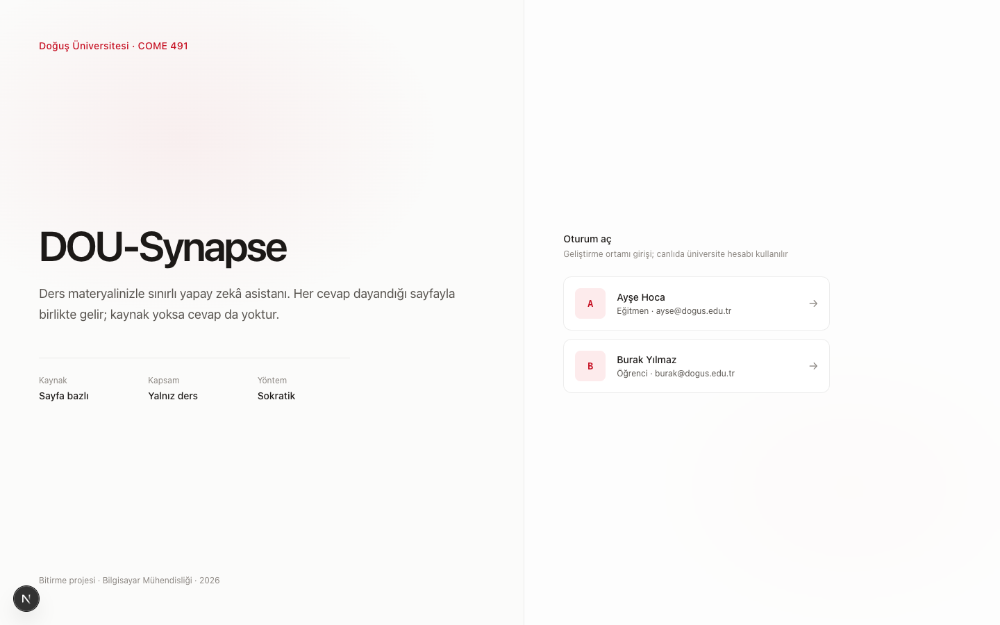
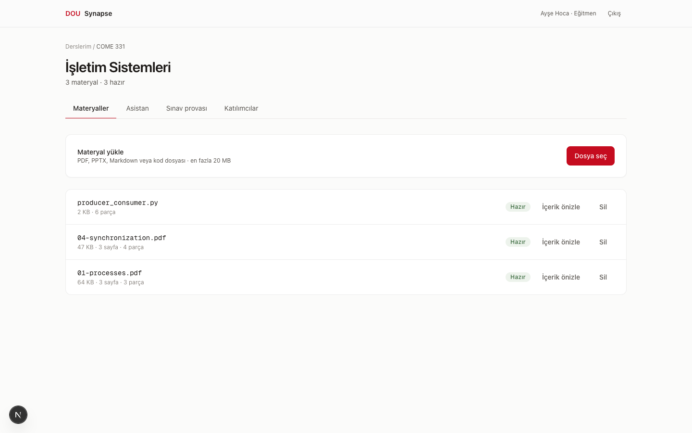
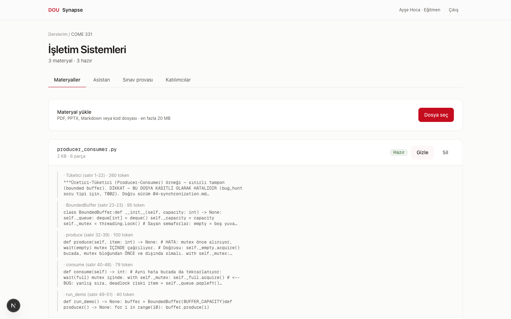
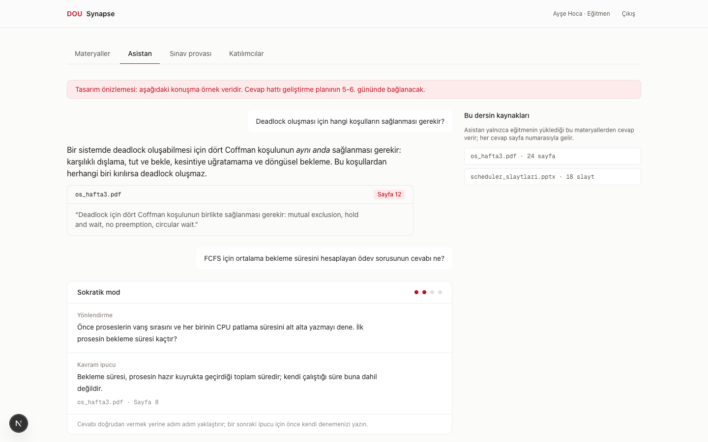
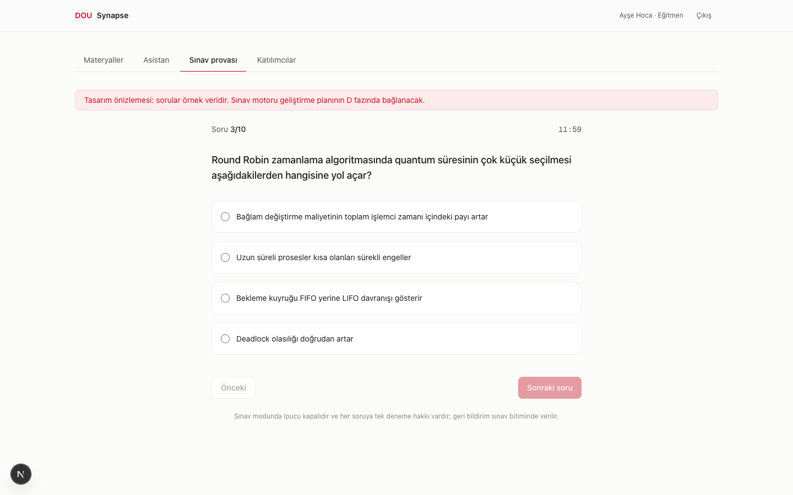
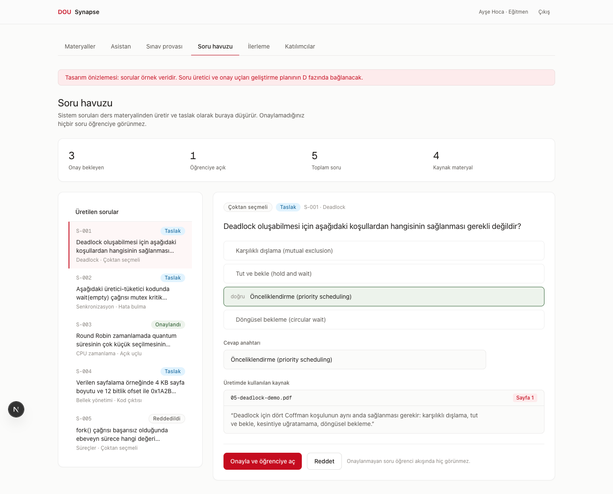
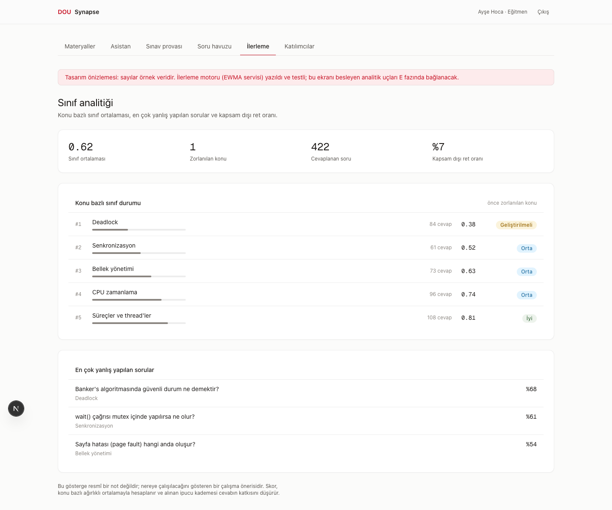
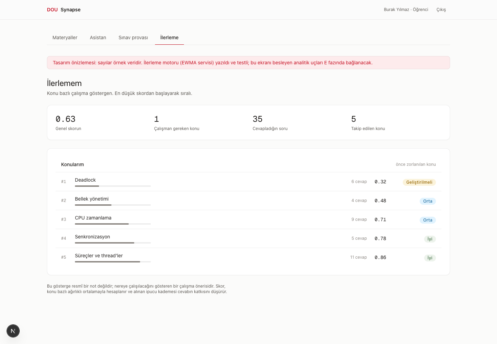
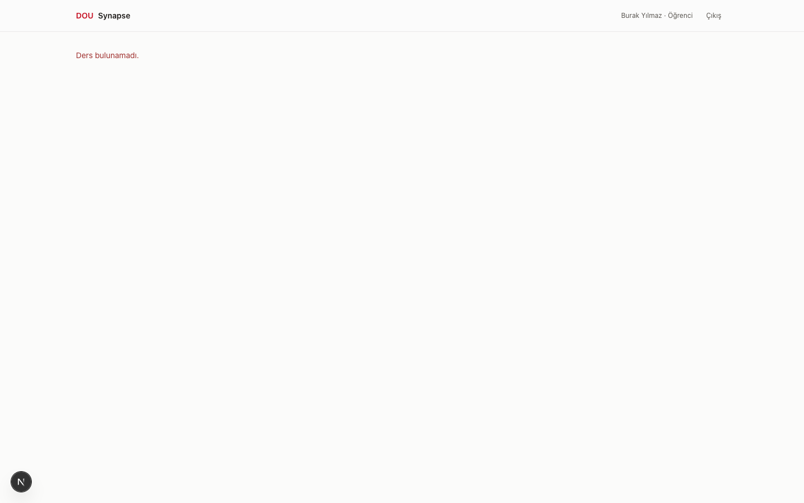
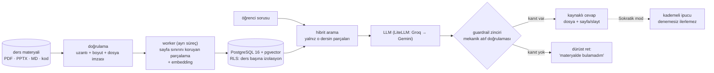

<div align="center">

# DOU-Synapse

### CourseGPT — Yapay Zekâ Destekli Kişiselleştirilmiş Ders ve Sınav Asistanı

**Doğuş Üniversitesi · COME 491/492 Bitirme Projesi · 2026**

Danışman: Yasemin Karagül · Takım: Muratcan Ateş (frontend + lead) · Eren (backend/RAG + guardrail) · Metehan Alphan (assessment + değerlendirme)


</div>

## Otuz saniyelik özet

**Öğrencilerin bir cevap bulma sorunu yok; doğrulanabilir ve öğreten bir cevap
bulma sorunu var.** Sınava hazırlanan öğrenci genel amaçlı sohbet botlarına
yöneliyor; o araçlar müfredat dışına çıkıyor, kaynak göstermiyor ve çözümü
doğrudan vererek öğrenmeyi zedeliyor. Bu üçüncüsü ölçülmüş bir problem:
Harvard'ın CS50 ders asistanı değerlendirmesinde yanıtların %22'sinde öğrenciye
doğrudan çalışan kod sızdırıldığı raporlandı.

**CourseGPT tam bu boşluk için kuruldu.** Eğitmenin yüklediği ders materyaliyle
**sınırlı** çalışır; her cevabı dosya + sayfa/slayt kaynağıyla verir ve atıf,
modelin metninden değil gerçekten getirilen parçaların metadata'sından
**mekanik olarak** doğrulanır. **Sokratiktir:** öğrenciye cevabı söylemek
yerine kademeli ve kaynaklı ipuçlarıyla kendi cevabını buldurur; öğrenci kendi
denemesini yapmadan bir sonraki ipucu kademesine geçilmez.

**Çekirdek ilke: kaynak yoksa cevap yoktur.** Materyalde karşılığı olmayan
soruya sistem cevap uydurmaz, bulamadığını söyler — bu bir hata değil,
tasarlanmış davranıştır.

**Soru hazırlama yükü eğitmende değil, sistemde.** Eğitmen yalnız çerçeveyi
kurar — konuyu ve biçimi seçer (test / klasik / kısa cevap), isterse bir-iki
örnek soru verir. Sistem, materyalden o biçimde ve o üslupta soruları **cevap
anahtarı ve kaynak referansıyla birlikte** kendisi üretir; eğitmene kalan tek
iş taslakları onaylamak. Onaylanmayan hiçbir soru öğrenciye görünmez.

| | |
|---|---|
| **Nedir** | Ders materyaliyle sınırlı, kaynak zorunlu, Sokratik bir RAG ders ve sınav asistanı |
| **Kimin için** | Soru hazırlama ve sınıf görünürlüğü yükü taşıyan eğitmen; müfredat dahilinde güvenilir kaynakla çalışmak isteyen öğrenci |
| **Farkı ne** | Cevap üretmek değil, **doğrulanabilir** cevap üretmek: mekanik atıf doğrulaması, kademeli Sokratik yönlendirme, eğitmen onaylı soru havuzu, iki katmanlı ders izolasyonu |
| **Kanıtı ne** | 92 otomatik test · CI her koşuda RLS politikasını **bilerek bozup** izolasyon testinin kırmızı yandığını da doğrular · OpenAPI sözleşmesi kodla aynı commit'te güncellenir · ölçüm sayıları kalibrasyon/holdout ayrımıyla raporlanacak |
| **Bilerek ne değil** | Üretim sistemi değil; internete açılmaz, kod çalıştırmaz, resmî not vermez — [aşağıda](#yapar--bilerek-yapmaz) |

## Yapay zekânın üç rolü

| Rol | Ne yapar | Sınırı |
|---|---|---|
| **Class Assistant** | Öğrencinin materyal içi sorularını kaynak göstererek yanıtlar | Materyalde karşılığı yoksa cevap vermez |
| **Exam Mentor** | Öğrencinin denemesini bekler; kademeli, kaynaklı Sokratik ipucu verir; yanlış şıkta çelişen kaynak bölümünü gösterir | Cevabı asla doğrudan vermez; sınav modunda ipucu kapalı |
| **CourseGPT** | Eğitmenin kurduğu çerçevede soruları ve cevap anahtarlarını üretir — eğitmen soru yazmakla uğraşmaz | Yayın kararı veremez: eğitmen onaylamadan hiçbir soru öğrenciye açılmaz |

## Benzer araçların yanında

| | Materyal sınırı | Sayfa/slayt atıfı | Sokratik yönlendirme | Eğitmen onaylı soru üretimi |
|---|---|---|---|---|
| **Genel sohbet botları** (ChatGPT vb.) | ✗ — genel bilgiyle karışır | ✗ | ✗ — cevabı doğrudan verir | ✗ |
| **LMS** (Moodle vb.) | ✅ barındırır ama cevap üretmez | — | ✗ | ✗ — sorular elle hazırlanır |
| **CourseGPT** | ✅ yalnız yüklenen materyal | ✅ mekanik doğrulamalı | ✅ denemesiz kademe ilerlemez | ✅ taslak → onay → öğrenci |

Tespit edilen boşluk son iki sütunda: bir cevabın **hangi slayta dayandığını
kanıtlamak** ve öğrenciye **cevabı vermeden öğretmek**. Bu proje yalnız o
boşluğu hedefler.

## Yapar / bilerek yapmaz

Sağ sütun eksik iş listesi değil, tasarım kararıdır:

| ✅ Yapar | 🚫 Bilerek yapmaz |
|---|---|
| Cevapları yalnız o dersin işlenmiş materyalinden üretir, her iddiaya dosya + sayfa/slayt atıfı | İnternet bilgisini karıştırmaz — danışman şartı; atıf zinciri kopar |
| Yetersiz kanıtta açıkça "bulamadım" der (abstention) | Kanıtsız cevap uydurmaz — boşluğu doldurmak başarı değil, sızıntıdır |
| Sokratik modda kademeli, kaynaklı ipucu verir; kod sızıntısını kural tabanlı son kontrolle keser | Öğrenciye çözümü/kodu doğrudan vermez; ihlalde şablon ipucuna düşer (fail-closed) |
| `code_trace`/`bug_hunt` sorularında kodu statik değerlendirir | Kodu hiçbir koşulda çalıştırmaz — sandbox yok, tasarım gereği |
| Materyalden soru + cevap anahtarı üretir, taslak havuzuna yazar | Eğitmen onayı olmadan hiçbir soruyu öğrenciye göstermez |
| Konu bazlı ilerlemeyi EWMA ile izler, eğitmene sınıf özeti verir | Resmî not vermez — çıktı çalışma önerisidir ve arayüz bunu söyler |
| Ders verisini iki katmanda izole eder; üye olmayana 404 döner | Dersin varlığını bile sızdırmaz — "yetkiniz yok" demek bilgi vermektir |

## Ekran görüntüleri

**Giriş** — geliştirme ortamı demo kartları (canlıda üniversite hesabı):



**Materyal yönetimi** — yükleme, doğrulama ve canlı işleme durumu:



**Parça önizleme** — her parçanın yanında geldiği sayfa/satır aralığı. Cevaplardaki
kaynak referansı buradan üretilir, modelin kendi metninden değil:



**Asistan + Sokratik mod** (tasarım önizlemesi — cevap hattı bağlanınca gerçek veriye
geçecek, şeritte açıkça belirtiliyor):



**Sınav provası** (tasarım önizlemesi):



**Soru havuzu ve eğitmen onayı** (tasarım önizlemesi) — sistem soruyu cevap anahtarı
ve kaynak parçasıyla üretir, eğitmen tek ekranda inceleyip onaylar. Onaylanmayan soru
öğrenci akışında hiç görünmez:



**Sınıf analitiği** (tasarım önizlemesi) — konu bazlı sınıf durumu en zorlanılandan
sıralı, en çok yanlış yapılan sorularla birlikte:



**Öğrenci ilerlemesi** (tasarım önizlemesi) — aynı ekran, öğrenci rolünde farklı soruya
cevap verir: "hangi konuya çalışmalıyım?" Skorun resmî not olmadığı ekranda yazılıdır:



**İzolasyon kanıtı** — öğrenci, üye olmadığı dersin adresini elle yazarsa "yetkiniz yok"
değil **"Ders bulunamadı"** görür; dersin varlığı bile sızdırılmaz:



Diğerleri: [ders listesi](docs/screenshots/02-ders-listesi.png) ·
[katılımcı yönetimi](docs/screenshots/07-katilimcilar.png)

## Yapılanlar ✅

Hepsi bu depoda çalışır ve testlidir — **92 otomatik test** + CI (ruff, mypy, pytest,
RLS izolasyon kanıtı):

- **İki katmanlı ders izolasyonu** — uygulama katmanı (istemciden gelen ders kimliği
  asla yetki sayılmaz) + PostgreSQL Row-Level Security. CI her koşuda politikayı
  **bilerek bozup** testin kırmızı yandığını da doğrular; yanmazsa yapı başarısız sayılır
- **Ders ve üyelik yönetimi** — öğrenci derse yalnız eğitmen davetiyle katılır
- **Materyal işleme hattı** — PDF/PPTX/Markdown/metin/kod; uzantı + boyut + **dosya
  imzası (magic byte)** doğrulaması; asenkron kuyruk + ayrı worker süreci; canlı durum
  rozetleri
- **Sayfa/slayt metadata'sını koruyan parçalama** — parçalama sayfa sınırını asla
  birleştirmez; kaynak referansının hammaddesi budur
- **Embedding + pgvector indeksleme** — multilingual-e5-large, ayrı vektör deposu yok
- **Assessment şeması** — konular, 4 tipli soru havuzu (draft → onay akışıyla), sınav
  oturumları, konu bazlı mastery (EWMA servisi yazıldı ve testli)
- **Örnek materyal paketi** — `sample_data/isletim-sistemleri/` (5 PDF + PPTX + 2 kod
  dosyası, bug_hunt için bilinçli hatalı örnek dahil)
- **8 ekranlı web arayüzü** — Türkçe, koyu tema, 375px mobil uyumlu
- **Gereksinim analizi** — danışman taslağının 12 maddesi → numaralı FR izlenebilirliği

## Yapılacaklar ⏳

Sıradaki iş **cevap üretim hattı** — hedef: 10 Ağustos uçtan uca dikey demo kapısı:

- **Retrieval → LLM → guardrail zinciri** — hibrit arama (dense + full-text, RRF),
  LiteLLM (Groq → Gemini otomatik yedekli), mekanik atıf doğrulaması
- **Sokratik motorun bağlanması** — kademeli durum makinesi backend'de, arayüzdeki
  tasarım önizlemesi gerçek veriye geçer
- **Soru üretimi uçları** — eğitmen çerçevesi (biçim + örnek soru) → taslak üretimi →
  onay/red akışı
- **Sınav prova motoru** — süreli oturum, tek deneme, "neden yanlış" analizi, açık uçlu
  rubrik değerlendirme
- **Mastery entegrasyonu + eğitmen analitiği** — konu bazlı sınıf özeti tek sayfada
- **Supabase Auth** — DEV kimlikleri üretimde yapılandırma düzeyinde zaten reddediliyor
- **Değerlendirme altyapısı** — ≥50 soruluk gold set, Recall@5/@8, atıf hassasiyeti,
  injection ve sızıntı testleri; sayılar kalibrasyon/holdout ayrımıyla raporlanır
- **Bulut dağıtımı** — canlı URL + çevrimdışı demo yedeği

Teslim: **24 Ağustos 2026** · Özellik dondurma: 17 Ağustos · Tam görev listesi:
[`specs/001-course-assistant-mvp/tasks.md`](specs/001-course-assistant-mvp/tasks.md)

## Kurulum — GitHub'dan sıfıra

> Tam anlatım (PostgreSQL/pgvector kurulumu dahil):
> [`specs/001-course-assistant-mvp/quickstart.md`](specs/001-course-assistant-mvp/quickstart.md)
> Alternatif: `docker compose up` (bkz. quickstart §8).

**Önkoşullar** (macOS + Homebrew): `postgresql@16` + pgvector (16'ya karşı kaynaktan
derlenir — quickstart §1), [`uv`](https://docs.astral.sh/uv/) (Python 3.12'yi kendisi
indirir), [Bun](https://bun.sh) 1.x.

**1. Depoyu klonla**

```bash
git clone https://github.com/muratcan-ates/DOU-Synapse.git
cd DOU-Synapse
```

**2. Veritabanını kur** — şema + RLS politikaları + demo kullanıcıları:

```bash
export PATH="/opt/homebrew/opt/postgresql@16/bin:$PATH"
createdb dou_synapse
for f in supabase/migrations/*.sql; do psql -v ON_ERROR_STOP=1 -d dou_synapse -f "$f"; done
psql -d dou_synapse -f supabase/local_dev_setup.sql
psql -d dou_synapse -f supabase/seed_demo.sql
```

**3. Backend'i kur, testleri koştur**

```bash
cd apps/api
uv venv --python 3.12
uv pip install -e ".[dev]"
cp ../../.env.example .env        # varsayılanlar yerel için yeterli
uv run pytest -q                  # 92 test yeşil olmalı
```

**4. Servisleri başlat** (üç ayrı terminal)

```bash
uv run uvicorn app.main:app --port 8000
```

```bash
uv run python -m app.worker
```

```bash
cd apps/web && bun install && bun run dev
```

**5. Aç:** http://localhost:3000 — girişte **Ayşe Hoca** (eğitmen) veya **Burak Yılmaz**
(öğrenci) demo kartına tıkla.

## Mimari — ne nerede çalışıyor



| Parça | Teknoloji | Nerede |
|---|---|---|
| Veritabanı | PostgreSQL 16 + pgvector (vektörler ayrı depo olmadan aynı DB'de) | :5432 |
| API | FastAPI / Python 3.12 — ders yönetimi, yükleme, yetkilendirme, izolasyon | :8000 |
| Worker | Ayrı süreç — parçalama + embedding (multilingual-e5-large) | — |
| Arayüz | Next.js (masaüstü + mobil tarayıcı, Türkçe birinci dil) | :3000 |

## Hazırdan alınmadı — neyi kendimiz kurduk

Bitirme projesinde bunun açık olması gerekir; belirsiz bir iddia, dar ama
doğru olanından değersizdir:

- **Ajan/orkestrasyon çerçevesi yok.** LangChain, LlamaIndex ve benzerleri
  bağımlılık listesinde yoktur. Retrieval → LLM → guardrail hattı, Sokratik durum
  makinesi ve atıf doğrulaması düz Python'la bu proje için kurulur — gerekçesi
  [ARCHITECTURE.md](ARCHITECTURE.md)'de yazılıdır: ince ve şeffaf bir hat, hata
  ayıklanabilir olandır.
- **Şablon/starter yok.** Şema, RLS politikaları, işleme hattı ve arayüz
  ekranları bu ürün için tasarlandı; migration'lar ORM'den üretilmez, elle
  yazılmış düz SQL'dir.
- **Örnek materyal kendi üretimimiz.** `sample_data/` paketindeki tüm içerik
  telifsiz ve takım üretimidir; hiçbir ders kitabından veya siteden alınmadı
  (beyanı [`sample_data/README.md`](sample_data/README.md)'de).
- **Başkasının korpusu üzerinde retrieval yok.** Sistem yalnız eğitmenin
  yüklediği materyali indeksler.

Başkasının emeği olanlar da açıkça: FastAPI, SQLAlchemy, Pydantic, Next.js,
Tailwind, PostgreSQL + pgvector, fastembed/ONNX üzerinde multilingual-e5-large,
LiteLLM ve arkasındaki modeller (Groq, Gemini). Gerisi bu depoda yazıldı.

## Belgeler

| Belge | İçerik |
|---|---|
| [docs/requirements-analysis.md](docs/requirements-analysis.md) | Gereksinim analizi — danışman taslağı → FR izlenebilirliği, kabul kriterleri |
| [specs/001-course-assistant-mvp/](specs/001-course-assistant-mvp/) | Spec (35 FR), plan, görev listesi, quickstart, OpenAPI sözleşmesi |
| [PLAN.md](PLAN.md) | 15 iş günlük takvim, kapılar (10 Ağu demo, 17 Ağu dondurma), riskler |
| [ARCHITECTURE.md](ARCHITECTURE.md) | Teknoloji kararları + gerekçeleri, guardrail zinciri, değerlendirme tasarımı |
| [DESIGN.md](DESIGN.md) | Tasarım token'ları — arayüzün tek otoritesi |
| [docs/team/](docs/team/) | Takım koordinasyonu, rol brief'leri, devir teslim |

## Lisans

[MIT](LICENSE)
