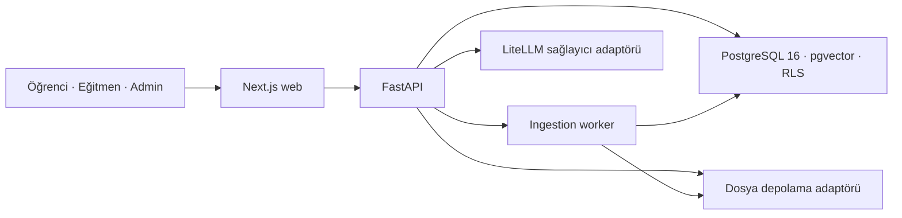

<div align="center">

# DOU-Synapse

### CourseGPT — kaynakla sınırlı, rol duyarlı ders ve sınav platformu

**Doğuş Üniversitesi · COME 492 Bitirme Projesi · 2026**

Danışman: Yasemin Karagül<br>
Takım: Muratcan Ateş · Eren Onur · Metehan Alphan


 <!-- docs-check: backend.tests = 904 -->
 <!-- docs-check: frontend.tests = 352 -->


**Öğretmenin kaynaklarını güvenilir bir öğrenme döngüsüne dönüştürür; öğrenciyi,
eğitmeni ve Bilgi İşlem ekibini aynı güvenli web ürününde buluşturur.**

</div>

---

## Şu an nerede?

| Başlık | Doğrulanmış durum |
|---|---|
| Kod | PR #5 ile AI-SDLC, rol duyarlı ders ajanı ve yeni ürün arayüzü `main` dalına alındı |
| Merge uyumluluğu | PR #15 ile içerikçe aynı GitHub merge commit'leri fail-closed biçimde doğrulanır hâle geldi |
| Güncel `main` | `dbb8988a0f9bfefa0a9bcf43e3d62668ca594a80` |
| CI | API, web, belge, güvenlik, AI kalite ve gerçek API + tarayıcı akışları depoda mevcut |
| Ajan dağıtımı | Kod `main` içinde; dağıtım bayrağı kapalı ve production çalışması kanıtlanmadı |
| Canlı site | Public staging/production URL veya GitHub deployment kaydı yok |

Buradaki ayrım önemlidir: **main'e birleşmiş kod**, **yeşil CI**, **staging** ve
**production** aynı kanıt sınıfı değildir. Bu depo ilk ikisini güçlü biçimde gösterir;
son ikisi için dış ortam kurulumu ve operasyon kanıtı gerekir.

## Ürün tezi

Genel amaçlı bir sohbet botu ders bağlamını, sınav kurallarını ve öğretmenin niyetini
kendiliğinden koruyamaz. DOU-Synapse bu nedenle AI'ı dersin içine sınırlar:

> **Kaynak yoksa cevap yok.**

Yanıtlar yalnız öğretmenin yüklediği materyallerden üretilir ve kaynaklarıyla gösterilir.
Kanıt yetersizse sistem bunu söyler. Sokratik mod, cevabı hemen vermek yerine öğrencinin
denemesini ve kademeli ipucunu merkeze alır.

## Bir fikirden ürüne

1. **Güvenli temel:** FastAPI, PostgreSQL/pgvector, ders üyeliği ve FORCE RLS ile
   API ve veritabanında iki katmanlı izolasyon kuruldu.
2. **Aranabilir ders hafızası:** PDF, PPTX, Markdown, metin ve kod dosyaları doğrulandı;
   worker üzerinden parçalandı, gömüldü ve kaynak bilgisiyle saklandı.
3. **Öğrenme döngüsü:** Kaynaklı QA, Sokratik yönlendirme, soru üretimi, öğretmen onayı,
   practice/exam, puanlama ve “Neden yanlış?” tek akışta birleşti.
4. **Demo varsayımları kaldırıldı:** Sınav kilidi yalnız arayüzde değil sunucu durumunda
   uygulandı; event-loop, warmup, rate/concurrency, pagination ve gizlilik yolları
   sertleştirildi.
5. **Rol bazlı portal:** Öğrenci, eğitmen ve Bilgi İşlem için ayrı görev akışları;
   profil, KVKK hakları, analitik ve içeriksiz operasyon görünürlüğü eklendi.
6. **Rol duyarlı ajan:** Öğrenciye Ders Koçu, eğitmene Eğitmen Asistanı sunuldu; rol
   istemciden değil sunucudaki ders üyeliğinden türetildi.
7. **Kanıtlı teslim:** CI, AI-SDLC, supply-chain kontrolleri ve append-only kanıt zinciri
   eklendi. Merge sırasında bulunan kanıt-soyu kusurları geçmiş silinmeden yeni
   revizyonlarla kapatıldı.

Bu yolculukta ürün “cevap veren bir chatbot”tan, öğretmenin sınırlarını koruyan tam bir
öğrenme ve değerlendirme platformuna dönüştü.

## Kim, nasıl kullanır?

### Öğrenci

1. Giriş yapar ve yalnız üyesi olduğu dersleri görür.
2. **Ders Koçu** ile soru-cevap veya Sokratik modda çalışır.
3. Her yanıtta dosya, sayfa, slayt, başlık ya da kod satırı kaynağını görür.
4. Practice sınavını çözer; puanını, rubric'i ve “Neden yanlış?” açıklamasını inceler.
5. İlerlemesini takip eder, yanıt kalitesine geri bildirim verir.
6. Profil, veri dışa aktarma ve hesap anonimleştirme haklarını kullanır.

### Eğitmen

1. Ders açar, üyeleri ve rollerini yönetir.
2. Materyal yükler; ingestion, chunk ve retrieval sonuçlarını inceler.
3. Dersin AI politikasını, modlarını, ipucu sınırını ve bütçelerini belirler.
4. AI ile soru taslağı üretir; onaylar, reddeder veya sınav blueprint'ine bağlar.
5. Practice/exam sürecini ve sınıfın toplu ilerlemesini izler.
6. **Eğitmen Asistanı** ile kaynaklı açıklama ve Sokratik yönlendirme tasarlar.

### Bilgi İşlem / platform yöneticisi

1. Servis sağlığını, kullanıcı/ders/ingestion sayılarını ve AI tüketimini görür.
2. Maskeli, içeriksiz olay ve audit kayıtlarıyla operasyonu izler.
3. Akademik cevaplara, özel sohbet içeriğine veya öğrenci adına ders rolüne erişmez.

## Başlıca özellikler

### Materyal ve RAG

- Dosya türü, boyut, MIME ve içerik doğrulaması.
- Arka plan worker'ı ile parse, chunk, embedding ve durum takibi.
- pgvector benzerliği + PostgreSQL full-text search ile hibrit retrieval.
- Sayfa/slayt/başlık/satır provenance'ı ve mekanik citation doğrulaması.
- Eğitmene kaynak, parça ve retrieval laboratuvarı.

### Sohbet ve ders ajanı

- Ders bazlı sohbet oturumları ve geçmiş.
- Kaynaklı QA ile adımlı Sokratik mod.
- Öğrenci için **Ders Koçu**, eğitmen için **Eğitmen Asistanı**.
- `out_of_scope` ile `insufficient_context` için ayrı ve dürüst ret yolları.
- Sunucudan türetilen, oturum boyunca değişmez rol/audience.

Ajan bilinçli olarak otonom değildir: web'de arama yapmaz, kod çalıştırmaz, harici araç
kullanmaz, not/üyelik/sınav yazmaz ve başka derslere geçmez.

### Soru ve sınav

- Çoktan seçmeli, açık uçlu, kod izleme ve hata bulma soru aileleri.
- AI taslağı → eğitmen onayı/red → öğrenciye yayın akışı.
- Sürümlü ve yayın kapılı sınav blueprint'leri.
- Sunucu süreli practice/exam, atomik teslim ve idempotent değerlendirme.
- Cevap anahtarı, rubric ve kaynaklı “Neden yanlış?” geri bildirimi.

### Analitik ve AI kalite

- Öğrenci için ilerleme ve konu bazlı ustalık görünümü.
- Eğitmen için yalnız toplu sınıf analitiği.
- Gold-set/holdout değerlendirmesi, citation ve kapsam-dışı ret kontrolleri.
- Geri bildirim paylaşımı yalnız öğrencinin açık rızasıyla.

### Gizlilik ve yönetim

- Kullanıcı veri export'u, silme/anonimleştirme ve geri bildirim rızası.
- Platform yöneticisi ile ders eğitmeni yetkilerinin ayrılması.
- İçeriksiz teknik telemetry ve dar SECURITY DEFINER işlemleri.
- Aktif sınav sırasında sohbet ve sohbet içeren export yollarının kilitlenmesi.

> Yönetici/eğitmen duyuru merkezi planlanan bir sonraki dikey dilimdir; bu sürümde
> uygulanmış özellik olarak sunulmaz.

## Güvenlik ve ajan sınırları

| Risk | Koruma |
|---|---|
| Dersler arası veri sızıntısı | API üyelik kontrolü + PostgreSQL ENABLE/FORCE RLS |
| Sahte öğrenci/eğitmen rolü | Rol istemciden alınmaz; sunucuda üyelikten türetilir |
| Sınav sırasında AI yardımı | İstek girişi, finalizasyon ve export aynı sınav durumu/kilit sözleşmesini kullanır |
| Kaynaksız veya zehirli cevap | Kaynak kapsamı, citation doğrulaması ve fail-closed ret |
| Token/maliyet suistimali | Günlük kullanıcı/ders/platform tavanları, atomik rezervasyon ve output sınırı |
| Eşzamanlı saldırı | Kalıcı kota ledger'ı, process içi sınırlama, concurrency ve süre sınırı |
| Cache ile rol sızıntısı | Audience-scoped cache, RLS ve dar invalidation fonksiyonu |
| Operasyonel acil durum | Feature flag ve kill switch; içeriksiz guard-event ledger'ı |

Temel felsefelerimiz:

- **Yetki arayüzde değil, API ve RLS'de korunur.**
- **Yeşil test, koruma kaldırıldığında kırmızı olabiliyorsa değerlidir.**
- **AI değişikliği kanıtsız terfi etmez; geçmiş düzeltilmez, yeni kayıt eklenir.**
- **CI sonucu production kanıtı değildir.**
- **Admin sistemi gözlemler; akademik içeriğin sahibi olmaz.**
- **AI, daha otonom olduğu için değil daha güvenilir öğrettiği için değerlidir.**

## Mimari



| Katman | Teknoloji |
|---|---|
| Web | Next.js 16, React 19, TypeScript, Bun |
| API | FastAPI, Python 3.12, Pydantic, SQLAlchemy, uv |
| Veri | PostgreSQL 16, pgvector, full-text search, FORCE RLS |
| AI | LiteLLM, Groq → Gemini sağlayıcı yolu, FastEmbed/hash test modu |
| İşleme | Ayrı ingestion worker'ı, object-storage adaptörü |

## CI/CD, AI-SDLC ve Engineering Excellence

| Alan | Depoda ve gözlenmiş | Açık sınır |
|---|---|---|
| **CI** | API lint/format/mypy/test/RLS/mutasyon; web type/test/kontrast/build; docs; API image; gerçek API + worker + Playwright E2E; CodeQL | Ortam sırları ve üçüncü taraf servisler yerel/CI sahte veya izole olabilir |
| **CD** | Tag kabulü, karantina image/digest, SBOM/provenance ve release-evidence doğrulama tasarımı | Protected staging/production promotion ve canlı deployment gözlenmedi |
| **AI-SDLC** | R1–R3 risk sınıfı, exact candidate, hash-bound evidence, append-only lineage, geçiş taraması, metric/candidate stale kontrolleri | Gerçek model, insan kabulü, canary ve production onayları açık |
| **Engineering Excellence** | CODEOWNERS, PR şablonu, Dependabot, pinli Actions, docs-check, ADR, SLO, incident/release/rollback belgeleri | Ruleset, protected environment ve bağımsız insan onayı dış ortamda ayrıca kurulmalı |

AI-SDLC özellikle iki kolay yanılgıyı fail-closed kapatır:

- Bir rapordaki ölçüm ile dossier'daki sayı farklıysa `EVIDENCE_METRIC_MISMATCH`.
- Eski bir `SELF` raporu yeni adayı yetkilendirmek için kullanılırsa
  `EVIDENCE_CANDIDATE_STALE`.

Git geçmişindeki AI kayıtları silinmez veya yeniden yazılmaz. Hatalı/tarihsel bir kayıt
yetki veremez; yeni, tam kapsamlı ve hash bağlı bir kök kayıt eklenir.

## Ölçülmüş kanıt

| Kapı | Son doğrulanmış sonuç | Ne kanıtlamaz? |
|---|---:|---|
| Backend testleri | **904** <!-- docs-check: backend.tests = 904 --> | Gerçek LLM pedagojik kalitesi |
| Frontend birim testleri | **352** <!-- docs-check: frontend.tests = 352 --> | 30 dosya <!-- docs-check: frontend.testFiles = 30 -->; tüm cihazlarda manuel erişilebilirlik |
| Gerçek API + Playwright | **36** <!-- docs-check: e2e.tests = 36 --> | Public staging/production çalışması |
| RLS/DB mutasyonları | **16/16** | Dış WAF veya cihaz itibarı koruması |
| Uygulama guard mutasyonları | **12/12** | Gerçek sağlayıcı maliyet ve kalite ölçümü |
| AI-SDLC validator paketi | **76/76** | İnsan domain/security onayı |
| Migration | **15** <!-- docs-check: migrations.count = 15 --> | Production'a uygulanmış migration |
| Veritabanı tablosu | **27** <!-- docs-check: tables.count = 27 --> | Canlı veri hacmi |
| Web ekranı | **20** <!-- docs-check: screens.count = 20 --> | Her ekranın canlı sunucuda açık olduğu |
| Örnek ders dosyası | **22** <!-- docs-check: sampleData.files = 22 --> | Gerçek üniversite içeriği |

Migration zinciri:
`0001,0002,0003,0004,0005,0006,0007,0008,0009,0010,0011,0012,0013,0014,0015` <!-- docs-check: migrations.list = 0001,0002,0003,0004,0005,0006,0007,0008,0009,0010,0011,0012,0013,0014,0015 -->

## Sorunlardan öğrendiklerimiz

- **Sınav kilidi bir CSS işi değildir.** İkinci sekme, doğrudan API, finalizasyon ve
  export yarışı ortak sunucu durumu altında ele alınmalıdır.
- **RLS var demek yetmez.** Bir politika kasıtlı bozulduğunda mutasyon testi gerçek
  sızıntıyı yakalamalıdır.
- **AI çağrısı bağlantı havuzunu kilitlememelidir.** Kota muhasebesi kısa ömürlü ve
  ayrı kontrollü bağlantı yoluna taşındı.
- **UI yeşili sözleşme uyuşmazlığını gizleyebilir.** Sayfalı API zarfını dizi sanan
  blueprint ekranı kontrat testiyle düzeltildi.
- **E2E temizliği de ürün güvenliğidir.** Test verisi benzersiz kimlikle kurulur,
  korunan ders sabit kimlikle saklanır ve kalıntı sıfır doğrulanır.
- **Belgeler canlı sayıları elle taşıyamaz.** `docs_check` koddan ölçer ve bayat
  iddiaları kırmızı yapar.
- **Kanıt geçmişi de saldırı yüzeyidir.** Sil-ekle/rename geçişleri ve eski raporun
  yeni adayda kullanılması validator tarafından reddedilir.

## Yerelde çalıştırma

### Önkoşullar

- PostgreSQL 16 + pgvector
- Python 3.12 ve `uv`
- Bun 1.3+

### 1. Veritabanı

```bash
createdb dou_synapse
for f in supabase/migrations/*.sql; do
  psql -v ON_ERROR_STOP=1 -d dou_synapse -f "$f"
done
psql -d dou_synapse -f supabase/local_dev_setup.sql
psql -d dou_synapse -f supabase/seed_demo.sql
```

### 2. API

```bash
cd apps/api
uv sync --extra dev --frozen
cp ../../.env.example .env
uv run uvicorn app.main:app --host 127.0.0.1 --port 8000
```

Kontrol: `http://127.0.0.1:8000/health/live` ve
`http://127.0.0.1:8000/health/ready`.

### 3. Worker

```bash
cd apps/api
uv run python -m app.worker
```

### 4. Web

```bash
cd apps/web
bun install --frozen-lockfile
NEXT_PUBLIC_API_URL=http://127.0.0.1:8000 bun run dev
```

Site: `http://localhost:3000`.

Claude'un sunucu panelindeki bir isim yalnız **başlatma profili**dir; çalışan deployment
değildir. Güncel tam yerel ürün için aynı temiz `main` worktree'sinden API, worker ve web
birlikte başlatılmalıdır. Eski `dou-docs-hygiene-*` profilleri tarihsel worktree'ye;
`cloudsentinel` ve `ncdb-*` profilleri başka projelere aittir.

## Production için kalanlar

- Gerçek Supabase Auth, Storage ve production migration provası.
- Seçilen gerçek Groq/Gemini modelinde holdout ve öğretmen kabulü.
- Protected staging/production ortamları ve adlandırılmış bağımsız onaylar.
- Telemetry/alert teslimi, saklama süresi ve veri residency kararı.
- Backup/restore ile rollback tatbikatı.
- Canary, kill-switch gözlemi ve production SLO takibi.
- Public URL, deployment kaydı ve operasyon devri.

Bu maddeler tamamlanmadan “production-ready”, “canlıya alındı” veya “gerçek LLM kalitesi
kanıtlandı” denmez.

## Depo haritası

```text
apps/api/                 FastAPI, worker, RAG, sınav, gizlilik ve admin
apps/web/                 Next.js portalı, bileşenler, birim testleri ve Playwright
supabase/migrations/      0001–0015 şema, RLS ve dar DB fonksiyonları
supabase/tests/           RLS referans ve mutasyon kontrolleri
specs/001…005/            Speckit ürün ve mühendislik sözleşmeleri
.ai/                      AI policy, dossier, quarantine ve kanıt kayıtları
docs/                     kullanıcı, güvenlik, SLO, release ve operasyon belgeleri
evaluation/               gold-set, holdout ve rol ajanı değerlendirmeleri
```

Başlangıç belgeleri:

- [Mimari](ARCHITECTURE.md)
- [Tasarım sistemi](DESIGN.md)
- [Öğrenci kılavuzu](docs/student-guide.md)
- [Eğitmen kılavuzu](docs/instructor-guide.md)
- [Güvenlik](docs/security.md)
- [KVKK](docs/kvkk.md)
- [AI-SDLC](docs/engineering/AI_SDLC.md)
- [Engineering Excellence](docs/engineering/ENGINEERING_EXCELLENCE.md)
- [Release süreci](docs/engineering/RELEASE_PROCESS.md)
- [SLO](docs/engineering/SLO.md)
- [Rol duyarlı ajan sözleşmesi](specs/005-role-aware-course-agent/spec.md)

Tarihsel ekran görüntüleri `docs/images/` ve `docs/screenshots/` altındadır; güncel arayüz
kanıtı olarak değil, ürünün gelişim arşivi olarak tutulur.

## Lisans

MIT — ayrıntılar için [LICENSE](LICENSE).
