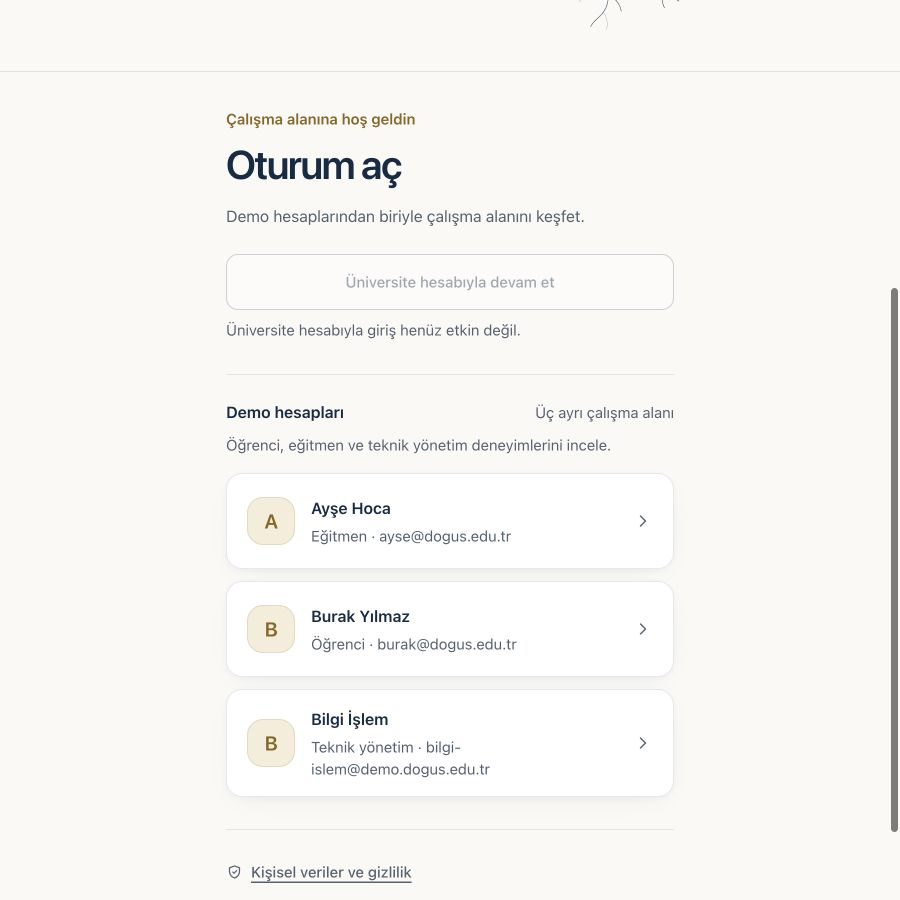
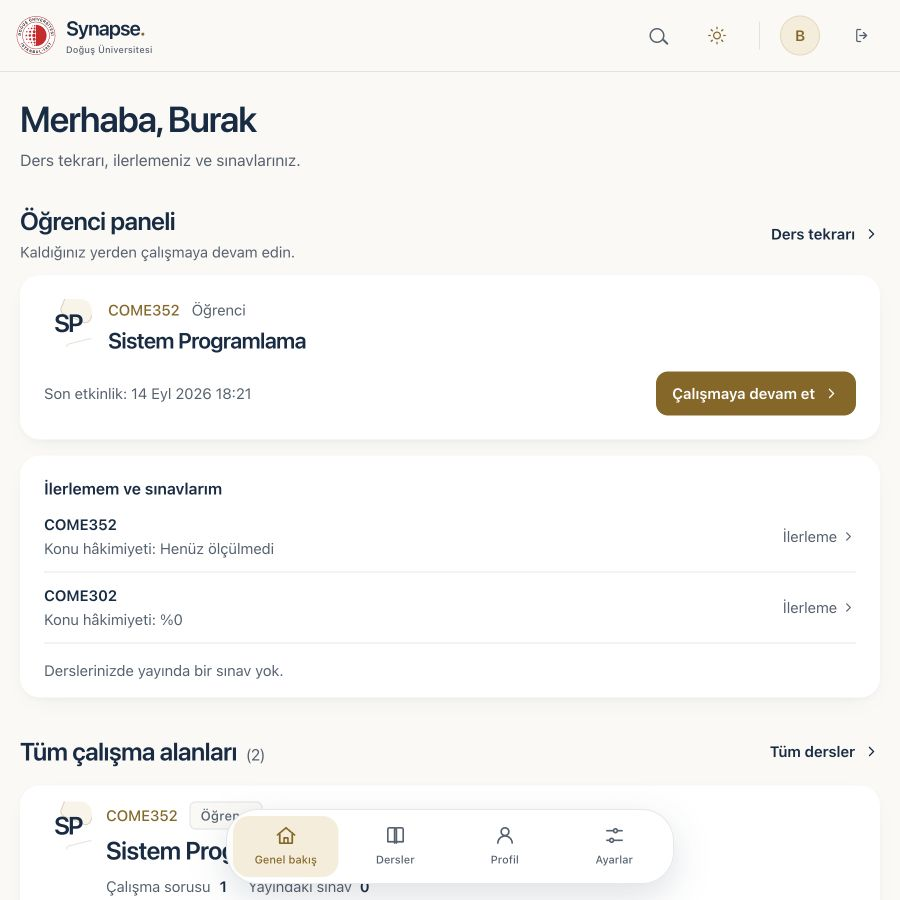
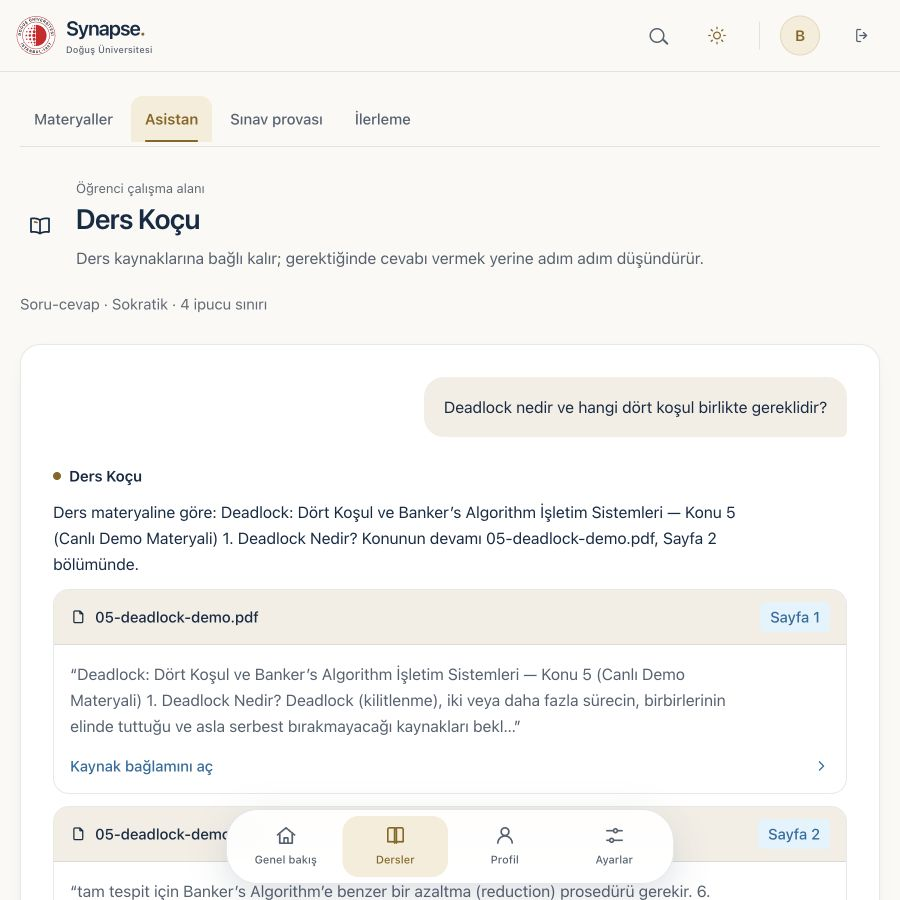
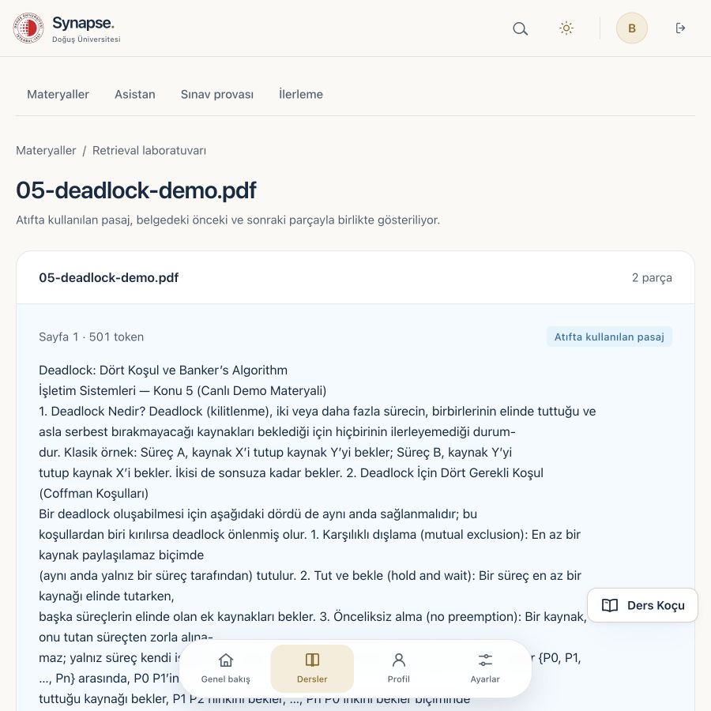
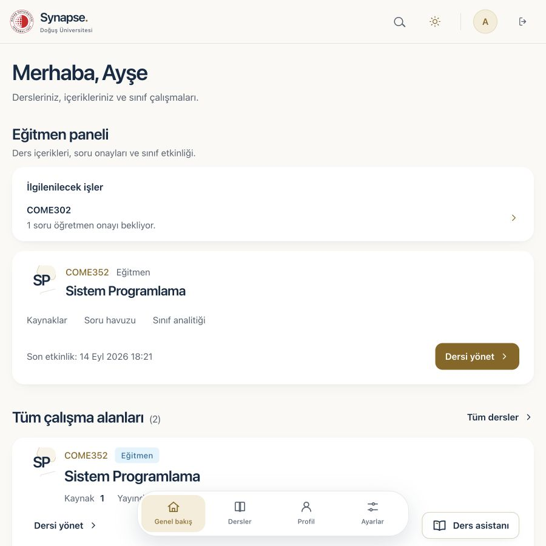
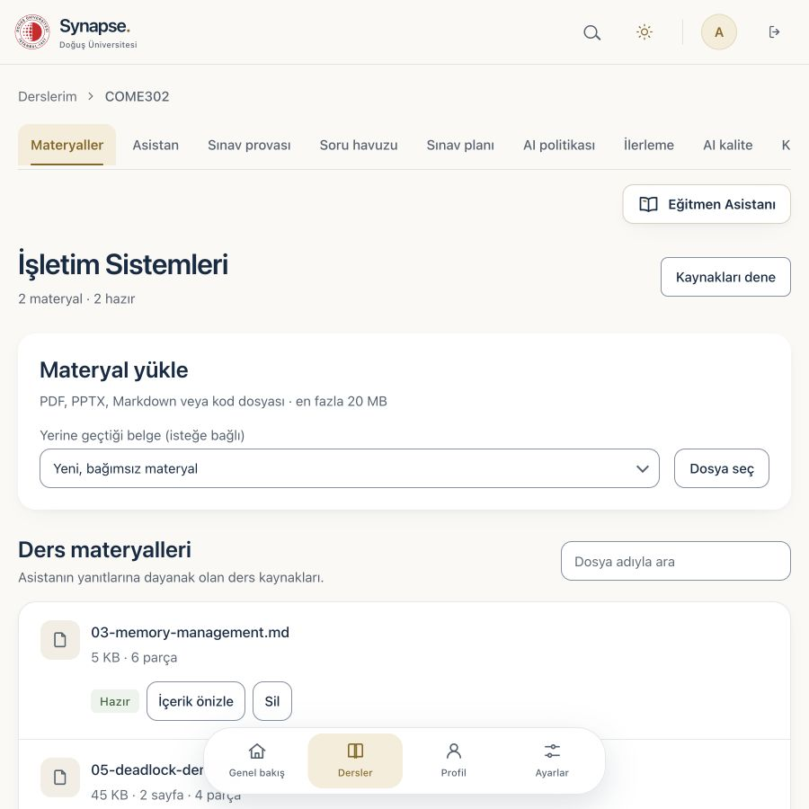
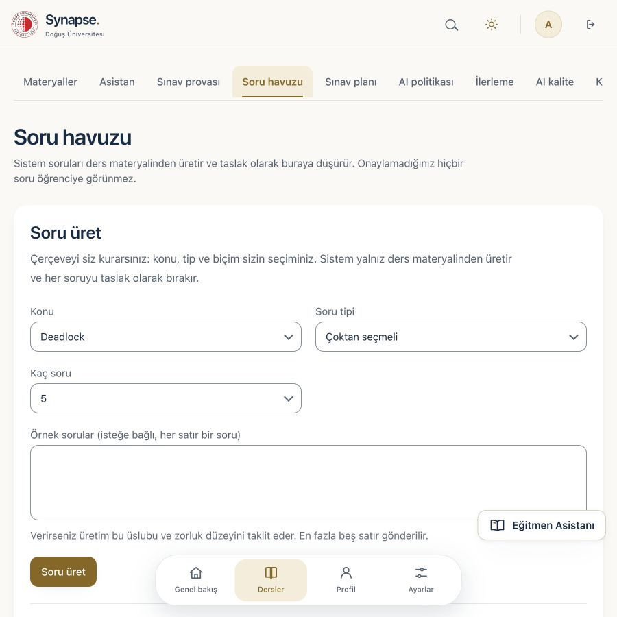
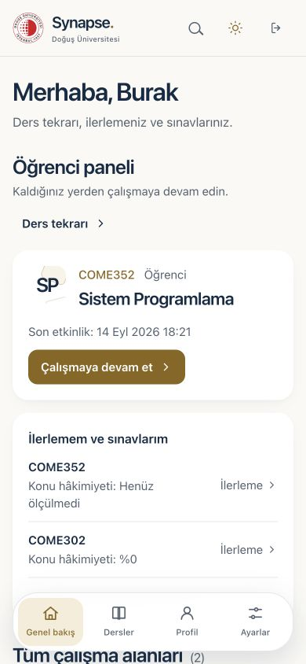

# DOU-Synapse

### CourseGPT — Yapay Zekâ Destekli Kişiselleştirilmiş Ders ve Sınav Platformu

**Doğuş Üniversitesi · COME 492 Bitirme Projesi · 2026**

Danışman: Dr. Öğr. Üyesi Yasemin Karagül 
Takım: Muratcan Ateş · Eren Onur · Metehan Alphan

 <!-- docs-check: backend.tests = 2197 -->
 <!-- docs-check: frontend.tests = 684 -->

**Yalnız öğretim elemanının yüklediği materyalden cevap veren, kaynağı gösterilemeyen
soruyu dürüstçe reddeden ders asistanı.**

---

## İçindekiler

| Bölüm | İçerik |
|---|---|
| [Ürün fikri](#ürün-fikri) | Ne yapar, hangi ilkeye dayanır |
| [Güncel durum](#güncel-durum) | Kanıt seviyesi tablosu: ne birleşti, ne ölçüldü, ne kanıtlanmadı |
| [Ekran görüntüleri](#ekran-görüntüleri) | Güncel arayüz |
| [Nasıl çalışır](#nasıl-çalışır) | Kanıt kapısı ve guardrail zinciri |
| [Danışman gereksinimleri](#danışman-gereksinimleri-nasıl-karşılandı) | Gereksinim → karşılık → kanıt sınırı |
| [Güvenlik ve sınav bütünlüğü](#güvenlik-ve-sınav-bütünlüğü) | İki katmanlı yetki, sınav kilidi, KVKK |
| [Ölçülmüş kanıt](#ölçülmüş-kanıt) | Sayılar ve neyi kanıtlamadıkları |
| [Yerel kurulum](#yerel-kurulum) | Beş adımda ayağa kaldırma |
| [Depo haritası](#depo-haritası) | Neyin nerede olduğu |
| [Belge dizini](#belge-dizini) | Başlıca belgeler, üç başlıkta |
| [Ürün ilkelerimiz](#ürün-ilkelerimiz) | On kural |

Ayrıntı isteyen üç belge: [ürün ayrıntıları](docs/product.md) (tüm özellikler, kullanıcı
yolculukları, ajan), [gelişim günlüğü](docs/development-log.md) (tarihsel kayıt),
[production yol haritası](docs/PRODUCT_PARITY_AND_PRODUCTION_ROADMAP.md).

---

## Ürün fikri

Öğrencilerin genel amaçlı bir sohbet botuna değil, **dersin öğretim elemanı tarafından
sınırlandırılmış bir çalışma ortamına** ihtiyacı var. CourseGPT bu nedenle yalnız
eğitmenin yüklediği PDF, PPTX, Markdown, metin ve kod dosyalarını bilgi kaynağı kabul eder.

> **Kaynak yoksa cevap yoktur.**

Sistem bir yanıtı yalnız üretmez; cevabın hangi dosya, sayfa, slayt, başlık veya kod
satırına dayandığını gösterir. Kanıt yetersizse bunu dürüstçe söyler. Sokratik modda
doğru cevabı doğrudan vermek yerine öğrencinin denemesini bekler ve kademeli ipucu verir.

Bu ilkenin etrafında kurulan ürün: rol bazlı öğrenci/eğitmen/Bilgi İşlem portalları,
materyal ingestion hattı, hibrit RAG, soru laboratuvarı ve öğretmen onayı, sürümlü sınav
blueprint'i, süreli sınav oturumları, hızlı tekrar kartları, kavram haritası, sınıf
analitiği, KVKK hakları ve platform yönetimi.

Özelliklerin tamamı ve kullanıcı yolculukları: [docs/product.md](docs/product.md).

## Güncel durum

Bu README yalnız özellikleri değil, **kanıt seviyesini** de gösterir. "Kodlandı",
"yerelde doğrulandı", "main'e birleşti" ve "production'da çalışıyor" aynı şey değildir.

| Katman | Durum | Açıklama |
|---|---|---|
| **Main'e birleşmiş ürün** | [`main`](https://github.com/muratcan-ates/DOU-Synapse/commits/main) | GitHub main'in güncel başı; kampüs arayüzü tasarımı (`025-campus-ui`) birleşiktir. SHA burada sabitlenmez, her commit'te eskir |
| **Etkin geliştirme dalı** | yerel `018-integration` → `main` | Şeritlerin işi yerel dalda toplanır ve doğrudan main'e itilir; uzak `018-codex-production-line` dalı güncel değildir |
| **Adayın kanıtı** | [018 doğrulaması](specs/018-codex-production-line/verification.md) | Yerel süitler geçiyor; CI'daki tarayıcı işi hâlâ kırmızı ve sebebi ölçüldü (kök neden tabloları doğrulama raporunda). Taban kanıt: [017 doğrulaması](specs/017-completion-integration/verification.md) |
| **Özelliklerin açılması** | Varsayılan kapalı | `QUESTION_AUTHORING_ENABLED` ve `STUDENT_ASSESSMENT_WORKSPACE_ENABLED` hedef ortamda açıkça yapılandırılır; birleştirme tek başına etkinleştirme değildir |
| **Gerçek model kabulü** | Kısmen ölçüldü | Demo yığını gerçek Groq ile koştu (`openai/gpt-oss-120b`); sonuçlar [aşağıda](#gerçek-modelle-kabul). **Holdout değerlendirmesi koşulmadı**, sebebi [gece raporunda](docs/team/GECE-RAPORU-14-EYLUL.md) §4.2 |
| **Staging / production** | Kanıtlanmadı | Canlı Auth/Storage/worker, yedek/geri yükleme ve geri dönüş kabulü tamamlanmadan yayın iddiası yok |

> Bugünkü ürün güçlü bir **repository candidate**'dır; "production'a deploy edildi" veya
> "gerçek model kalitesi kanıtlandı" iddiasında bulunmaz.

## Ekran görüntüleri

Aşağıdaki sekiz görsel **16 Eylül 2026'da, güncel kampüs arayüzünden** (`025-campus-ui`,
commit `aba76c26`) alınmıştır. Çekim yerel demo yığınında, **sahte sağlayıcıyla**
yapılmıştır (`LLM_FAKE_PROVIDER=true`, `EMBEDDING_PROVIDER=hashing`); kayıtlar sentetik
demo verisidir. Bu galeri **arayüzün bugünkü hâlini** gösterir, **model cevap kalitesini
kanıtlamaz** — onun kanıtı [aşağıdaki gerçek model bölümüdür](#gerçek-modelle-kabul).

| | |
|---|---|
| **Giriş — üç rol için demo hesapları**  | **Öğrenci paneli — kaldığın yerden devam**  |
| **Ders Koçu — kaynak kartıyla cevap**  | **Kaynak bağlamı — atıf yapılan pasaj**  |
| **Eğitmen paneli — önce onay bekleyen işler**  | **Ders materyalleri — durum ve pasaj önizleme**  |
| **Soru havuzu — taslaklar onay bekler**  | **Mobil — aynı hiyerarşi, 390 px**  |

<b>15 Eylül galerisi</b> (önceki kabuk)

 

Bu sekiz görsel bir gün önce, gerçek Groq sağlayıcısı açıkken çekildi
([`docs/screenshots.md`](docs/screenshots.md) 15 Eylül eki); arayüz kampüs tasarımı
birleşmeden önceki kabuktur. Sohbet görselindeki cevap **önbellekten** gelmiştir (ekranda
"Önceden kaydedilmiş demo yanıtı" yazar), yani görsel arayüzü belgeler, model çıktısını
değil. Model davranışının kanıtı görsel değil koşu kaydıdır:
[`docs/team/GECE-RAPORU-14-EYLUL.md`](docs/team/GECE-RAPORU-14-EYLUL.md).

| Akış | Görsel |
|---|---|
| Materyal yönetimi | [`03-egitmen-materyaller.png`](docs/images/03-egitmen-materyaller.png) |
| Kaynaklı cevap | [`09-sohbet-kaynakli-cevap.png`](docs/images/09-sohbet-kaynakli-cevap.png) |
| Sokratik ısrar reddi | [`13-sokratik-israr-ilerlemiyor.png`](docs/images/13-sokratik-israr-ilerlemiyor.png) |
| Kapsam dışı nazik ret | [`10-sohbet-nazik-ret.png`](docs/images/10-sohbet-nazik-ret.png) |
| Soru havuzu ve onay | [`05-egitmen-soru-havuzu.png`](docs/images/05-egitmen-soru-havuzu.png) |
| Sınav provası | [`14-ogrenci-sinav-provasi.png`](docs/images/14-ogrenci-sinav-provasi.png) |
| Sınıf analitiği | [`06-egitmen-sinif-analitigi.png`](docs/images/06-egitmen-sinif-analitigi.png) |
| KVKK | [`16-kvkk.png`](docs/images/16-kvkk.png) |

Üye olunmayan ders için 404 davranışı 8 Ağustos tarihli
[`08-izolasyon-404.png`](docs/screenshots/08-izolasyon-404.png) ile belgelenmiştir;
davranış değişmediği için tarihsel hâliyle bırakıldı.

Çekim kayıtları ve hangi görüntünün hangi akışı gösterdiği:
[`docs/screenshots.md`](docs/screenshots.md).

## Nasıl çalışır

~~~mermaid
flowchart LR
    U["Öğrenci / Eğitmen / Bilgi İşlem"] --> WEB["Next.js 16 + React 19"]
    WEB --> API["FastAPI · Python 3.12"]
    API --> AUTH["Supabase Auth / JWT"]
    API --> DB[("PostgreSQL 16 + pgvector RLS + FTS + audit")]
    API --> ST["Supabase Storage veya yerel storage"]
    API --> Q["Ingestion job"]
    Q --> W["Ayrı worker parse + chunk + embed"]
    W --> ST
    W --> DB
    API --> R["Hybrid retrieval dense + FTS + RRF"]
    DB --> R
    R --> S{"Kanıt / kapsam / bütçe"}
    S -->|"uygun"| L["LiteLLM → Groq gpt-oss-120b"]
    S -->|"yetersiz"| X["Dürüst ret LLM çağrısı yok"]
    L --> G["Citation + leakage + sanitize guardrails"]
    G --> C["Kaynaklı cevap / Sokratik ipucu"]
    C --> T["İçeriksiz kullanım ve kalite sinyali"]
    T --> DB
~~~

Şemanın iki kritik noktası:

**Kanıt kapısı modelden öncedir.** Retrieval eşiği geçemezse model hiç çağrılmaz;
öğrenciye `out_of_scope` veya `insufficient_context` döner. Bu, maliyet değil doğruluk
kararıdır: kaynağı olmayan bir soruya model uydurma şansı bulamaz.

**Guardrail zinciri kodda sabittir.** `üretim → citation kontrolü → leakage kontrolü →
sanitize` sırası atlanamaz. Citation kontrolü, modelin verdiği pasaj kimliklerini
retrieval kümesine karşı doğrular; karşılığı olmayan atıf düşer, geçerli tek atıf kalmazsa cevap bloklanır.

| Katman | Teknoloji | Neden |
|---|---|---|
| Web | Next.js 16, React 19, TypeScript 5, Tailwind 4, Bun | Rol bazlı routing, responsive UI |
| API | FastAPI, Pydantic, SQLAlchemy 2, Python 3.12 | Açık sözleşme, async API, güçlü tip/doğrulama |
| Veritabanı | PostgreSQL 16 + pgvector | İlişkisel veri, FTS, vektör, RLS ve audit tek yerde |
| AI | LiteLLM → Groq (sohbet, soru üretimi); Gemini yalnız görsel okuma | Sağlayıcı adaptörü ve zaman aşımı; sohbet yolunda otomatik yedek sağlayıcı bilerek yok |
| Embedding | FastEmbed multilingual-e5-large veya deterministik hashing | Anlamsal production yolu ve hızlı test yolu |
| Storage | Supabase Storage veya yerel adaptör | Yerel geliştirme ile cloud depolamayı ayırma |
| Test | Pytest, Bun test, Playwright, SQL/RLS mutasyon betikleri | Birim, sözleşme, tarayıcı ve yetki kanıtı |
| Delivery | GitHub Actions, Docker, Speckit, AI dossier | Ölçülebilir ve izlenebilir değişiklik akışı |

**Neden LangChain/LlamaIndex/LangGraph yok?** Retrieval → LLM → guardrail hattı, Sokratik
durum makinesi, citation kontrolü ve sınav kuralları düz Python'la yazıldı. Amaç çerçeve
sayısını artırmak değil; yetki, citation ve maliyet kararlarını kodda görünür ve test
edilebilir tutmak.

Bileşen sınırları ve kararlar: [ARCHITECTURE.md](ARCHITECTURE.md) ·
[ADR kayıtları](docs/adr/README.md).

## Danışman gereksinimleri nasıl karşılandı?

| Danışman gereksinimi | Uygulamadaki karşılığı | Kanıt sınırı |
|---|---|---|
| PDF, Markdown ve kod yükleme | PDF, PPTX, MD, TXT ve yaygın kod türleri; doğrulama, parçalama, provenance, worker. **Taranmış ve el yazısı PDF** görsel okuma açıkken (`OCR_VLM_ENABLED=true`, `GEMINI_API_KEY`) görsel modelle okunur | 15 Eyl: el yazısı ders notu 4 sayfa, atılan sayfa 0, 5 parça |
| Yalnız öğretmenin kaynakları | Ders üyeliği + PostgreSQL RLS + seçili kaynak politikası | Yerel RLS ve mutasyon kanıtı |
| Sokratik mod | Deneme bekleyen, kademeli ve kaynaklı ipucu merdiveni; teşhis kademesinde materyali yeniden anlatan yanıt bloklanır | 15 Eyl gerçek modelle: ısrarda merdiven ilerlemedi, anlatım sızıntısı yakalandı. Geniş örneklemli pedagojik ölçüm açık |
| Sınav prova modu | Sunucu süreli practice/exam oturumları, puanlama ve geri bildirim | 15 Eyl uçtan uca prova: alıştırma açıldı, cevap puanlandı, "neden yanlış" kaynak kartıyla geldi. Yayımlanmış sınav akışı demo verisinde yok |
| AI soru üretimi | Çoktan seçmeli, açık uçlu, kısa cevap, kod izleme ve hata bulma; öğrenme çıktısı, zorluk, cevap anahtarı ve kaynak | 15 Eyl gerçek modelle iki koşu: 6 istendi/6 kabul/0 ret ve 3 istendi/3 kabul/0 ret. Geniş örneklemli kabul oranı açık |
| Öğretmen onayı | Taslak → onay/red → öğrenciye yayın akışı; RLS yalnız onaylı soruları açar | API, DB ve testlerle zorunlu |
| "Neden yanlış?" | Yanlış şık/cevap ile çelişen kaynak ve rubric kırılımı | Kodlandı |
| Kod/senaryo inceleme | <code>code_trace</code> ve <code>bug_hunt</code>; statik değerlendirme | Kod hiçbir zaman çalıştırılmaz |
| Kapsam dışı ret | <code>out_of_scope</code> ve <code>insufficient_context</code> ayrı sinyaller | 15 Eyl gerçek modelle 4/4 doğru ret (2 kapsam dışı, 2 kanıt yetersiz); LLM öncesi ret yolu mevcut |
| Kaynak gösterme | Retrieved metadata'dan mekanik citation doğrulaması | Kodlandı; gerçek-model faithfulness örneklemi açık |
| Web platformu | Next.js öğrenci/eğitmen/admin portalı + FastAPI + PostgreSQL | Yerelde build/test kanıtı |
| Test raporu ve kılavuz | Speckit, docs-check, öğrenci/eğitmen kılavuzları, test/eval belgeleri | Depoda mevcut |
| Hızlı tekrar (15 Eyl isteği) | Öğrencinin **bitirdiği** alıştırmadan kart destesi: ön yüz soru, arka yüz sunucunun sonucu + "neden yanlış" pasajı + çözüm; kaydırma, klavye ve düğme aynı kararı verir; kararlar puan değildir, kaydedilmez | 15 Eyl tarayıcıda ölçüldü: 6 kart, yanlışlar başta, özet 4 biliyordum / 2 tekrar / "bildiğini sandığın 1"; model çağrısı yok; aktif sınavda kilitli |
| Kavram haritası / özet (15 Eyl isteği) | Materyalden çıkarılan anahtar terimler, her terimin geçtiği pasaj ve terimlerin birlikte-geçme bağları; Markdown indirme; yapay zekâ yorumu yok | 15 Eyl gerçek korpusta: 28 pasaj → 40 terim, 60 bağ, 13 ms; 25 çıkarım + 13 uç testi (ders izolasyonu, sınav kilidi 403); dossier 160 |

Gereksinimlerin izlenebilir hâli: [docs/requirements-analysis.md](docs/requirements-analysis.md).

## Güvenlik ve sınav bütünlüğü

**İki katmanlı yetkilendirme.** Her istek önce API'de ders üyeliği bağımlılığından, sonra
aynı işlemde PostgreSQL row-level security politikasından geçer. Uygulama katmanı atlansa
bile üye olmayan kullanıcıya tek satır dönmez. Politikalar mutasyon testleriyle
kanıtlanır: bir politika bilerek zayıflatıldığında testlerin kırmızı yanması gerekir.

**Sınav bütünlüğü arayüzde değil, API ve veritabanında.** Yürüyen bir oturumda asistan,
hızlı tekrar kartları ve kavram haritası `403 exam_in_progress` döner; sekmeyi kapatmak
kilidi kaldırmaz. Öğrenciye giden gövde yalnız soru kökü ve şıklardır; **sınav modunda** çözüm anahtarı
oturum bitmeden sunucudan çıkmaz (alıştırma modunda her cevaptan sonra açılır). Cevaplar tek
kez yazılır.

**Mahremiyet.** KVKK kapsamında dışa aktarma, silme ve anonimleştirme uçları vardır.
Öğrenme olayları içerik taşımaz. Platform admin sıfatı ders içeriğine, öğrenci
sohbetlerine veya cevaplarına erişim vermez; izin verilen ve reddedilen her admin erişimi
request ID ile denetim kaydına yazılır.

Ayrıntı: [docs/product.md](docs/product.md#güvenlik-sınav-bütünlüğü-ve-kvkk) ·
[docs/security.md](docs/security.md) · [docs/kvkk.md](docs/kvkk.md).

## Ölçülmüş kanıt

| Ölçüm | Güncel kaynak değeri | Ne kanıtlar / neyi kanıtlamaz |
|---|---:|---|
| Backend testleri | **2197** <!-- docs-check: backend.tests = 2197 --> | Repo sözleşmeleri ve deterministik mekanik davranış; gerçek LLM kalitesi değil |
| Frontend birim testleri | **684** <!-- docs-check: frontend.tests = 684 --> | 55 test dosyasındaki UI yardımcıları/sözleşmeleri; tek başına pedagojik kalite kanıtı değil <!-- docs-check: frontend.testFiles = 55 --> |
| Playwright tarayıcı vakaları | **87** <!-- docs-check: e2e.tests = 87 --> | Sayı `playwright test --list` ile toplanan vakalardır; başarılı koşu sayısı değildir |
| Migration | **24** <!-- docs-check: migrations.count = 24 --> | Şema evriminin kaynak dosyası sayısı |
| CREATE TABLE | **32** <!-- docs-check: tables.count = 32 --> | Migration'larda kurulan benzersiz tablo sayısı |
| Web ekranı | **26** <!-- docs-check: screens.count = 26 --> | Next.js <code>page.tsx</code> sayısı |
| Örnek teslim dosyası | **22** <!-- docs-check: sampleData.files = 22 --> | İşletim Sistemleri örnek materyal paketi |

Bu sayılar **yerel PostgreSQL + deterministik fake provider** ortamındadır. Gerçek
provider, staging, canary veya production kanıtı değildir. Tarihsel ölçüm koşuları ve
şema yolculuğu: [gelişim günlüğü](docs/development-log.md).

### Gerçek modelle kabul

14–15 Eylül 2026'da demo yığını gerçek Groq (`openai/gpt-oss-120b`) ile koşturuldu:

| Ne ölçüldü | Sonuç |
|---|---|
| Kapsam dışı ret | 4/4 doğru ret, hiçbirinde model çağrısı yok |
| AI soru üretimi ve öğretmen onayı | İki koşu: 6/6 ve 3/3 kabul |
| Sokratik merdiven | Tekrarlı ısrara rağmen kademe ilerlemedi; anlatım sızıntısı bloklandı |
| El yazısı not okuma | 4 sayfa, atılan sayfa 0, 5828 karakter |
| Kavram haritası (gerçek korpus) | 40 terim, 60 bağ, 13 ms, model çağrısı yok |
| Uçtan uca sahne provası | 10/10 adım, 27 uç noktadan HTTP 200 |

**Açık kalan:** holdout değerlendirmesi koşulmadı, geniş örneklemli pedagojik ölçüm ve
bağımsız insan kabulü yapılmadı. Koşu kayıtları ve sebepler:
[GECE-RAPORU-14-EYLUL.md](docs/team/GECE-RAPORU-14-EYLUL.md) ·
[test raporu](docs/test-report.md).

### Kalite kapıları

Her değişiklikte koşan kapılar: Ruff, format, mypy, Pytest, migration ve RLS/mutasyon
kontrolleri; web tarafında tip kontrolü, birim testleri, kontrast kapısı ve production
build; ayrıca docs-check (belgelerdeki canlı sayıları kaynağından doğrular), test-quality
(yalnız durum kodu doğrulayan testleri yakalar) ve AI-SDLC dossier denetimi.

[AI-SDLC](docs/engineering/AI_SDLC.md) ·
[Engineering Excellence](docs/engineering/ENGINEERING_EXCELLENCE.md) ·
[Release süreci](docs/engineering/RELEASE_PROCESS.md)

## Yerel kurulum

**Önkoşullar:** PostgreSQL 16 + pgvector · Python 3.12 · uv · Bun 1.3+

### 1. Depoyu klonla

~~~bash
git clone https://github.com/muratcan-ates/DOU-Synapse.git
cd DOU-Synapse
~~~

### 2. API bağımlılıklarını kur

~~~bash
cd apps/api
uv sync --extra dev --frozen
cp ../../.env.example .env   # DEV_AUTH_ENABLED=true gelir: demo hesaplarıyla giriş açık
cd ../..
~~~

### 3. Veritabanını kur ve testleri koştur

~~~bash
export PATH="/opt/homebrew/opt/postgresql@16/bin:$PATH"
createdb dou_synapse
DATABASE_URL="postgresql://localhost/dou_synapse" \
DOU_MIGRATE_PYTHON="apps/api/.venv/bin/python" sh scripts/migrate.sh
psql -d dou_synapse -f supabase/local_dev_setup.sql
psql -d dou_synapse -f supabase/seed_demo.sql
(cd apps/api && uv run pytest -q)
~~~

Göçler `scripts/migrate.sh` ile uygulanır; betik `app.schema_migrations` defterini tutar.
Dosyaları elle sırayla koşturmak bu defteri atlar ve sonraki göç kontrolünü bozar.

Güncel feature kanıtında backend koleksiyonu 2197 testtir; 38 alt vaka ayrıca raporlanır. <!-- docs-check: backend.tests = 2197 -->

### 4. Web bağımlılıklarını kur ve test et

~~~bash
cd apps/web
bun install --frozen-lockfile
bun test lib/
bun run typecheck
bun run build
~~~

Güncel feature kanıtında frontend kütüphane paketi 684 testtir. <!-- docs-check: frontend.tests = 684 -->

Gerçek tarayıcı testi ayrı sentetik DB ve sahip olunan sunucu gerektirir;
[E2E çalıştırma sözleşmesini](docs/development/owned-e2e.md) izleyin.

### 5. Servisleri başlat

İki çalıştırma yolu vardır ve **portları farklıdır**; karıştırmayın.

**Elle geliştirme** — üç ayrı terminal:

~~~bash
# Terminal 1 — API · 127.0.0.1:8000
cd apps/api && uv run uvicorn app.main:app --host 127.0.0.1 --port 8000

# Terminal 2 — worker
cd apps/api && uv run python -m app.worker

# Terminal 3 — web · localhost:3000
cd apps/web && NEXT_PUBLIC_DEV_AUTH=true bun run dev
~~~

Web, `NEXT_PUBLIC_API_URL` verilmezse `http://localhost:8000` adresindeki API'ye bağlanır
(`apps/web/lib/api.ts`). API tarafındaki `CORS_ORIGINS` varsayılanı tarayıcı kaynağını,
yani web'in 3000 portunu listeler. `NEXT_PUBLIC_DEV_AUTH=true` olmadan giriş ekranında demo
hesap kartları çıkmaz. Ardından [http://localhost:3000](http://localhost:3000) adresini açın.

**Hazır demo yığını** — jüri ve demo günü için; ayrı portlar, ayrı veritabanı:

~~~bash
sh scripts/demo/setup_db.sh  # bir kez: dou_demo veritabanı, göçler, yerel roller, sentetik seed
sh scripts/demo/run_api.sh   # API · 127.0.0.1:8020
sh scripts/demo/run_web.sh   # web · 127.0.0.1:3020 (production derlemesi)
~~~

Geliştirme sunucusu isteyen varyant `scripts/demo/run_web_dev.sh` (3021). Demo günü kontrol
listesi, önbellek ısıtma ve fallback planı: [demo runbook](docs/runbook.md).

| Yol | API | Web | Veritabanı |
|---|---|---|---|
| Elle geliştirme | 8000 | 3000 | `dou_synapse` |
| Demo yığını | 8020 | 3020 (dev varyantı 3021) | `dou_demo` |

**Embedding modu.** Hashing modu deterministik ve hızlıdır; test/CI için kullanılır,
anlamsal kalite kanıtı değildir. Gerçek semantic retrieval için FastEmbed modeli
kullanılır. Korpus hangi embedding sağlayıcı ve sürümüyle üretildiyse sorgu aynı uzayda
çalışmalıdır; migration provenance kaydı uyuşmazlıkta fail-closed davranış sağlar.

## Depo haritası

~~~text
README.md       Bu dosya
ARCHITECTURE.md Bileşen sınırları ve kararlar
DESIGN.md       UI tasarım sistemi
PLAN.md         İlk üç haftalık plan (tarihsel)
AGENTS.md       Ajan çalışma sözleşmesi (CLAUDE.md buna işaret eder)
apps/
  api/          FastAPI uygulaması, worker, RAG/guardrail modülleri, testler
  web/          Next.js arayüzü, lib reducer'ları, Playwright e2e
supabase/
  migrations/   24 göç: şema, RLS, kota ve claim/lease sözleşmeleri
  tests/        RLS ve mutasyon betikleri
specs/          Speckit şartnameleri; her klasör bir özellik şeridi (001…025)
docs/           Belgeler — dizin aşağıda
evaluation/     Gold set, kalibrasyon, holdout ve kalite araçları
sample_data/    İşletim Sistemleri örnek ders paketi
scripts/        Docs, workflow, göç, test-kalite ve güvenlik kapıları
.ai/            AI değişiklik politikası, şema, dossier ve kanıt kayıtları
.release/       Release evidence sözleşmesi ve doğrulayıcı
.github/        CI, AI-quality ve güvenlik iş akışları
~~~

`docs/` içindeki alt klasörler:

| Klasör | İçerik |
|---|---|
| `docs/engineering/` | AI-SDLC, release süreci, SLO, incident response |
| `docs/adr/` | Mimari karar kayıtları |
| `docs/security/` | Güvenlik incelemeleri |
| `docs/operations/` | İşletim ve kurtarma |
| `docs/evidence/` | Ölçüm çıktıları ve kanıt dosyaları |
| `docs/images/` | Ürün ekran görüntüleri (`ui-2026-09-16/` güncel arayüz) |
| `docs/screenshots/` | 8 Ağustos tarihli ilk ekran seti (tarihsel) |
| `docs/acceptance/` | Öğretmen kabul formları |
| `docs/development/` | Geliştirici sözleşmeleri (E2E koşusu vb.) |
| `docs/team/` | Şerit planları, gece raporları, günlük notlar (tarihli arşiv) |

## Belge dizini

### Ürünü anlamak

| Belge | Amaç |
|---|---|
| [Ürün ayrıntıları](docs/product.md) | Tüm özellikler, kullanıcı yolculukları, ders ajanı, güvenlik ayrıntısı |
| [ARCHITECTURE.md](ARCHITECTURE.md) | Sistem bileşenleri, güven sınırları, kararlar |
| [DESIGN.md](DESIGN.md) | UI tasarım sistemi ve ürün dili |
| [Gereksinim analizi](docs/requirements-analysis.md) | Danışman taslağı → izlenebilir gereksinimler |
| [Gelişim günlüğü](docs/development-log.md) | Tarihsel kayıt, şema yolculuğu, kapatılan kusurlar |

### Kullanmak

| Belge | Amaç |
|---|---|
| [Öğrenci kılavuzu](docs/student-guide.md) | Öğrenci akışları |
| [Eğitmen kılavuzu](docs/instructor-guide.md) | Eğitmen akışları |
| [Bilgi İşlem kılavuzu](docs/admin-guide.md) | Platform durumu ve teknik kayıtlar |
| [Demo runbook](docs/runbook.md) | Demo günü kontrol ve fallback planı |
| [Demo senaryosu](docs/demo-script.md) | Sahne sahne anlatım ve sunum öncesi hazırlık |
| [Jüri demosu](docs/jury-demo.md) | 10 dakikalık senaryo, ölçüm kartı, jüri sorularına cevaplar |
| [KVKK](docs/kvkk.md) | Veri işleme ve kullanıcı hakları |
| [Erişilebilirlik](docs/accessibility.md) | Klavye turu ve kontrast kuralları |

### Mühendislik

| Belge | Amaç |
|---|---|
| [AI-SDLC](docs/engineering/AI_SDLC.md) | AI değişiklik yönetimi ve dossier kuralları |
| [Engineering Excellence](docs/engineering/ENGINEERING_EXCELLENCE.md) | CI, supply chain ve kalite sistemi |
| [Release süreci](docs/engineering/RELEASE_PROCESS.md) | Candidate, promotion ve rollback |
| [SLO](docs/engineering/SLO.md) | Hedef hizmet seviyeleri ve kanıt durumu |
| [Incident response](docs/engineering/INCIDENT_RESPONSE.md) | Olay yönetimi |
| [ADR kayıtları](docs/adr/README.md) | Mimari karar geçmişi |
| [Test raporu](docs/test-report.md) | Ölçüm ve sınırlar |
| [Tarayıcı testleri](docs/testing.md) | Playwright politikası ve kararsız test kuralı |
| [Görsel regresyon](docs/visual-testing.md) | Ekran görüntüsü karşılaştırma protokolü |
| [Ekran görüntüsü kayıtları](docs/screenshots.md) | Hangi görsel ne zaman, hangi sağlayıcıyla çekildi |
| [Dağıtım](docs/deployment.md) | Ortam, göç sırası, önbellek doldurma |
| [Güvenlik](docs/security.md) | Tehdit modeli ve kontroller |
| [Sağlayıcı hazırlığı](docs/provider-readiness.md) | Gerçek model/gömme sağlayıcı kanıtı |
| [Yedek ve geri yükleme](docs/recovery.md) | PostgreSQL yedekleme provası |
| [Öğretmen kabul formu](docs/acceptance/teacher-scoring-review.md) | Puanlama paketleri için imza bekleyen kabul |
| [Ajan ve beceri envanteri](docs/agents-skills-inventory.md) | Depoda tanımlı ajanlar ve beceriler |
| [Proje anayasası](.specify/memory/constitution.md) | Pazarlık yapılmayan geliştirme ilkeleri |
| [Beceri paketi](docs/agent-skills.md) | Depo içi geliştirme becerileri, Codex/Claude kullanımı |

### Yol haritası

| Belge | Amaç |
|---|---|
| [Production yol haritası](docs/PRODUCT_PARITY_AND_PRODUCTION_ROADMAP.md) | Açık kapılar ve yayına giden yol |
| [Tamamlama programı](docs/completion-program.md) | Kalan işlerin sırası ve tamamlanma ölçütleri |

## Ürün ilkelerimiz

1. **Kaynak yoksa cevap yok.**
2. **Öğretmen onayı olmadan soru yayınlanmaz.**
3. **Sınav bütünlüğü UI'da değil, API ve veritabanında korunur.**
4. **Rol global değil, ders üyeliğinden türetilir.**
5. **Admin observability, akademik içerik yetkisi değildir.**
6. **Fake provider, gerçek model kalitesi değildir.**
7. **Belge sayısı elle yazılmaz; kaynağından ölçülür.**
8. **Yeşil test ancak guard kaldırıldığında kırmızıya dönebiliyorsa anlamlıdır.**
9. **Production iddiası canlı ortam kanıtı olmadan yapılmaz.**
10. **AI daha otonom olduğu için değil, daha güvenilir öğrettiği için değerlidir.**

## Takım

- **Muratcan Ateş** — frontend, ürün, entegrasyon ve proje liderliği
- **Eren Onur** — backend, RAG ve guardrail
- **Metehan Alphan** — assessment ve değerlendirme
- **Dr. Öğr. Üyesi Yasemin Karagül** — proje danışmanı

## Lisans

Bu proje [MIT Lisansı](LICENSE) ile yayımlanır.
