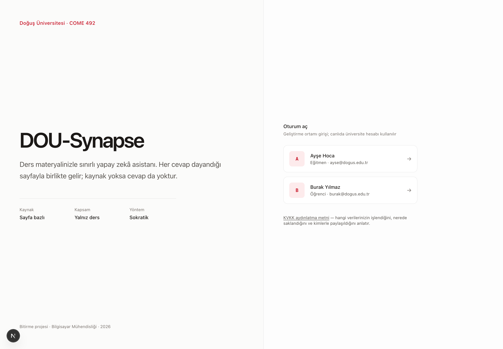
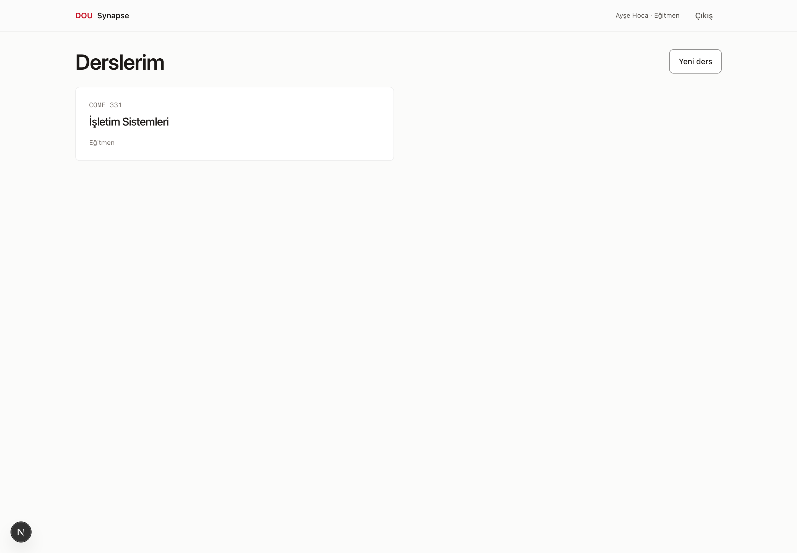
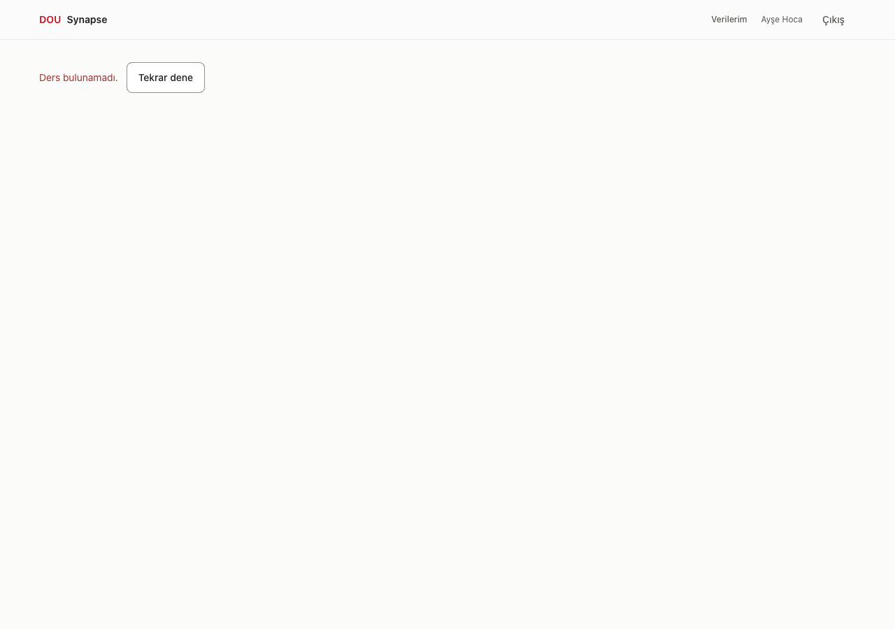
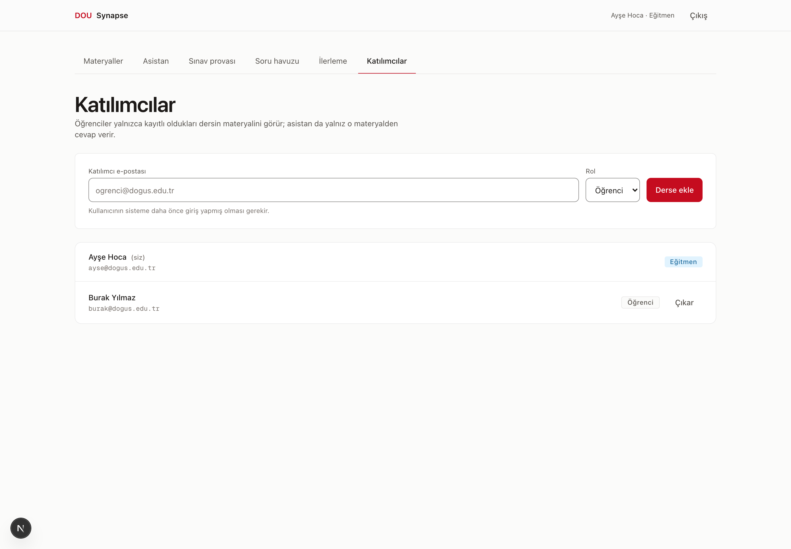
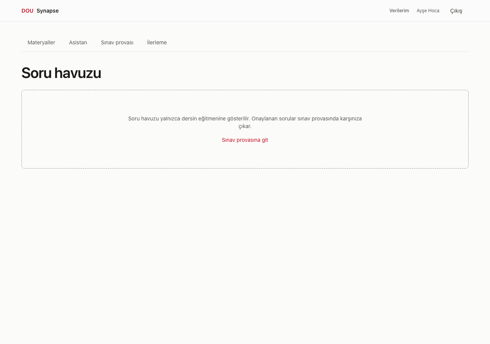
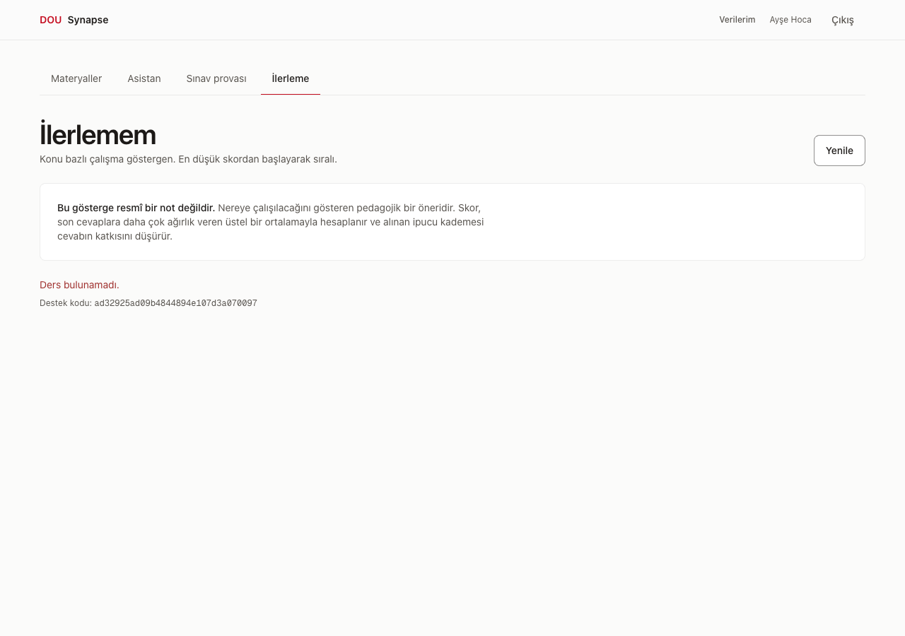

# Eğitmen Kılavuzu

DOU-Synapse, dersinize yüklediğiniz materyallerden — **ve yalnız onlardan** — cevap veren
bir asistandır. Bu kılavuz sırasıyla: ders açma, materyal yükleme, öğrenci ekleme, soru
havuzu ve onay, sınıf analitiği.

> **Belgedeki ekran görüntüleri gerçektir** — çalışan sistemden alındı, çizim değildir.
> Beş şerit birleştikten sonra (9 Ağustos akşamı) yeniden çekildi; artık **hiçbiri
> tasarım önizlemesi değil**, hepsi gerçek veriyle çalışan ekranlar.

---

## 1. Giriş

Geliştirme ortamında iki hazır kimlik kartı vardır (Ayşe Hoca / Burak Yılmaz); karta
tıklamak yeterlidir. Canlı ortamda üniversite hesabınızla giriş yaparsınız.

Sistemde **genel bir "eğitmen" rolü yoktur.** Yetkiniz her zaman **ders bazlıdır**: bir
derste eğitmen, başka bir derste öğrenci olabilirsiniz. Bir ders açtığınızda o dersin
eğitmeni olursunuz.

---

## 2. Ders açma ve materyal yükleme

### Ders açma

Derslerim ekranında yeni ders oluşturun: ders kodu (`COME 331`) ve ad
(`İşletim Sistemleri`).

### Materyal yükleme

Ders → **Materyaller** → *Dosya seç*.

| | |
|---|---|
| Kabul edilen türler | `.pdf` `.pptx` `.md` `.txt` ve kod dosyaları (`.py .java .js .ts .c .h .cpp`) |
| Boyut sınırı | 20 MB |
| Kontrol | Uzantı + MIME + dosyanın gerçek imzası (adı değiştirilmiş dosya geçmez) |

Yükledikten sonra dosya arka planda işlenir ve durumu listede görünür:

| Rozet | Anlamı |
|---|---|
| **Yükleniyor** | Dosya alındı, sıraya girdi |
| **İşleniyor** | Sayfalara/slaytlara bölünüyor ve indeksleniyor |
| **Hazır** | Asistan bu materyalden cevap verebilir. Yanında **parça sayısı** yazar |
| **Başarısız** | İşlenemedi. Dosyayı silip yeniden yükleyin |

**Parça (chunk) nedir ve neden görünüyor?** Materyaliniz sayfa/slayt sınırlarını koruyarak
küçük parçalara bölünür. Bir cevabın altında "Sayfa 7" yazabilmesinin sebebi budur: sayfa
numarası modelin yazdığı metinden değil, **o parçanın kendi kaydından** gelir.

**İlk yükleme yavaştır.** İlk dosyada çok dilli dil modeli belleğe yüklenir; ölçülen
**~19 saniye**. Sonraki dosyalar 2-7 saniye. Bu tek seferliktir.

**Durum "Hazır" olmadan asistan o materyalden cevap veremez.** Ders başında bütün
materyalleri yükleyip listenin tamamının Hazır olduğunu görmek en iyisidir.

---

## 3. Öğrenci ekleme

Ders → **Katılımcılar**. Öğrenciyi e-postasıyla ekleyin ve rolünü seçin.

- Sistemde kaydı olmayan bir e-posta eklenemez; öğrenci önce giriş yapmış olmalıdır.
- Bir katılımcıyı çıkardığınızda üyeliği **iptal** edilir; ders içeriğine erişimi anında
  kesilir, geçmiş kayıtları silinmez.
- Erişimi olmayan biri dersinizin adresini bilse bile **dersin var olduğunu göremez** —
  sistem "bulunamadı" der. Bu bilinçlidir: hangi derslerin açık olduğu bile sızmamalıdır.

---

## 4. Soru havuzu ve onay

### Akış

1. **Konu tanımlayın** (örn. "Kilitlenme (Deadlock)"). Sorular konuya bağlanır; ilerleme
   takibi de konu bazlıdır.
2. **Soru üretin.** Sistem materyalinizden dört tipte soru üretir:
   `çoktan seçmeli`, `açık uçlu`, `kod çıktısı tahmini`, `hata bulma`.
   Her soru **hangi parçadan üretildiyse ona bağlıdır.**
3. **Onaylayın veya reddedin.**

### Onay kuralı — en önemli madde

> **Onaylamadığınız hiçbir soru öğrenciye görünmez.**

Bu bir arayüz nezaketi değil, sunucuda zorlanan bir kuraldır. 9 Ağustos'ta canlı sistemde
doğrulandı:

- Havuzda 5 taslak soru varken öğrenci hesabı listede **0 soru** gördü.
- Öğrenci sınav provası başlatmayı denedi; sistem reddetti:
  *"Bu derste henüz onaylanmış soru yok. Eğitmeniniz soruları onayladıktan sonra sınav
  provası başlatabilirsiniz."*
- 4 soru onaylandıktan sonra öğrenci **4 soru** gördü — ve gördüğü kayıtlarda
  **cevap anahtarı yoktu.** Cevap anahtarı, çeldirici kaynakları ve değerlendirme rubriği
  öğrenciye giden veriden beyaz listeyle elenir.

Reddettiğiniz sorular havuzda kalır (kayıt için) ama hiçbir sınavda çıkmaz.

### Soru üretimi çalışmıyorsa

Anahtar tanımlı değilse sistem deterministik sahte sağlayıcıyla geçerli taslaklar
üretir; blueprint→taslak→onay akışını çevrimdışı doğrulayabilirsiniz. Bu taslaklar
pedagojik kalite kanıtı değildir. Gerçek ders için Groq/Gemini sağlayıcısını açın,
taslakların kaynaklarını ve rubriğini inceleyin ve yalnız uygun olanları onaylayın.

---

## 5. Sınıf analitiği

Ekran üç soruyu cevaplar:

1. **Konu bazlı sınıf ortalaması** — hangi konu sınıfça zayıf?
2. **En çok yanlış yapılan sorular** — hangi soru ayırt edici değil, hangi kavram yanlış
   anlaşılmış?
3. **Ret istatistiği** — asistan kaç soruyu cevaplamayı reddetti?

### Sayıları doğru okumak

| Alan | Ne demek | Dikkat |
|---|---|---|
| Konu ortalaması | 0-1 arası ağırlıklı puan | Yanında **kaç cevaba dayandığı** yazar. 4 cevaba dayanan bir ortalama sınıf hükmü değildir |
| Seviye | <0.40 Geliştirilmeli · 0.40-0.74 Orta · ≥0.75 İyi | Eşikler sabit |
| Yanlış oranı | Sorunun yanlış cevaplanma oranı | Az cevaplı soruda 1.0 görmek olağandır |
| **Kapsam dışı ret oranı** | Kapsam dışı diye reddedilen isteklerin payı | Kanıt yetersizliği bu orana **girmez**, ayrı sayılır |

**Bu kartı doğru okumak.** Asistanın iki farklı reddi vardır ve kart yalnız birini sayar:

- **Kapsam dışı** — soru bu dersin konusu değil ("İtalya'nın başkenti"). Orana **girer**.
- **Kanıt yetersiz** — konu dersin alanında ama materyalde yeterli dayanak yok. Orana
  **girmez**, ayrıca gösterilir.

Ayrım bilinçlidir: birincisi sistemin doğru çalıştığının göstergesi, ikincisi
*"bu konuda materyal eksik olabilir"* sinyalidir ve size farklı bir iş verir.

Ders henüz hiç cevap üretmediyse kart sayı yerine **"Ölçüm yok"** der. Sıfır ile
ölçülmemiş aynı şey değildir; kart bunları karıştırmaz.

### Öğrencilerin sorularını göremezsiniz — bilerek

Analitik, öğrencilerin **ne sorduğunu** göstermez ve gösteremez. Sohbet mesajları
eğitmene kapalıdır; analitik yalnızca serbest metin taşımayan ölçüm kayıtlarından okur.

Bu bir eksiklik değil, ürünün gerekçelerinden biridir: **öğrencinin hocasına sormaya
çekindiği soruyu sisteme sorabilmesi.** Eğitmen bunu satır satır okuyabilseydi o güven
ortadan kalkardı.

---

## 6. Asistan ne yapmaz

Bu bölümü öğrencilerinize de aktarın; beklentiyi baştan doğru kurmak, sonradan
"çalışmıyor" denmesini engeller.

**Asistan:**

- **İnternetten bilgi getirmez.** Erişebildiği tek kaynak sizin yüklediğiniz materyaldir.
- **Başka dersin materyaline bakamaz.** Ders izolasyonu iki katmanda uygulanır: sunucuda
  üyelik doğrulaması ve veritabanı düzeyinde satır güvenliği.
- **Kaynaksız cevap göstermez.** Bir cevaba geçerli kaynak bağlanamıyorsa cevap
  gösterilmez — eksik cevap yanlış cevaptan iyidir.
- **Ödevi çözmez.** Sokratik modda cevabı vermez; öğrenci deneme yapmadan bir sonraki
  ipucuna geçmez, ısrar edilirse hiç ilerlemez.
- **Sınav sırasında ipucu vermez.** Gerçek sınav modunda ipucu tamamen kapalıdır. Sınav
  **provasında** ipucu verilir ve alınan ipucu puanı düşürür.
- **Not vermez.** Konu bazlı puan bir **çalışma göstergesidir**, resmî değerlendirme
  değildir. Karar sizindir.
- **Bilmediğinde uydurmaz.** Materyalde yeterli dayanak yoksa nazikçe reddeder.
  Bu doğru davranıştır.

---

## 7. Sık karşılaşılan durumlar

| Durum | Sebep / çözüm |
|---|---|
| Materyal **Başarısız** oldu | Dosya bozuk ya da metin çıkarılamıyor (taranmış PDF). Silip yeniden yükleyin; taranmış PDF desteklenmiyor |
| Öğrenci "cevap alamıyorum" diyor | Materyal **Hazır** mı? İlgili konu yüklü mü? Asistan yalnız yüklediğiniz materyalden cevap verir |
| Asistan bildiğim bir şeye "dayanak yok" diyor | Konu materyalde geçmiyor ya da çok kısa geçiyor olabilir. İlgili haftanın materyalini ekleyin |
| Öğrenci soruları görmüyor | Sorular **onaylanmamış** olabilir |
| "Çok sık soru gönderiyorsun" | Dakikada 20 isteklik sınır. Bir dakika bekleyin |
| Analitikte ret oranı %0 | Bilinen kusur, §5'e bakın |

---

## İlgili belgeler

- [Öğrenci Kılavuzu](student-guide.md)
- [KVKK Aydınlatma Metni](kvkk.md) — hangi kişisel veri nasıl işleniyor
- [Mimari](../ARCHITECTURE.md) — kararlar, gerekçeler ve **uygulanmayanlar**
