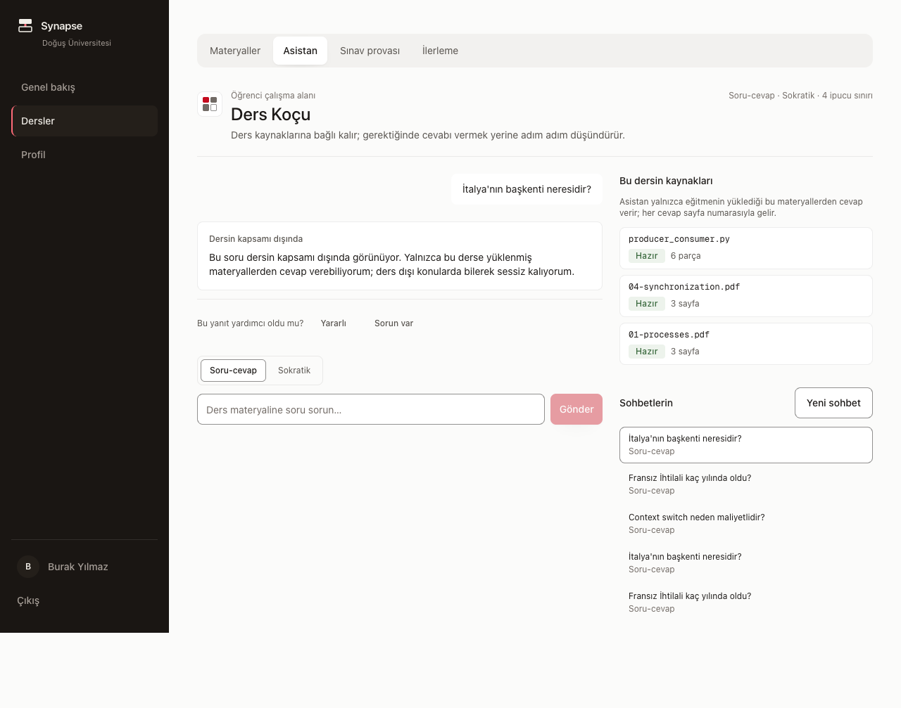

# Demo Senaryosu — sahne sahne

> [runbook.md](runbook.md) "bozulursa ne yapılır"ı anlatır. **Bu belge her şey yolundayken
> ne anlatılacağını** anlatır: hangi cümle, hangi tıklama, ekranda ne görünecek, kaç saniye.
>
> Altı sahnenin **beşi 9 Ağustos 2026'da canlı sistemde koşuldu** ve buradaki ekran
> metinleri o koşudan alındı — uydurulmuş replik yok. Altıncı sahnenin (sınav) ön koşulu
> aşağıda yazılı.

**Toplam süre: ~9 dakika.** Soru-cevap için ayrıca 3-5 dakika bırakın.

---

## Sunumdan 10 dakika önce — yığını kaldırma ve kanıt turu

Aşağıdaki sıra **20 Ağustos 2026'da bu makinede birebir koşuldu**; her madde o koşuda
ölçülmüş bir tuzağı kapatır (hepsi gerçekten yaşandı, hiçbiri varsayım değil).

1. **PostgreSQL ayakta mı?**
   ```bash
   pg_isready
   ```
   Cevap vermiyorsa: bilgisayar çökmüşse `postmaster.pid` bayat kalır ve içindeki PID
   başka bir sürece ait olabilir (ölçüldü: PID McAfee'ye aitti). O dosyayı silip
   `brew services restart postgresql@16`.

2. **Rollerin giriş yetkisi duruyor mu?** (test koşuları bunu düşürebiliyor)
   ```bash
   psql -d postgres -tAc "select rolname, rolcanlogin from pg_roles where rolname like 'dou_%'"
   ```
   `f` görürsen: `psql -q -d dou_synapse -f supabase/local_dev_setup.sql`.

3. **Model önbelleği gösteriliyor mu?** `apps/api/.env` içinde `EMBEDDING_CACHE_DIR`
   dolu olmalı. Boşsa fastembed ~2 GB'ı yeniden indirmeye çalışır; dolu diskte açılış
   `No space left on device` ile düşer ve asistan sunumda hiç cevap veremez. Doğru
   ayarla ilk hazırlık **~5 saniye** sürer.

4. **API ve web'i başlat** (ayrı iki terminal ya da Claude'un sunucu profilleri):
   ```bash
   cd apps/api && EMBEDDING_PROVIDER=fastembed uv run uvicorn app.main:app --port 8030
   ```
   ```bash
   cd apps/web && NEXT_PUBLIC_API_URL=http://localhost:8030 bun run dev --port 3030
   ```

5. **Hazırlık kanıtı — üçü de `ok` olmadan sahneye çıkma:**
   ```bash
   curl -s http://localhost:8030/health/ready
   ```
   Beklenen: `{"status":"ok","checks":{"database":"ok","pgvector":"ok","embedding":"ok"}}`

6. **Sağlayıcı dürüstlüğü.** `GROQ_API_KEY` doluysa cevaplar gerçek modelden gelir.
   Boşsa uygulama **deterministik sahte sağlayıcıya** düşer (log: "llm anahtarı yok"),
   cevaplar materyalden alıntı birleştirir. İkisi de meşrudur ama **hangisinde
   olduğunuzu bilerek** anlatın; jüriye "gerçek model" demeden önce logdan doğrulayın.

7. **Isıtma turu.** Sahneye çıkmadan bir soru sorup atın: ilk soru embedding modelini
   belleğe alır (~12 sn), sonrakiler saniyenin altında döner. Jüri o 12 saniyeyi
   görmesin.

8. **Ders listesi temiz mi?** Demo veritabanında yalnız gerçek dersler olmalı
   (`COME 331` ve arkadaşları). Test artığı ders birikirse liste çöplük görünür:
   ```bash
   psql -d dou_synapse -tAc "select count(*) from courses"
   ```
   20 Ağustos'ta bu sayı 204'tü ve 197'si test artığıydı; temizlendi, **7 kaldı**.

9. **LLM modeli hâlâ geçerli mi?** Sağlayıcılar model adlarını kullanımdan
   kaldırır. 20 Ağustos'ta `groq/llama-3.3-70b-versatile` Groq'ta artık yoktu ve
   asistan "Cevap üretme servisine ulaşılamıyor" hatası veriyordu. Kontrol:
   ```bash
   curl -s -H "Authorization: Bearer $GROQ_API_KEY" https://api.groq.com/openai/v1/models \
     | python3 -c "import json,sys; print([m['id'] for m in json.load(sys.stdin)['data']])"
   ```
   `.env`'deki `LLM_PRIMARY_MODEL` bu listede yoksa listeden bir model seçin.

10. **Demo öğrencisinin günlük AI kotası boş mu?** Kota kalıcıdır (veritabanında);
    prova sırasında dolarsa sunumda "Günlük kişisel AI kullanım kotan doldu"
    hatası çıkar. Provadan sonra sıfırlayın:
    ```bash
    psql -d dou_synapse -c "delete from ai_token_reservations"
    ```

11. **Bilgi İşlem konsolu görünüyor mu?** Ayşe Hoca platform yöneticisi değilse
    admin sekmesi hiç çizilmez (20 Ağustos'ta paylaşılan veritabanında bu satır
    eksikti ve üç E2E testi de bu yüzden düşüyordu):
    ```bash
    psql -d dou_synapse -tAc "select count(*) from platform_admins"
    ```
    `0` ise: `psql -d dou_synapse -f supabase/seed_demo.sql`

**Demoda gösterilecek ders:** `COME 331 · İşletim Sistemleri` — üç materyali işlenmiş
durumda (`producer_consumer.py`, `04-synchronization.pdf`, `01-processes.pdf`).
Kimlikler: **Ayşe Hoca** (eğitmen) ve **Burak Yılmaz** (öğrenci); giriş ekranında iki
kartla seçilir, parola yoktur (geliştirme kimliği).

---

## Anlatının omurgası

Ürünün tezi tek cümlede: **"Kaynak yoksa cevap da yok."**

Altı sahne bu cümleyi sırayla kanıtlar. Sıra rastgele değil — her sahne bir öncekinin
açtığı soruyu kapatır:

| # | Sahne | Kanıtladığı şey | Süre |
|---|---|---|---|
| 1 | Eğitmen materyal yükler | Bilgi tabanı **hocanın koyduğudur** | 60 sn |
| 2 | Öğrenci soru sorar | Cevap **sayfa numarasıyla** gelir | 90 sn |
| 3 | Ödev sorusu sorulur | Cevap yerine **Sokratik merdiven** | 90 sn |
| 4 | "Sadece söyle" denir | Merdiven **ilerlemez** | 60 sn |
| 5 | Ders dışı soru sorulur | **Nazik ret — bu bir özellik** | 60 sn |
| 6 | Sınav provası + "neden yanlış" | Öğrenme döngüsü kapanır | 120 sn |

En özgün an **5. sahnedir**: bilmediğini söyleyebilen asistan. Bunu bir eksiklik gibi değil,
**tasarım kararı** olarak anlatın.

> **Altı sahnenin altısı da 9 Ağustos akşamı, beş şerit birleştikten sonra canlı sistemde
> koşuldu.** Buradaki ekran metinleri o koşumdan alındı. Daha önceki sürümde 6. sahne
> "arayüzde gösterilemez" diye işaretliydi; soru havuzu, sınav ve ilerleme ekranları o
> tarihte bağlandı ve bu not geçersizleşti.

---

## Sahne 1 — Eğitmen materyal yükler (60 sn)

**Kim:** Ayşe Hoca (eğitmen) · **Ekran:** COME 331 → Materyaller

**Ne söylenecek:**

> "Sistem hiçbir şey bilmiyerek başlıyor. Bilgi tabanını dersin hocası kuruyor —
> internetten değil, kendi materyalinden."

**Ne yapılacak:**

1. Materyaller sekmesi açık, listede 8 materyal ve her birinin yanında **Hazır** rozeti
   ve parça sayısı görünüyor (`01-processes.pdf · 45 KB · 3 sayfa · 3 parça`).
2. "Dosya seç" ile küçük bir PDF yükleyin (5-10 sayfa). Durum **Yükleniyor → İşleniyor →
   Hazır** akar ve parça sayısı belirir.

**Ne görünecek:** 

**Söylenecek ikinci cümle:**

> "Her dosya sayfa sayfa parçalanıyor ve sayfa numarası saklanıyor. Birazdan cevapta o
> numarayı göreceksiniz — çünkü kaynak model tarafından yazılmıyor, buradan geliyor."

**Süre uyarısı:** ilk yükleme embedding modelini belleğe alır ve **19 saniye** sürebilir;
sonrakiler 2-7 saniye. T-15 warm-up yapıldıysa bu maliyet zaten ödenmiştir.

---

## Sahne 2 — Öğrenci soru sorar, kaynaklı cevap gelir (90 sn)

**Kim:** Burak (öğrenci) · **Ekran:** COME 331 → Asistan · **Mod:** Soru-cevap

**Sorulacak soru** (kopyala-yapıştır):

```
Süreç ile iş parçacığı arasındaki fark nedir?
```

**Ne söylenecek (soru gönderilirken):**

> "Öğrenci soruyor. Dikkat edin: cevabın altında ne göreceğiz?"

**Ekranda görünen (9 Ağustos koşusu):** cevap metni, altında **üç kaynak kartı** —
`01-processes.pdf · Sayfa 1`, `01-processes.pdf · Sayfa 2`, `02-cpu-scheduling.pdf · Sayfa 2`.
Her kartta materyalden **birebir alıntı** var.


**Ne söylenecek (cevap geldikten sonra):**

> "Dosya adı ve sayfa numarası modelin yazdığı metinden gelmiyor. Model yalnızca 'hangi
> parçaya dayandım' diyor; dosya adını ve sayfayı sistem, o parçanın kendi kaydından
> üretiyor. Yani model uydursa bile buraya uydurma bir kaynak yazamaz — atıf, getirilen
> parça kümesine karşı **mekanik olarak** doğrulanıyor."

**İsteğe bağlı 15 saniye:** sağdaki "Bu dersin kaynakları" panelini gösterin —
"asistanın erişebildiği her şey bu listede."

---

## Sahne 3 — Ödev sorusu: cevap yerine merdiven (90 sn)

**Kim:** Burak · **Mod:** **Sokratik** (mod düğmesine basın; arayüz yeni oturum açar)

**Sorulacak soru:**

```
Deadlock oluşması için gereken dört koşul nedir?
```

**Ne söylenecek:**

> "Aynı öğrenci, bu sefer ödev sorusu soruyor. Sokratik modda sistemin işi cevap vermek
> değil, öğrenciyi cevaba yürütmek."

**Ekranda görünen:** "Sokratik mod" başlıklı kart, sağ üstte **beş noktalı merdiven
göstergesi** (birincisi dolu), kademe etiketi **Tanı**, ve metin:

> "Bu konuda şimdiye kadar ne denedin? 05-deadlock-demo.pdf, Sayfa 1 bölümündeki hangi
> adımda takıldığını yazar mısın?"

Altında kaynak: `05-deadlock-demo.pdf · Sayfa 1`.

**Ne söylenecek:**

> "Cevabı vermedi ama **kaynaksız da bırakmadı.** İpucu da tıpkı cevap gibi getirilen bir
> parçaya bağlı — 'her yanıtta kaynak' kuralı ipuçlarını da kapsıyor."

**Şimdi öğrenci gerçekten deniyor** (kopyala-yapıştır):

```
Sanırım karşılıklı dışlama ve döngüsel bekleme var, diğerlerini bilmiyorum
```

**Ekranda görünen:** merdiven göstergesi **ikinci noktaya** ilerler, kademe **Yönlendirme**
olur:

> "05-deadlock-demo.pdf, Sayfa 1 bölümündeki tanımı bir kez daha oku. Sence orada senin
> sorunun hangi parçası tarif ediliyor?"

**Ne söylenecek:**

> "Öğrenci bir deneme yaptı, merdiven bir kademe ilerledi. Kademeyi ilerleten şey soru
> sormak değil, **denemek.**"

---

## Sahne 4 — "Sadece söyle": merdiven ilerlemiyor (60 sn)

**Kim:** Burak, aynı oturum · **Bu sahnenin tamamı bir önceki oturumun devamıdır**

**Yazılacak** (kopyala-yapıştır):

```
sadece söyle
```

**Ne söylenecek (göndermeden önce):**

> "Şimdi öğrencinin yapacağı şeyi yapalım."

**Ekranda görünen:** merdiven göstergesi **ilerlemez** — hâlâ ikinci nokta. Metin:

> "Cevabı doğrudan veremem; bu modun amacı çözümü birlikte kurmak. Aklına gelen ilk adımı
> ya da bir tahminini yazar mısın? En küçük deneme bile bir sonraki ipucunu açar."

Ardından **aynı kademenin** ipucu tekrar gösterilir, yine kaynağıyla.


**Ne söylenecek:**

> "Merdiven ilerlemedi. Bu bir prompt talimatı değil — kademe kararı sunucudaki bir durum
> makinesinde veriliyor, modele sorulmuyor. Model kendini bir üst kademeye terfi ettiremez.
> Israr edildiğinde sistem dil modeline hiç gitmiyor bile; sabit bir metinle karşılık
> veriyor."

**Tekrar edin — bu cümle sahnenin özeti:**

> "Yani öğrenci ısrar ederek cevabı alamıyor."

---

## Sahne 5 — Ders dışı soru: nazik ret (60 sn) ★ en özgün an

**Kim:** Burak · **Mod:** Soru-cevap (**yeni sohbet** açın)

**Sorulacak soru:**

```
İtalya'nın başkenti neresidir?
```

**Ne söylenecek (göndermeden önce):**

> "Son olarak, bu asistanın bence en önemli özelliği."

**Ekranda görünen:** nötr bir bildirim kartı — **hata rengi ya da hata ikonu yok**:

> **Dersin kapsamı dışında**
> "Bu soru dersin kapsamı dışında görünüyor. Yalnızca bu derse yüklenmiş materyallerden
> cevap verebiliyorum; ders dışı konularda bilerek sessiz kalıyorum."



**Ne söylenecek:**

> "Bu bir hata değil. **Ürünün çalıştığının kanıtı.** Genel amaçlı bir sohbet botu bu
> soruya kendinden emin bir cevap üretirdi ve öğrenci onu ders bilgisi sanırdı. Biz
> materyalde yeterince güçlü bir dayanak bulamadığımız anda dil modeline **hiç
> gitmiyoruz** — cevap üretilmiyor ki uydurulabilsin."

**İkinci ret türünü de gösterin (15 sn).** Sistem iki farklı ret veriyor ve ayrım
kasıtlı:

```
Bugünkü dolar kuru ne kadar?
```

Bu soru **"Materyalde dayanak bulunamadı"** döner, "kapsam dışı" değil.

> "İki farklı ret var. Birincisi 'bu ders bu konuyu kapsamıyor', ikincisi 'konu ilgili
> olabilir ama materyalde yeterli dayanak yok'. Öğrenci için ikisi farklı iş demek:
> birinde başka yere sorarsın, ötekinde soruyu düzeltirsin. Eğitmen için de farklı —
> ikinci tür birikiyorsa o hafta materyal eksik demektir."

**Sayıyla destekleyin (dürüst hâliyle):**

> "Bu kapının eşiğini 15 soruluk bir kalibrasyon setiyle ayarladık ve kararı dondurduktan
> sonra 55 soruluk ayrı bir sette ölçtük. Hedefimiz %90 doğru retti; **%80 ölçtük.**
> Eşiği yükseltirsek %100'e çıkıyor ama o zaman test setimizi ikinci bir ayar setine
> çevirmiş olurduk. Yapmadık ve sayıyı olduğu gibi raporladık."

**Neden bu cümle:** ölçümün altında kalan bir sonucu kendiniz söylemek, jürinin onu
bulmasından her zaman iyidir — ve metodolojiyi anladığınızı kanıtlar.

**Dikkat — soru seçimi önemli.** Ret türü ölçülmüş bir sinyalle belirleniyor ve her ders
dışı soru "kapsam dışı" etiketini almıyor. 9 Ağustos'ta ölçülen:

| Soru | Dönen |
|---|---|
| İtalya'nın başkenti neresidir? | **kapsam dışı** |
| Bugün hava nasıl? | **kapsam dışı** |
| Fenerbahçe dün kaç attı? | **kapsam dışı** |
| Bugünkü dolar kuru ne kadar? | dayanak yok |
| En iyi pizza tarifi nedir? | dayanak yok |
| Osmanlı Devleti ne zaman kuruldu? | dayanak yok |

Sahnede yukarıdaki ilk soruyu kullanın; **denenmemiş bir soruyla sahneye çıkmayın.**

## Sahne 6 — Sınav provası ve "neden yanlış" (120 sn)

**Ön koşul:** derste **onaylanmış soru** olmalı. Soru üretimi gerçek LLM anahtarı ister;
anahtar yoksa sorular T-60'ta üretilip onaylanmış olmalıdır ([runbook §3](runbook.md#3-sabah-kontrol-listesi)).

### 6a. Eğitmen onayı (40 sn)

**Kim:** Ayşe Hoca · **Ekran:** Soru havuzu

**Ne söylenecek:**

> "Sorular otomatik üretiliyor ama **otomatik yayınlanmıyor.** Hoca onaylamadan hiçbir soru
> öğrenciye görünmüyor."

Bir soruyu **Onayla**, birini **Reddet** ile işaretleyin.

**Kanıtı gösterin:** öğrenci hesabına geçmeden önce söyleyin —

> "Onaylanmamış bir soru öğrenci tarafında listede bile görünmez; öğrenci sınav başlatmak
> isterse sistem 'bu derste henüz onaylanmış soru yok' der."

### 6b. Öğrenci sınav provası (80 sn)

**Kim:** Burak · **Ekran:** Sınav provası

1. Sınavı başlatın. Sorular şıklarıyla gelir — **cevap anahtarı gelmez.**
2. **Bilerek yanlış** bir şık işaretleyin.

**Ekranda görünen:** `Yanlış · 0 / 100` rozeti, altında **"Neden yanlış?"** kartı —
seçilen çeldiricinin çeliştiği kaynak, dosya adı ve sayfasıyla
(`04-synchronization.pdf · Sayfa 3`) ve materyalden birebir alıntıyla. Altında cevap
anahtarı ve açıklama.


**Ne söylenecek:**

> "'Yanlış' demekle yetinmiyor. Seçtiğin şıkkın **hangi cümleyle çeliştiğini** gösteriyor.
> Bu eşleme de modelden değil: her çeldirici, soruyu üretirken hangi parçaya karşı
> yazıldıysa o parçaya bağlanmış durumda. Yani deterministik."

3. Sınavı bitirin, **İlerleme** sekmesine geçin: konu bazlı seviye ve puan görünür.

**Kapanış cümlesi:**

> "Döngü kapanıyor: hocanın materyali → kaynaklı cevap → cevap yerine yönlendirme →
> sınav → nerede zayıf olduğunun konu bazlı görüntüsü. Hepsi tek bir kuralın üstünde
> duruyor: kaynak yoksa cevap da yok."

---

## Sorulması muhtemel jüri soruları

| Soru | Kısa cevap |
|---|---|
| "Model uydurmuyor mu?" | Atıflar getirilen parça kümesine karşı **set üyeliğiyle** sınanıyor; kümede olmayan atıf düşürülüyor, geçerli atıf kalmazsa cevap gösterilmiyor. Bu deterministik. Ama **iddia-kaynak tutarlılığını** garanti etmez, onu ayrıca örneklemle ölçüyoruz |
| "Öğrenci ödevi yaptırabilir mi?" | Sokratik modda merdiven denemeye bağlı; ısrarda dil modeline hiç gidilmiyor. Kod/çözüm sızıntısı için ayrı bir kural tabanlı filtre var, ihlalde bir kez yeniden üretiyor, ısrar ederse sabit şablona düşüyor |
| "Başka dersin materyaline erişebilir mi?" | İki katman: sunucuda üyelik doğrulaması + PostgreSQL satır düzeyi güvenlik. API tabloların sahibi olmayan ayrı bir rolle bağlanıyor, testler de aynı rolle koşuyor — yoksa test hiçbir şey kanıtlamaz |
| "Sayılarınız ne kadar güvenilir?" | n=50, alt kümeler n≈10 — yön göstergesi. Kalibrasyon ve test setleri ayrı; hedefin altında kalan metriği (%80) olduğu gibi raporluyoruz |
| "Neden LangChain kullanmadınız?" | Hat ince; düz Python daha şeffaf ve durum makinesi çatı istemiyor. Karar PLAN.md'de gerekçesiyle yazılı |

---

## Önbelleğe doldurulacak sorular (R3'ye)

Plan C (tam çevrimdışı) için `answer_cache` **birebir eşleşmeyle** çalışır — soru metni
harfi harfine aşağıdaki gibi olmalı. Yalnız `qa` modu önbelleğe girer; Sokratik sahneler
(3 ve 4) önbelleğe **girmez** ve sahte sağlayıcıyla koşar.

`fill_answer_cache.py` bu listeyi almalı:

```text
Süreç ile iş parçacığı arasındaki fark nedir?
İtalya'nın başkenti neresidir?
Bugünkü dolar kuru ne kadar?
Semafor nedir ve ne işe yarar?
Deadlock oluşması için gereken dört koşul nedir?
Sayfalama nedir?
Context switch maliyeti neden yüksek?
```

İlk ikisi 2. ve 5. sahnenin **tam** soruları; kalan dördü jüri "başka bir şey sorun"
derse kullanılacak yedeklerdir.

Notlar:

- 5. sahnenin iki sorusu (`İtalya'nın başkenti…`, `Bugünkü dolar kuru…`) önbelleğe
  **girmez** — `answer_cache` yalnız `answered` + atıflı cevapları saklar. Yani
  çevrimdışında bu sahne zaten doğru davranır (kanıt kapısı kapanır) ve önbelleğe ihtiyaç
  duymaz. Listede durmalarının sebebi R3'ün doldurma koşusunda **isabetsizliği
  doğrulaması**.
- Sürücü soruları **kopyala-yapıştır** ile sormalı. Bir harf farkı isabeti kaçırır.
