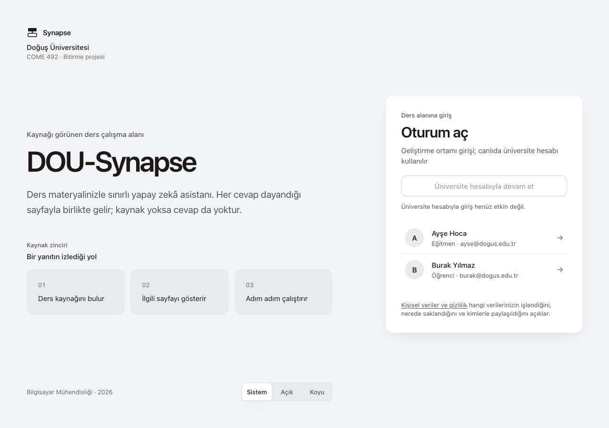
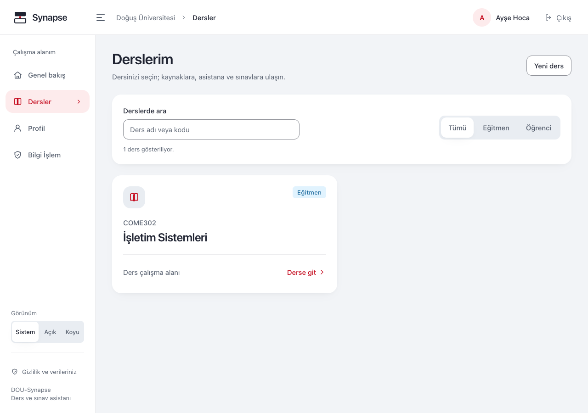
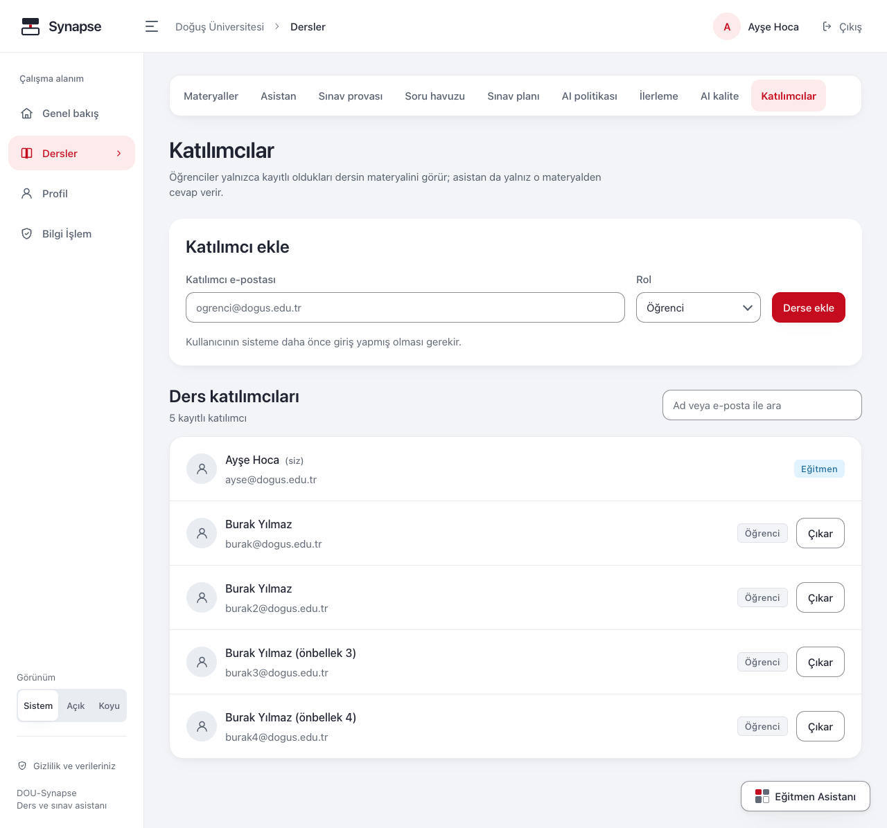

# Eğitmen Kılavuzu

Bu kılavuz ders açma, materyal yükleme, soru inceleme, sınav hazırlama, dersin asistan
ayarları ve öğrenci geri bildirimlerini kapsar. Yapay zekânın ürettiği soru ve puanları
kaynakla birlikte inceleyin; kaynak gösterilmesi tek başına pedagojik doğruluk kanıtı değildir.

> Görseller önceki sürümden örnek ekranlardır. Aşağıdaki adımlar mevcut ekran adlarına
> göre düzenlenmiştir; bazı özellikler kullandığınız ortamda açılmamış olabilir.

## 1. Giriş ve ders yetkisi

Giriş ekranında hesabınız için sunulan yöntemi kullanın. E-posta ve parola isteniyorsa
kurumunuzun uygulama için verdiği bilgileri kullanın. Örnek ortamdaki hazır kimlik
kartları kişisel hesabınızın yerine geçmez.

Eğitmen yetkiniz **ders bazlıdır**: bir derste eğitmen, başka bir derste öğrenci
olabilirsiniz. Açtığınız dersin eğitmeni olursunuz. **Bilgi İşlem** alanının yetkisi
ayrıdır; eğitmen olmak bu alana giriş hakkı vermez.

## 2. Ders açma ve materyal yükleme

**Derslerim** ekranında ders kodunu ve adını girerek yeni ders oluşturun.

Dersi açıp **Materyaller → Dosya seç** adımını izleyin.

PDF, PPTX, Markdown, metin ve desteklenen kod dosyalarını yükleyebilirsiniz. Ekrandaki
boyut sınırına ve yükleme uyarısına uyun; dosyanın adını değiştirmeniz desteklenmeyen bir
dosyayı uygun hâle getirmez. Metin içermeyen taranmış PDF yerine metni seçilebilen sürümü
hazırlayın.

| Durum | Yapılacak işlem |
|---|---|
| **Sırada** | Dosya alındı; işlenmesini bekleyin |
| **İşleniyor** | İçeriğin hazırlanmasını bekleyin; süre dosyaya ve hizmet yoğunluğuna bağlıdır |
| **Hazır** | Parça sayısını ve **İçerik önizle** alanını inceleyin |
| **Başarısız** | Uyarıyı okuyun; geçici sorun giderildiyse **Yeniden işle** düğmesini kullanın. Dosyanın içeriği sorunluysa düzeltilmiş dosyayı yükleyin |

**Parça**, materyalin kaynak gösterilebilen bir bölümüdür. Sayfa veya slayt konumu bu
bölümün kaydından gelir. **Hazır** durumu, metnin çıkarıldığını gösterir; öğretim içeriğinin
veya üretilen yanıtların doğruluğunu sizin yerinize onaylamaz. Öğrencinin kullanacağı
kaynakları ayrıca **AI politikası** ekranından kontrol edin.

### Yeni sürüm yükleme ve silme

Bir dosyanın yerine güncel sürümünü yükleyecekseniz **Yerine geçtiği belge (isteğe bağlı)**
alanından eski belgeyi seçip **Dosya seç** deyin. Bağımsız bir materyal için
**Yeni, bağımsız materyal** seçili kalsın.

Eski kaynağa bağlı soru ayrıntısındaki **Etkilenen sınavları göster**, bu soruyu kullanan
sınav sürümlerini listeler. Bağlantıdan ilgili sürümün **Kâğıt önizlemesi** açılır. Güncel
kaynak yeni soru gerektiriyorsa yeni taslağı inceleyip onaylayın ve yeni sınav sürümü
hazırlayın; geçmiş sınavın içeriğini değiştirmeye çalışmayın.

**Sil** işlemi bağlantılı sorular veya sınav kayıtları nedeniyle reddedilebilir. Gösterilen
bağımlılığı inceleyin. Kullanılan bir soruyu veya materyali kaldırmak için geçmiş öğrenci
kayıtlarını silmeye yönelmeyin.

### Materyalin soruya dayanak olup olmadığını inceleme

**Materyaller → Retrieval testi** bağlantısı **Retrieval laboratuvarı** ekranını açar.
Dersle ilgili soruyu yazıp **Parçaları getir** deyin. Gelen alıntı ve konumları inceleyin.
Bu ekran, ilgili materyal bölümlerini bulmanıza yardımcı olur; üretilmiş bir yanıtın veya
puanlamanın doğruluğunu ölçmez.

## 3. Katılımcılar

Ders → **Katılımcılar**. Kullanıcıyı e-postasıyla ekleyip dersteki rolünü seçin.

Kullanıcı önce uygulamada hesabıyla oturum açmış olmalıdır. Üyelik kaldırıldığında ders
ile ilgili erişimi kapanır; geçmiş sınav ve ilerleme kayıtları otomatik silinmez.
Öğrencinin ders görünürlüğünü kontrol ederken doğru hesabı kullandığından emin olun.

## 4. Öğrenme çıktıları ve soru havuzu

### Konu ve öğrenme çıktısı

1. **Soru havuzu** ekranında konuları tanımlayın; ilerleme takibi konuya bağlıdır.
2. **Sınav blueprint'i → Öğrenme çıktıları** bölümünde **Çıktının konusu**, **Kod** ve
   **Açıklama** alanlarını doldurup **Çıktı ekle** deyin.
3. Bir konu seçmek çıktıyı o konuya bağlar. **Konu atama** seçeneği, çıktıyı bütün konulara
   yaymaz; konu bağlantısını boş bırakır. Listede **Konu atanmadı; dağılımda ayrı gösterilir**,
   sınavın konu dağılımında ise **Konusuz çıktıdan** olarak ayrı görünür.

### Soru üretme ve filtreleme

**Soru havuzu** ekranında konu, **Soru tipi** ve **Kaç soru** alanlarını seçip **Soru üret**
deyin. Türler **Çoktan seçmeli**, **Açık uçlu**, **Kod çıktısı** ve **Hata bulma**dır.
Açık uçluda **Cevap biçimi** alanından **Klasik** veya **Kısa cevap** seçebilirsiniz.

Sınıflandırma açık olduğunda öğrenme çıktısını ve zorluğu birlikte seçin; ikisini de
boş bırakabilirsiniz. Sınıflandırılmamış bir soru sınav dağılımını karşılamaz. Örnek
soru alanı isteğe bağlıdır; örnek yazmak üretilen sorunun doğruluğunu onaylamaz.

**Tümü**, **Taslaklar**, **Onaylananlar**, **Reddedilenler** seçeneklerini **Konu süzgeci**
ile birlikte kullanın. Bu seçimler havuzun tamamında uygulanır; yalnız açık listedeki
soruları süzmez. Ekrandaki “gösteriliyor” sayısı yüklenen sonuç sayısıdır, havuzun toplamı
değildir. Sonuç yoksa önce filtreleri kontrol edin; **Tümü** ve **Tüm konular** ile
seçimleri genişletin. Yeni bir filtre seçmek listeyi baştan getirir.

### Taslağı düzenleme ve onaylama

1. Soruyu seçip metni, cevap anahtarını ve **Üretimde kullanılan kaynak** bölümünü karşılaştırın.
2. Düzenleme açıksa **Taslağı düzenle** ile gereken alanları düzeltin. Kaynak ve soru tipi
   bu işlemde değişmez. Yalnız kullanılmamış taslaklar düzenlenebilir; onaylanmış,
   reddedilmiş veya sınava bağlanmış sorunun yerine yeni taslak hazırlayın.
3. Açık uçlu ve kod sorularındaki **Puanlama ölçütleri** bölümünü inceleyin. Kod sorularında
   en az bir, en fazla 12 farklı ve boş olmayan ölçüt gerekir; tam sayı ağırlıklar toplamı
   100 olmalıdır. **Ölçüt ekle**, **Ölçütü kaldır** ve puan alanlarıyla düzenleyin.
4. Eski bir kod sorusunda ölçüt yoksa ekran bunu bildirir. Kaydetmeden önce ölçüt ekleyin.
   Eski kayıtlar için bazı alanlar kilitliyse açıklamayı izleyin; her eski kaydın bütün
   alanlarının düzenlenebildiğini varsaymayın.
5. **Taslağı kaydet**, yalnız düzenlemeyi saklar. İnceleme bittiyse **Onayla ve öğrenciye aç**;
   soru uygun değilse **Reddet** deyin. **Sıradaki taslağa geç** ile incelemeyi sürdürün.

Onaylanmamış sorular öğrenciye açılmaz. Reddedilen sorular havuzda kalır ve sınavlarda
kullanılmaz. **Havuzdan sil** işlemini yalnız gerçekten kaldırmak istediğiniz soru için
kullanın; onayda kapsamı okuyun. Soru kullanılmışsa silme engellenebilir. Silme sonrası
filtrelenmiş liste boşalırsa bu, bütün havuzun boşaldığı anlamına gelmez.

Soru üretilemezse ekrandaki hatayı, hazır materyalleri ve kullanım sınırlarını kontrol edin.
Örnek ortamın yanıtlarını gerçek ders için model başarı kanıtı olarak kullanmayın.

## 5. Sınav blueprint'i ve yayınlama

1. **Sınav blueprint'i → Yeni sınav kur** düğmesini açın. **Sınav adı**, **Süre (dakika)** ve
   **Deneme hakkı** alanlarını doldurun.
2. **Dağılım** bölümünde öğrenme çıktısını, soru sayısını ve zorluk yüzdelerini seçin.
   **Hücrelere aç** sonrası oluşan soru adetlerini, türlerini ve puanları inceleyin;
   ardından **Sınavı kur** deyin. Gerekirse **Dağılımı düzenle** alanını kullanın.
3. **Sürümler → Yeni taslak sürüm** ile sınav sürümünü açın.
4. **Kâğıdı düzenle** ile onaylı soruları seçip **Kâğıdı kaydet** deyin.
5. **Kâğıdı görüntüle** ile içerik ve sıralamayı inceleyin. **Kapıyı denetle** ile yayın için
   eksikleri görün. **Blueprint'e uymayan hücreler** ile **Sınıflandırılmamış sorular**
   ayrı sorunlardır; ilgili soruları veya dağılımı düzeltip yeniden denetleyin.
6. Hazır olduğunda **Yayınla** deyin ve işlem sonucunu kontrol edin. Önceki bir denetimin
   başarılı olması, sonraki yayının kesin başarılı olacağını garanti etmez.

**Sınıflandırma kapalıysa:** zaten sınıflandırılmış ve onaylı sorularla sınav hazırlayıp
yayınlayabilirsiniz. Eksik sınıflandırmalı soruyu bu ekrandan onaramazsınız; kâğıtta uygun
bir soruyla değiştirin. Sınıflandırma açıksa öğrenme çıktısı ve zorluğu tanımlı yeni bir
taslak hazırlayıp onaylayın, sonra kâğıttaki soruyu değiştirin.

### Öğrencinin sınava ulaşması ve sonuçlar

Öğrenci çalışma alanı açıksa sınav, katılım koşulları sağlandığında **Sınav provası → Şu
anda açık sınavlar** bölümünde görünür. Öğrenci süreyi ve kalan deneme hakkını görür.
**Oturumlarım** kişiye özeldir; sizin listeniz öğrencilerin oturumlarını göstermez.

Aynı derste öğrenci olarak etkin süreli sınavı bulunan kişi eski sonuçların ayrıntılarını,
alıştırma yardımını ve asistanı açamaz. Başlamış oturumun süresi, katılım penceresi
kapandığı için kısalmaz. Sonuçlar bitmiş oturumdan okunur; tekrar açmak yeniden puanlama yapmaz.

Açık uçlu/kod yanıtında **Değerlendirilemedi** bilgisi başarısız yanıt demek değildir.
**Eksik ölçütün dayanağı**, eksik ölçüte bağlı kaynak alıntısıdır; öğrencinin yanıtıyla
kanıtlanmış çelişki olarak yorumlamayın. Çoktan seçmelideki **Neden yanlış?** dayanağını da
materyalle karşılaştırın. Gerçek ders soruları ve örnek öğrenci yanıtları üzerinde puan
ve ölçütleri ayrıca inceleyin.

## 6. AI politikası ve değişiklik geçmişi

Ders → **AI politikası**. **Ders AI politikası** ekranında asistanın ders içindeki kullanımını
ayarlayın:

| Alan | Etkisi |
|---|---|
| **Asistan modları** | İzin verilen **Soru ve cevap** ve **Sokratik koç** modları; isterseniz **Global varsayılanı kullan** seçimini koruyun |
| **İpucu sınırı** | Sokratik açılış sorusundan sonraki en fazla ipucu sayısı |
| **Kanıt eşiği** | Yanıt vermek için yeterli kaynak bulunup bulunmadığına ilişkin eşiği değiştirir; yüksek değer daha çok kaynak yetersizliği uyarısına yol açabilir |
| **Günlük sohbet token bütçesi** ve kişi başına sınırlar | Sohbet kullanımını sınırlar; token, metin kullanımının ölçüsüdür. Varsayılan seçimi sınırsız kullanım anlamına gelmez |
| **Yanıt başına token tavanı** | Yanıtın azami uzunluğunu sınırlar |
| **Eşzamanlı istek tavanı** | Aynı kişinin birlikte yürütebildiği sohbet isteklerini sınırlar |
| **İzin verilen kaynaklar** | Öğrencinin asistan yanıtlarında kullanılabilecek materyalleri seçer |

**Tüm ders materyallerini kullan** seçimini kapatıp hiç belge seçmezseniz öğrencinin
asistanı için bütün kaynakları kapatırsınız. Değişiklikleri **Politikayı kaydet** ile
saklayın ve ekrandaki etkin sınırları kontrol edin.

**Politika geçmişi** bölümünde bir kaydı açarak **Önce** ve **Sonra** değerlerini okuyun.
**Daha eski kayıtlar**, **Daha yeni kayıtlar** ve **Geçmişi yenile** ile gezin. İşlemi yapan
kişi **Siz**, **Başka bir hesap** veya **Hesap bilgisi yok** olarak gösterilebilir.
Geçmiş yalnız inceleme içindir; bir kaydı açmak eski ayarları geri yüklemez. Değişiklik
gerekiyorsa üstteki formdan düzenleyip yeniden kaydedin.

## 7. AI kalite ve öğrenci paylaşımı

Ders → **AI kalite**. Yararlılık değerlendirmelerini, sorun türlerini ve
**Paylaşılan inceleme kuyruğu** bölümünü kontrol edin; güncellemek için **Yenile** deyin.

Sohbet geçmişi varsayılan olarak size açılmaz. Öğrenci **Sorun var** formunda ilgili
soru-cevap çiftini ve açıklamasını öğretmen incelemesine açmayı seçerse, bu kayıt hesapta
görünen ad veya e-posta ve zaman bilgisiyle kuyrukta görünür. Bu izin bütün konuşma geçmişine erişim vermez. Paylaşımı
olmayan bildirimlerin soru-cevap metni ve açıklaması inceleme kuyruğuna gelmez.

Sık bildirilen bir sorunu ders materyali, kaynak alıntısı ve politika ayarlarıyla birlikte
inceleyin. Bildirim sayısını modelin doğruluk yüzdesi olarak yorumlamayın; yalnız geri
bildirim verilmiş etkileşimleri kapsar.

## 8. Sınıf ilerlemesi

Ders → **İlerleme**.

Konu ortalamalarını, kaç yanıta dayandıklarını ve en çok yanlış yapılan soruları birlikte
okuyun. Az yanıtla hesaplanan yüksek yanlış oranı tek başına sınıf hakkında hüküm vermez.
Konu puanı bir çalışma göstergesidir; resmî not değildir.

**Kapsam dışı ret oranı**, kapsam dışında değerlendirilen isteklerin payıdır.
**Kanıt yetersizliği** ayrı sayılır. Kapsam dışı uyarısı soruyu; kanıt yetersizliği ise
ilgili materyali veya sorunun açıklığını yeniden incelemenize yardımcı olabilir.
Hiç ölçüm yoksa **Ölçüm yok** görünür; bunu yüzde sıfır ile karıştırmayın. Bu analitik
alanında öğrenci sohbetlerinin metni gösterilmez; açık paylaşımlar ayrı **AI kalite**
ekranındadır.

## 9. Kendi sohbetleriniz ve kişisel veriler

Eğitmen olarak da **Asistan → Sohbetlerin → Sohbeti sil** ile tek konuşmanızı veya
**Kişisel sohbet geçmişin → Bu dersteki sohbetlerimi sil** ile dersteki bütün kendi
sohbetlerinizi silebilirsiniz. **Kalıcı olarak sil** ile açıkça onaylayın veya **Vazgeç**
deyin. Bu işlemler öğrencilerin sohbetlerini silmez.

**Profil → Verilerimi indir veya sil**, kendi veri indirme, tüm sohbet geçmişini silme ve
profil bilgilerini kaldırma işlemlerinizi açar. **Profil bilgilerimi kaldır**, bütün
verileri ve kurumun giriş hesabını silmez; sınav, ilerleme ve materyal kayıtları mevcut
profil kaydıyla bağlantılı kalır. Tam kapsam ve adımlar
[Öğrenci Kılavuzu — Profil ve kişisel veriler](student-guide.md#7-profil-ve-kişisel-veriler)
bölümündedir; aynı kişisel işlemler eğitmen hesabı için de geçerlidir.

## 10. Sık karşılaşılan durumlar

| Durum | Yapılacak işlem |
|---|---|
| Materyal başarısız | Uyarıyı inceleyin; geçici sorun giderildiyse **Yeniden işle**, içerik bozuksa düzeltilmiş sürümü yükleyin |
| Öğrenci yanıt alamıyor | Materyalin hazır olduğunu, kaynak seçimini, izin verilen modu, sınav kilidini ve kullanım sınırını kontrol edin |
| Soru havuzu boş görünüyor | Durum ve konu filtrelerini kontrol edin; öğrenciye açılacak soruların onaylandığından emin olun |
| Sınav yayınlanmıyor | **Kapıyı denetle** sonucundaki dağılım ve sınıflandırma eksiklerini giderin |
| Soru düzenleme görünmüyor | Özellik kapalı olabilir veya soru artık düzenlenebilir taslak olmayabilir; uyarıyı izleyin |
| Kullanım sınırı uyarısı | Gösterilen bekleme süresi ve etkin bütçeyi izleyin; sayfayı yenilemek sınırı sıfırlamaz |

Sorunu destek ekibine iletirken ekran adını, yaklaşık zamanı ve varsa **Destek kodu**nu
paylaşın. Sunucu bu kodu ilgili istek için oluşturur; yeniden denemede değişebilir.
Öğrenci cevaplarını, notlarını veya giriş bilgilerini destek mesajına eklemeyin.

## İlgili belgeler

- [Öğrenci Kılavuzu](student-guide.md)
- [Bilgi İşlem Kılavuzu](admin-guide.md)
- [Kişisel Veriler ve Gizlilik](kvkk.md)
