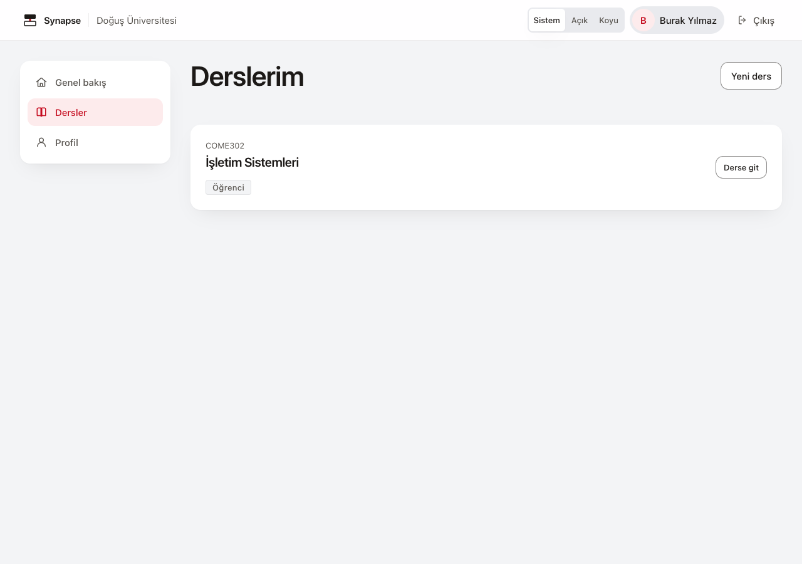
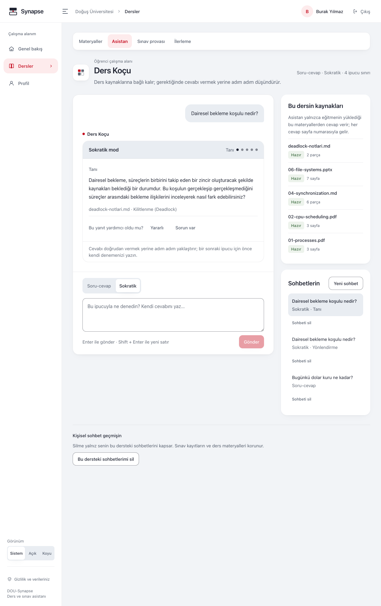
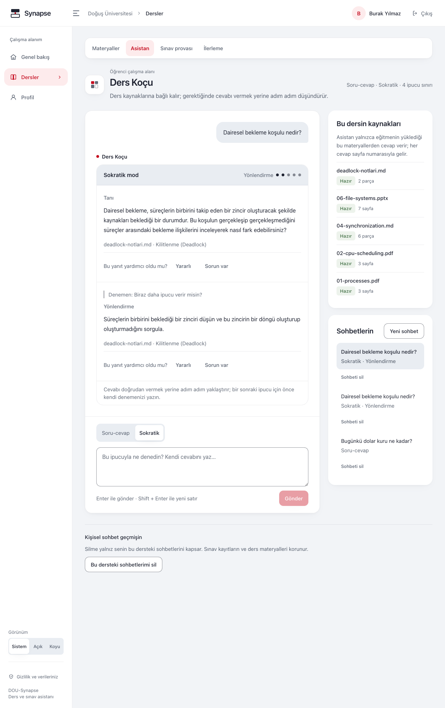
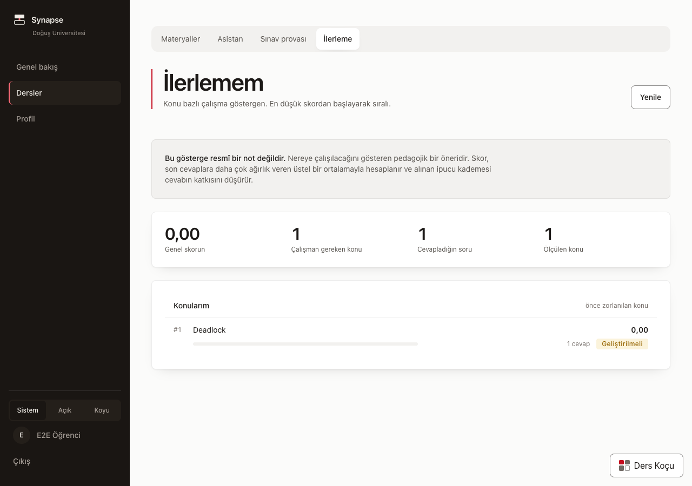

# Öğrenci Kılavuzu

DOU-Synapse, derse yüklenen materyallerle çalışmanıza, soru çözmenize ve konu eksiklerinizi
izlemenize yardımcı olur. Asistanın kullanabildiği kaynakları ve çalışma modlarını hocanız
belirler. Yanıtları ve değerlendirmeleri kaynaklarıyla birlikte inceleyin; bir kaynak
bağlantısı, açıklamanın veya puanın mutlaka doğru olduğu anlamına gelmez.

> **13 Eylül 2026 — kaynak ve yerel tarayıcı incelemesi:** sentetik öğrenci hesabıyla
> ders sayfaları, rol sınırları, alıştırma sonucu ve profil/veri işlemi girişleri
> kontrol edildi. Koşu fake sağlayıcı ve hashing kullanır; gerçek Supabase girişi,
> parola kurtarma ve dış sağlayıcı kalitesi denenmedi. Bütün iş akışları veya
> WCAG AA uygunluğu doğrulanmış değildir. Mobil profil görüntüsündeki menü örtüşmesi
> dahil kapsam ve açık sınırlar [kılavuz doğrulama kaydındadır](guide-verification.md).
> Bu belgede kullanılan görsellerden [ekran görüntüsü kaydında](screenshots.md)
> listelenenler H7 kapsamında yenilendi; diğer görseller önceki sürüm örnekleridir.
> Bazı özellikler kullandığınız ortamda açılmamış olabilir.

## 1. Giriş ve derse katılım

Giriş ekranında hesabınız için sunulan yöntemi kullanın. E-posta ve parola isteniyorsa
kurumunuzun bu uygulama için verdiği giriş bilgilerini kullanın. Örnek ortamda hazır
kimlik kartları gösterilebilir; bunlar kişisel hesabınızın yerine geçmez.

**Dersler** menüsü **Derslerim** ekranını açar ve yalnız erişiminiz olan dersleri gösterir.
Bir ders görünmüyorsa doğru hesapla
giriş yaptığınızı kontrol edin ve hocanızdan üyeliğinizi doğrulamasını isteyin. Bu ekranda
kendinizi mevcut bir derse ekleyemezsiniz.

### Parolayı yenileme

Parolalı giriş kullanıyorsanız **Parolamı unuttum** bağlantısını açın. **E-posta** alanını
doldurup **Yenileme bağlantısı gönder** deyin. Ekranın genel yanıtı hesabın varlığını
doğrulamaz. Gelen bağlantıdan **Yeni parola belirle** ekranını açıp yeni parolayı ve
**Yeni parola tekrar** alanını doldurun; **Parolayı güncelle** ile kaydedin. İşlem
başarılıysa **Derslerime git** bağlantısını kullanın. Bağlantı geçersiz veya süresi
dolmuşsa **Yeni bağlantı iste** deyin. Hazır kimlik kartlarıyla kullanılan yerel demoda
parola yenileme etkin değildir.

### Genel bakış ve gezinme

Girişten sonra **Genel bakış** açılır. Öğrenci olduğunuz dersin **Çalışmaya devam et**
bağlantısı asistanı açar; etkin sınav kilidi varsa **Sınava dön** görünür. **Tüm dersler**
ders listenize götürür. Ders kartındaki rol, o derse özgüdür; başka dersteki eğitmen
rolünüz burada öğrenci yetkisini değiştirmez.

Bir ders için **Henüz ölçülmedi** görüyorsanız bunu sıfır başarı olarak yorumlamayın.
**Yeni ders**, mevcut bir derse katılma yolu değildir; ayrı bir ders oluşturur.
Hocanızın dersine erişmek için üyeliğinizin eklenmesi gerekir.

## 2. Asistanla çalışma

Dersi açıp **Asistan** sekmesine geçin. Hocanızın izin verdiği modlar arasından seçim yapın:

| Mod | Kullanım |
|---|---|
| Soru-cevap | Bir kavramı açıklatmak veya hatırlamak |
| Sokratik | Çözüm denemenizi paylaşarak adım adım ipucu almak |

### Ders kartındaki veya köşedeki asistan

Genel bakıştaki ders kartında **Ders asistanı**, ders sayfalarının köşesinde ise
üyeliğiniz doğrulandıktan sonra **Ders Koçu** düğmesi kısa paneli açar.
Öğrenci panelinin adı **Ders Koçu**dur.
**Sorun** alanına yazıp **Gönder** deyin; Sokratik devamda alan **Denemen** olarak görünür.
**Yeni konuşma** ayrı konuşma başlatır. Panelde mod değiştirmek de yeni konuşma başlatır;
mevcut konuşmanın modunu dönüştürmez. **Kapat** veya Escape ile panelden çıkabilirsiniz.

Panel yalnız açtığınız dersin kaynaklarına ve izinlerine bağlıdır. Sınav kilidi veya
kullanımın kapalı olduğu uyarısı varken yeni panel açmak sınırı kaldırmaz. Geçmişi ve
silme işlemlerini yönetmek için dersin **Asistan** sekmesini kullanın.

### Kaynakları inceleme

Kaynak kartlarında dosya adı, varsa sayfa veya slayt konumu ve materyalden alıntı bulunur.
Yanıtı bu bölümle karşılaştırın. Kaynak bağlantısını açtığınızda erişiminiz yeniden
kontrol edilir; eski bir konuşmada görünmüş olması kaynağın hâlâ açılabileceği anlamına
gelmez. **Bu dersin kaynakları** paneli de ders materyallerini incelemenizi sağlar.
Hocanızın kaynak seçimi, hangi materyallerin yanıt için kullanılabileceğini sınırlayabilir.

Kaynak ayrıntısında **Atıfta kullanılan pasaj** işaretini ve varsa önceki/sonraki parçaları
birlikte okuyun. Buradaki **Retrieval laboratuvarı** bağlantısı eğitmen aracına gider;
öğrenci olarak bu araca erişiminiz olmayabilir. Kaynak okumaya veya çalışmaya devam
etmek için dersin **Asistan** ya da **Materyaller** sekmesini kullanın.

### Konuşmalara dönme ve silme

**Sohbetlerin** listesinden önceki konuşmanızı açın. **Yeni sohbet**, ayrı bir konuşma başlatır;
eskisini silmez. Bir sohbetin ortasında mod değişmez.

- Tek konuşmayı silmek için listedeki konuşmanın **Sohbeti sil** düğmesini kullanın.
- Bu dersin tamamındaki kendi konuşmalarınız için **Kişisel sohbet geçmişin → Bu dersteki
  sohbetlerimi sil** düğmesini kullanın.
- Kapsamı okuyup **Kalıcı olarak sil** ile onaylayın veya **Vazgeç** ile kapatın. İşlem geri
  alınamaz. Diğer kullanıcıların sohbetleri, sınav kayıtlarınız ve ders materyalleri silinmez.

Silme sonrası açık konuşma kapanabilir. Geçmişin değiştiğine ilişkin bir uyarı görürseniz
**Sohbeti yeniden yükle** düğmesini kullanın. Sınav sırasında kişisel geçmişi silebilmeniz,
asistanı veya eski yanıtları yeniden kullanıma açmaz.

### Yanıta geri bildirim verme

Yanıtın altındaki **Yararlı** veya **Sorun var** düğmesini kullanın. Sorun bildirirken türünü
seçebilir ve isteğe bağlı açıklama yazabilirsiniz.

**“Bu soru-cevap çiftini ve açıklamamı öğretmen incelemesine aç.”** kutusunu işaretlerseniz
ilgili soru-cevap içeriği ve açıklamanız, hesabınızda görünen adınız veya e-postanızla
birlikte hocanızın inceleme alanında görülebilir. Bu tercih bütün sohbet geçmişinizi paylaşmaz. Paylaşım kutusunu işaretlemeden
değerlendirme gönderebilirsiniz; bu durumda hocanız bu bildirim üzerinden soru-cevap
metnini ve açıklamanızı okuyamaz. **Geri bildirimi kaydet** ile gönderin veya **Vazgeç** deyin.

## 3. Sokratik mod

Sokratik modda soruyla birlikte ne denediğinizi ve nerede takıldığınızı yazın. Örneğin,
“Karşılıklı dışlama koşulunu buldum ama döngüsel beklemeyi ayırt edemiyorum” ifadesi,
sadece “Cevabı söyle” demekten daha kullanışlıdır. Yanlış bir deneme de çözümünüzü
incelemeye yardımcı olur; her kısa mesajın yeni ipucu açacağı garanti edilmez.

İpucu sayısı hocanızın belirlediği sınıra bağlıdır. Ekrandaki aşamayı ve yönlendirmeyi
izleyin; basamak göstergesini sınırsız ipucu hakkı olarak yorumlamayın. Doğrudan yanıt istemeyi
tekrarlamak yerine denemenizi açıklayın. Başka bir soruya geçerken **Yeni sohbet** açın.

## 4. Kaynak yetersizliği veya kapsam dışı uyarısı

| Uyarı veya durum | Yapılacak işlem |
|---|---|
| Dersin kapsamı dışında | Doğru derste olduğunuzu kontrol edin; soruyu ders konusuyla ilişkilendirin |
| Materyalde yeterli dayanak bulunamadı | Kavramı veya haftayı belirtip soruyu somutlaştırın; ilgili materyali hocanızla kontrol edin |
| Soru çok genel veya belirsiz | “Bu nasıl oluyor?” yerine kavram adını ve takıldığınız adımı yazın |
| Kaynak artık açılamıyor | Uyarıyı izleyin; eski alıntıyı güncel ve erişilebilir kaynakla aynı kabul etmeyin |

Bu uyarılar tek başına teknik arıza anlamına gelmez. Asistanın cevap vermiş olması da
kaynak kontrolü yapma gereğini kaldırmaz.

## 5. Sınav provası

Ders → **Sınav provası**. Sorular hocanızın onayladığı havuzdan gelir.

| Çalışma biçimi | İpucu ve geri bildirim |
|---|---|
| **Alıştırma** | Süre sınırı olmadan çalışma; her yanıttan sonra geri bildirim ve kullanılabilir ipuçları |
| **Sınav** | Süreli çalışma; ipucu kapalı, yanıt ayrıntıları sınav bittikten sonra |

Alıştırmada **İpucu al** veya **Sonraki ipucu** kullanılabilir. Aldığınız ipuçları puanı
etkiler; ipuçsuz çözümle aynı değerlendirmeyi beklemeyin.

### Başlama ve geri dönme

Öğrenci çalışma alanı açılmışsa **Çalışma konusu** listesinden konu seçip **Alıştırma başlat**
deyin. Tüm konular seçimi, dersteki onaylı havuzu kullanır. **Şu anda açık sınavlar**
bölümünde yayımlanan sınavın süresini ve kalan deneme hakkını inceleyip **Sınava katıl**
düğmesini kullanın. Katılım engellenirse ekranda belirtilen nedeni izleyin.

**Oturumlara dön**, oturumu bitirmeden listeye döner. **Oturumlarım → Devam et** aynı oturumu
açar. Sayfayı yenilemek veya başka cihazdan giriş yapmak süreyi ve deneme hakkını
sıfırlamaz. Katılım penceresinin kapanması başlamış oturumun kalan süresini değiştirmez.
Süresi dolmuş oturumu **Oturumu aç** ile açıp bitirin.

Sınavı tamamlamak için **Sınavı bitir** ve ardından **Bitir ve sonucu gör** adımını izleyin.
Bundan sonra o oturuma yeni yanıt gönderemezsiniz. Bitmiş oturumu listeden **Sonucu gör**
ile yeniden açabilirsiniz. Ayrıntılı çalışma alanı açılmamışsa konu, sınav kataloğu ve
sonuç geçmişi yerine temel başlangıç ekranını görürsünüz.

### Yarım kalan yanıt ve kayıtlı geri bildirim

Henüz göndermediğiniz metin veya işaretlediğiniz şık, aynı sekmede sayfayı yenilediğinizde
korunabilir. **Cevabı gönder** demeden teslim edilmiş sayılmaz. Taslak sekmeye özeldir;
sekme kapanınca veya çıkış yapınca silinir ve başka cihaza taşınmaz. Tarayıcı saklamayı
engelliyorsa uyarı görürsünüz; yanıtı yine gönderebilirsiniz.

Gönderilmiş alıştırma sorusuna geri döndüğünüzde kayıtlı geri bildirim ve erişilebilen
kaynak tekrar yüklenir; yanıt yeniden puanlanmaz. Kaynak artık okunamıyorsa ilgili
ayrıntılar gösterilmez. Süreli sınavın yanıtları ise bitmiş sonuç ekranında açılır.

### Sonucu okuma

Açık uçlu veya kod yanıtı geçerli ders kaynağıyla değerlendirilemiyorsa
**Değerlendirilemedi** bilgisi gösterilir. Bu, yanlış yanıt demek değildir; o değerlendirme
puan ortalamasına alınmaz.

- **Neden yanlış?**, çoktan seçmeli soruda yanlış seçeneğe bağlı kaynak bölümünü gösterir.
- **Eksik kalan noktalar** ve varsa **Rubrik ölçütleri**, açık uçlu veya kod yanıtında
  hangi değerlendirme ölçütlerinin eksik kaldığını incelemenizi sağlar.
- **Eksik ölçütün dayanağı**, eksik ölçüt için gösterilen kaynak alıntısıdır. Yanıtınızla
  kanıtlanmış bir çelişki anlamına gelmez. Kaynağı açıp ölçütle birlikte okuyun.

Puan veya açıklama ders materyaliyle uyuşmuyorsa hocanızla değerlendirin. Bu ekranlar
resmî not yerine çalışma geri bildirimi sunar.

### Sınav sırasında kapanan alanlar

Öğrenci olarak aynı derste süreli sınavınız sürerken asistan, kaynak yardımı, önceki
sonuçların ayrıntıları ve alıştırma geri bildirimi kilitlenir. Başka sekme açmak veya
eski bağlantıyı kullanmak bu sınırı kaldırmaz. Birden fazla etkin sınav oturumu varsa
her birini bitirebilirsiniz; ayrıntılar son etkin sınav da bittiğinde veya süresi
dolduğunda açılır. Açık bir ekranın kilitlenmesi hâlinde mesajı izleyin.

**Verilerim** ekranındaki kişisel veri indirme, herhangi bir derste öğrenci olarak etkin
süreli sınavınız varsa geçici olarak kapanır. Sınav bittikten veya süresi dolduktan sonra
tekrar deneyin. Alıştırma bu indirme kilidini oluşturmaz.

## 6. İlerleme

Dersin **İlerleme** sekmesi öğrenci için **İlerlemem** ekranını açar. Konu bazında puan,
seviye ve ölçümün kaç yanıta dayandığını gösterir. Son yanıtlarınızdan sonra **Yenile**
deyin; ekran sürekli kendiliğinden yenilenmez:

| Seviye | Puan |
|---|---|
| Geliştirilmeli | 0,40'ın altında |
| Orta | 0,40 ile 0,75 arasında; 0,75 hariç |
| İyi | 0,75 ve üzeri |

Son yanıtlar daha ağırlıklıdır; alınan ipuçları puanı etkiler. Az sayıda yanıta dayanan
sonucu genel başarı yargısı olarak kullanmayın. Bu bir resmî not değildir.

## 7. Profil ve kişisel veriler

**Profil** ekranında adınızı düzenleyip **Profili kaydet** diyebilirsiniz. E-posta alanı
bu ekranda düzenlenmez. **Ders rolleri** listesinde her dersin üyeliğini ayrı kontrol
edin; profil adı değiştirmek ders yetkisi vermez. Görünümü **Sistem**, **Açık** veya
**Koyu** seçeneğiyle değiştirebilirsiniz. **Verilerimi indir veya sil** bağlantısı
**Verilerim** alanını açar.

| İşlem | Adımlar ve kapsam |
|---|---|
| Kayıtlarımı indirme | **Verilerimi indir → JSON olarak indir**. Size ait profil, üyelik, sohbet, sınav yanıtı ve ilerleme kayıtlarını indirir. Kota ve güvenlik operasyon kayıtları bu dosyanın dışında kalır; dosyadaki kapsam açıklamasını okuyun |
| Tüm sohbetlerimi silme | **Tüm sohbet geçmişini sil → Evet, geçmişi sil**. Bütün derslerdeki kendi sohbetlerinizi, bağlı mesajları ve geri bildirimleri siler. Sınav ve ilerleme kayıtları korunur |
| Profil bilgilerimi kaldırma | **Profil bilgilerimi kaldır → Evet, profil bilgilerimi kaldır**. Ad ve e-postayı kaldırır, sohbetleri siler ve üyelikleri kapatır. Sınav, ilerleme ve materyal kayıtları mevcut profil kaydıyla bağlantılı kalır |

**Profil bilgilerini kaldırmak bütün verileri silmez ve kimliğinizle bağlantıyı tamamen
kaldırmaz.** Kurumun giriş hesabını da kapatmaz; bunun için kurumunuzun ayrı sürecini izleyin.
Sohbet silme, daha önce indirdiğiniz dosyaları cihazınızdan kaldırmaz. Silmeden önce
onaydaki kapsamı okuyun; vazgeçerseniz onaylamadan kapatın.

Ortak cihazda işiniz bitince **Çıkış** yapın. Ayrıntılı kapsam için
[Kişisel Veriler ve Gizlilik](kvkk.md) sayfasını okuyun.

## 8. Sık karşılaşılanlar

| Durum | Yapılacak işlem |
|---|---|
| Çok sık istek veya bütçe uyarısı | Ekranda gösterilen bekleme süresini veya sınırı izleyin; yenilemek kotayı sıfırlamaz |
| Asistan modu görünmüyor | Dersin modları hocanız tarafından sınırlandırılmış olabilir |
| Sokratik modda ilerlemiyorum | Denediğiniz çözümü ve takıldığınız adımı açıklayın; ipucu sınırına bakın |
| Ders listemde ders yok | Doğru hesabı ve ders üyeliğini hocanızla kontrol edin |
| Yanıt veya yükleme gecikiyor | İşlemin durumunu izleyin; süre içerik ve hizmet yoğunluğuna bağlıdır |
| Eski sonuç veya kaynak açılmıyor | Etkin sınav, değişmiş kaynak veya erişim uyarısını okuyun; yetki gerektiren içeriği eski ekranla kullanmaya çalışmayın |

Sorun sürerse etkilenen ekranı, yaklaşık zamanı ve varsa **Destek kodu**nu yetkili
destek ekibine iletin. Bu kod sunucu tarafından ilgili istek için oluşturulur;
yeniden denemede değişebilir. Kodu paylaşırken soru-cevap metnini, öğrenci notunu,
parolanızı veya giriş bilgilerinizi eklemeyin.

## İlgili belgeler

- [Eğitmen Kılavuzu](instructor-guide.md)
- [Kişisel Veriler ve Gizlilik](kvkk.md)
